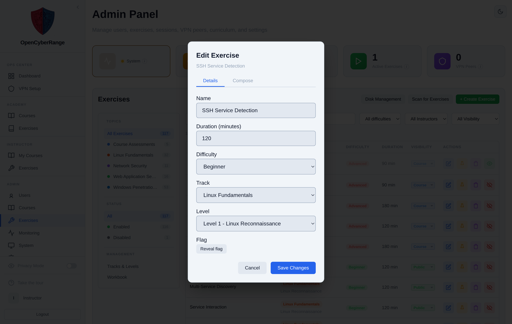
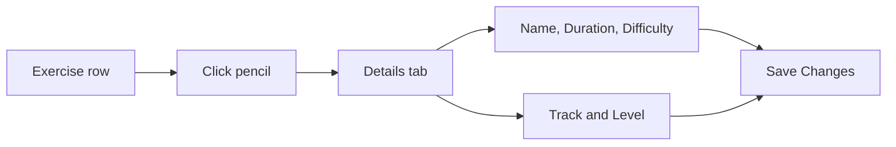

# Editing Lab Metadata

You edit an exercise's metadata to fix its name, set the run duration, set difficulty, or move it into a different track and level. The Details tab of the Edit Exercise modal holds these fields.

## Prerequisites

- An admin account. See [Admin Panel Overview](01_Admin_Panel_Overview.md).
- The Exercises tab. See [Managing Labs](08_Managing_Labs.md).

## Open the Details tab

1. On the Exercises tab, find the exercise and click the **Edit exercise** action (the pencil icon) on the row.
2. The modal opens with two tabs at the top, **Details** and **Compose**. Stay on **Details**.

<figure markdown>

<figcaption>The Edit Exercise modal's Details tab edits the exercise name, duration, difficulty, track, and level.</figcaption>
</figure>

## Fields on the Details tab

| Field | What it sets |
| --- | --- |
| Name | The exercise name shown in catalogs and tables |
| Duration (minutes) | The expected run time |
| Difficulty | Beginner, Intermediate, or Advanced |
| Track | The track the exercise belongs to, or Course Assessments for no track |
| Level | The level within the chosen track; appears once a track is selected |

The Compose tab holds the Docker Compose definition and is a separate concern from metadata.

## Save the change

1. Edit the fields you need.
2. Click **Save Changes**.

**What you should see:** the modal closes and the row reflects the new values, for example the changed difficulty badge or track placement.

!!! warning "A re-scan can overwrite manual edits"
    Some metadata is read from the lab definition on disk during a scan. Editing a field here, then running **Scan for Exercises**, can overwrite your change with the value from the definition. Edit the lab definition itself when you want the change to survive a scan.

!!! note "Difficulty is a single word"
    The difficulty value is stored in a short column. Use a single-word value (Beginner, Intermediate, Advanced); a compound value can fail to save.

To assign an exercise to a track that does not yet exist, build the track first under Exercises, Tracks and Levels. To change the active state or visibility instead of metadata, see [Enabling and Disabling Labs](09_Enabling_and_Disabling_Labs.md).
