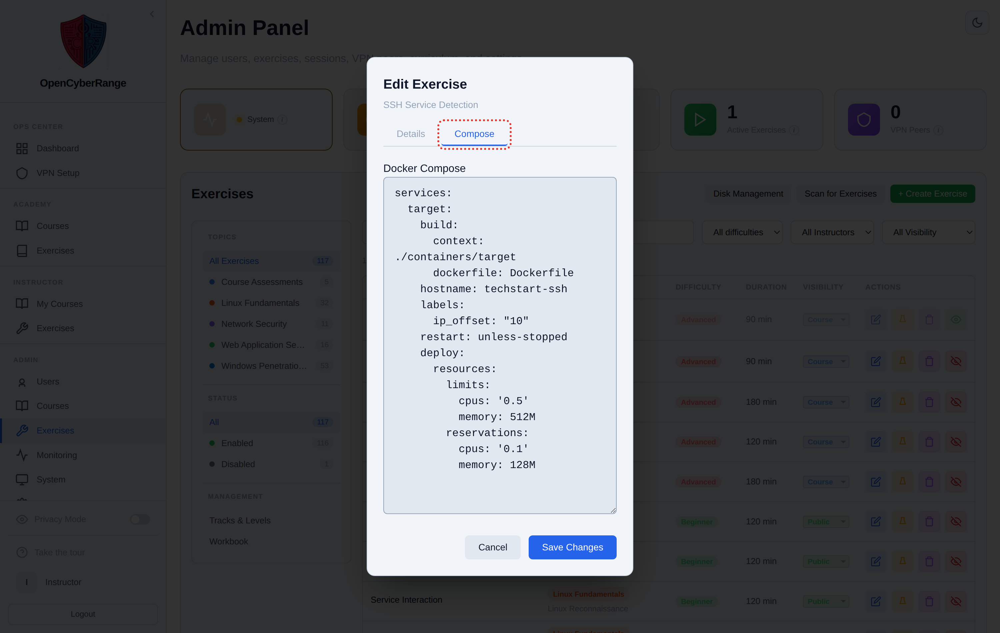

# Editing Docker Compose Files

Each exercise runs from a Docker Compose definition that declares the lab's containers, networks, and volumes. You edit that definition from the Compose tab of the Edit Exercise modal when you need to change an image, add a service, fix a bind mount, or adjust environment variables for a lab.

## Prerequisites

- An [admin account](../01_Getting_Started/05_Logging_In.md) signed in to the Admin Panel.
- The exercise already exists in the Exercises list. To create a brand new one, see [Creating a Lab from the Web UI](12_Creating_a_Lab_from_the_Web_UI.md).

## Steps

1. In the left sidebar, click **Exercises**. The panel opens at `/admin?tab=exercises` and shows the exercise management table.
2. Find the exercise row you want to change. Use the search box or the topic and status filters in the left column to narrow the list.
3. Click the **edit** (pencil) action on that row. The **Edit Exercise** modal opens.
4. At the top of the modal, click the **Compose** tab. The compose YAML for the exercise loads into an editor.
5. Make your changes in the YAML editor. Keep service names, image references, and volume paths valid.
6. Click **Save** to write the compose file back to the exercise.

**What you should see:** The modal confirms the save, and the next time the exercise spawns it uses the updated compose definition.

<figure markdown>

<figcaption>The Edit Exercise modal exposes Details and Compose tabs; the Compose tab holds the lab's docker-compose YAML.</figcaption>
</figure>

!!! warning "Bind mounts must use the host path variable"
    Relative paths in a lab compose file resolve against the backend container, not the host, so they point at the wrong directory. Write bind mounts as `${LABS_HOST_PATH}/...` so the host path resolves correctly when the lab spawns.

!!! warning "Saving compose does not rebuild cached images"
    A saved compose file is used on the next spawn, but an image cached from an earlier build is reused as is. If your change touches a Dockerfile or image build, clear the cached image first with the per-row **Delete cached Docker images** action, then spawn the exercise so it rebuilds. See [Managing Labs](08_Managing_Labs.md) for the cache action.

!!! note "No Unicode dashes in compose values"
    Do not paste en-dashes or em-dashes into any value. Use a plain hyphen or a comma.

If a lab fails to start after a compose edit, see [Lab Fails to Start](../07_Troubleshooting/03_Lab_Fails_to_Start.md).
