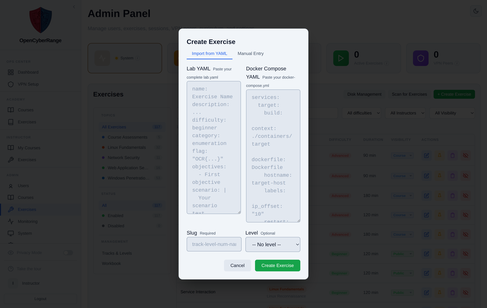
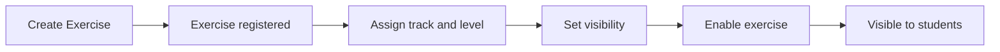

# Creating a Lab from the Web UI

You create a new exercise without touching the server filesystem by using the Create Exercise modal in the Admin Panel. The modal accepts a complete `lab.yaml` paste or a field-by-field manual entry, then registers the exercise so it can be assigned to a track and spawned by students.

## Prerequisites

- An [admin account](../01_Getting_Started/05_Logging_In.md) signed in to the Admin Panel.
- A valid lab definition: either a complete `lab.yaml` to paste, or the metadata and compose YAML to enter by hand.

## Steps

1. In the left sidebar, click **Exercises** to open `/admin?tab=exercises`.
2. In the panel header, click **+ Create Exercise**. The **Create Exercise** modal opens.
3. Choose a mode with the tab buttons at the top of the modal:
    - **Import from YAML** pastes a complete `lab.yaml` into one field. The form parses it into the exercise definition.
    - **Manual Entry** fills name, difficulty, category, flag, and compose fields by hand.
4. Provide the lab content for the mode you picked. Set the flag in the exact format `OCR{...}` (lowercase letters, digits, and underscores only).
5. Click **Create** to register the exercise.

**What you should see:** The new exercise appears in the Exercises management table. It does not show in any track until you assign it a track and level.

<figure markdown>

<figcaption>The Create Exercise modal offers Import from YAML and Manual Entry modes for registering a new exercise.</figcaption>
</figure>

The lifecycle below shows where creation fits before an exercise becomes visible to students.

!!! note "Assign a track and level so students can find it"
    A created exercise with no track or level lands under Course Assessments only. To place it in a track, set the track and level in the Edit Exercise modal. See [Managing Tracks and Levels](18_Managing_Tracks_and_Levels.md).

!!! warning "Visibility and enabled state are separate gates"
    A new exercise must be enabled and have an appropriate visibility (public, course, draft, or pending) before students see it. See [Enabling and Disabling Labs](09_Enabling_and_Disabling_Labs.md).

!!! tip "No exclamation mark in the flag"
    Flag values and any password fields use `#` rather than `!`. Keep the flag inside `OCR{...}`.

To edit the compose YAML after creation, see [Editing Docker Compose Files](11_Editing_Docker_Compose_Files.md).
