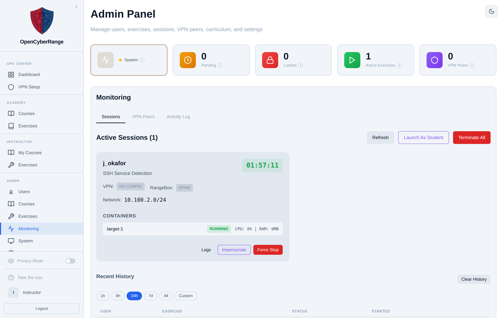

# Terminating Sessions

You stop a single running lab session, clear a session that lost its containers, or stop every session at once from the Sessions view. Use these controls when a lab is stuck, when a student needs to free their one active slot, or when you are clearing the platform before maintenance.

## Prerequisites

- An [admin account](../01_Getting_Started/05_Logging_In.md) signed in to the Admin Panel.
- At least one session in the Sessions view. See [Monitoring Active Sessions](13_Monitoring_Active_Sessions.md).

## Steps

1. In the left sidebar, click **Monitoring** to open `/admin?tab=monitoring` on the **Sessions** sub-tab.
2. Locate the session card you want to act on.
3. Stop one session: click **Force Stop** on its card. The action tears down the session's containers and stops it.
4. Clear a stale session: when a card shows the stale warning, click **Reset Stale**. A confirmation explains that the session is marked stopped so the student can start a new lab.
5. Stop everything: click **Terminate All** in the panel header to stop every running session at once. The button is disabled when no sessions exist.

**What you should see:** The targeted card disappears from the Active Sessions list, or all cards clear for Terminate All. The session moves into the Recent History table with a stopped status.

<figure markdown>

<figcaption>Force Stop ends one session; Terminate All in the header ends every running session.</figcaption>
</figure>

The three teardown actions differ in what they touch:

| Action | When to use | Effect |
| --- | --- | --- |
| Force Stop | A single live session is stuck or must end | Tears down that session's containers and marks it stopped |
| Reset Stale | The database shows running but no containers exist | Clears the database row only, freeing the student's active slot |
| Terminate All | Clearing the platform before maintenance | Stops every running session at once |

!!! warning "Reset Stale does not stop containers"
    Reset Stale only clears the database row for a session that has no containers. If containers are still running, use Force Stop, which tears them down.

!!! warning "Clearing history is destructive"
    The **Clear History** button under Recent History removes session history rows used for audit retention. Clearing history does not affect the Activity Log.

A correct flag submission already auto-stops and tears down a student's lab, so manual termination is for stuck or abandoned sessions. If a session expired on its own without tearing down, see [Session Expired Unexpectedly](../07_Troubleshooting/07_Session_Expired_Unexpectedly.md).
