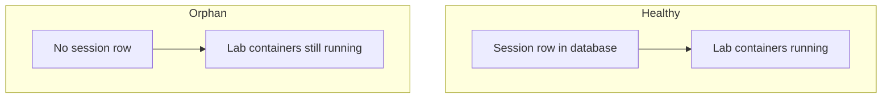

# Cleaning Up Orphaned Containers

An orphaned container is a lab container left running with no matching session in the database, usually after a crash or an interrupted teardown. Orphans hold disk, memory, and network resources, so you clear them to keep the host clean. The platform exposes orphan cleanup as a maintenance action backed by the orphan-cleanup endpoint.

## Prerequisites

- An [admin account](../01_Getting_Started/05_Logging_In.md) signed in to the Admin Panel.
- No legitimate session mid-spawn. Confirm the Sessions view first. See [Monitoring Active Sessions](13_Monitoring_Active_Sessions.md).

## What an orphan is

The diagram below contrasts a healthy session with an orphaned container.

A healthy session has a database row that points at running containers. An orphan is the reverse of a stale session: containers keep running while their session row is gone.

## How to clear orphans

Two paths reduce orphaned and unused container resources from the Admin Panel:

1. Open the **Sessions** view under **Monitoring** and check for cards with the stale warning. For a session whose row exists but has lost its containers, use **Reset Stale**. For a session whose containers must be torn down, use **Force Stop**. See [Terminating Sessions](14_Terminating_Sessions.md).
2. Open the **Exercises** tab and click **Disk Management** in the panel header. Use **Prune Unused Images** and **Prune Build Cache** to reclaim space held by containers and images that no session references. See [Disk Management](24_Disk_Management.md).

**What you should see:** The stale or stuck cards clear from the Sessions view, and the Disk Management modal reports freed space after a prune.

!!! warning "Do not clean up during an active spawn"
    A lab that is mid-spawn can briefly look orphaned before its session row is committed. Confirm the Sessions view shows no spawning lab before you prune, so you do not remove a container that a student is about to use.

!!! note "Orphans differ from stale sessions"
    A stale session has a database row but no containers, cleared with Reset Stale. An orphan has containers but no row, cleared by pruning unused images and caches in Disk Management.

If pruning does not free the space you expect, check the [Disk Management](24_Disk_Management.md) modal.
