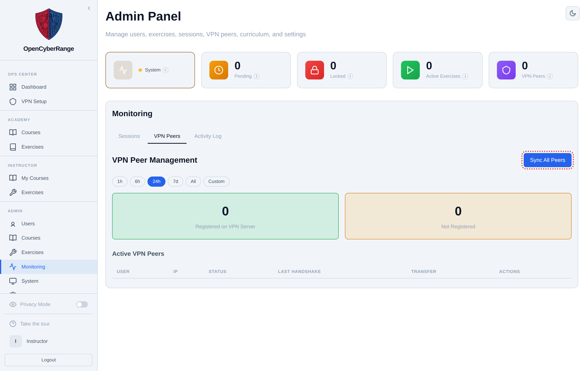
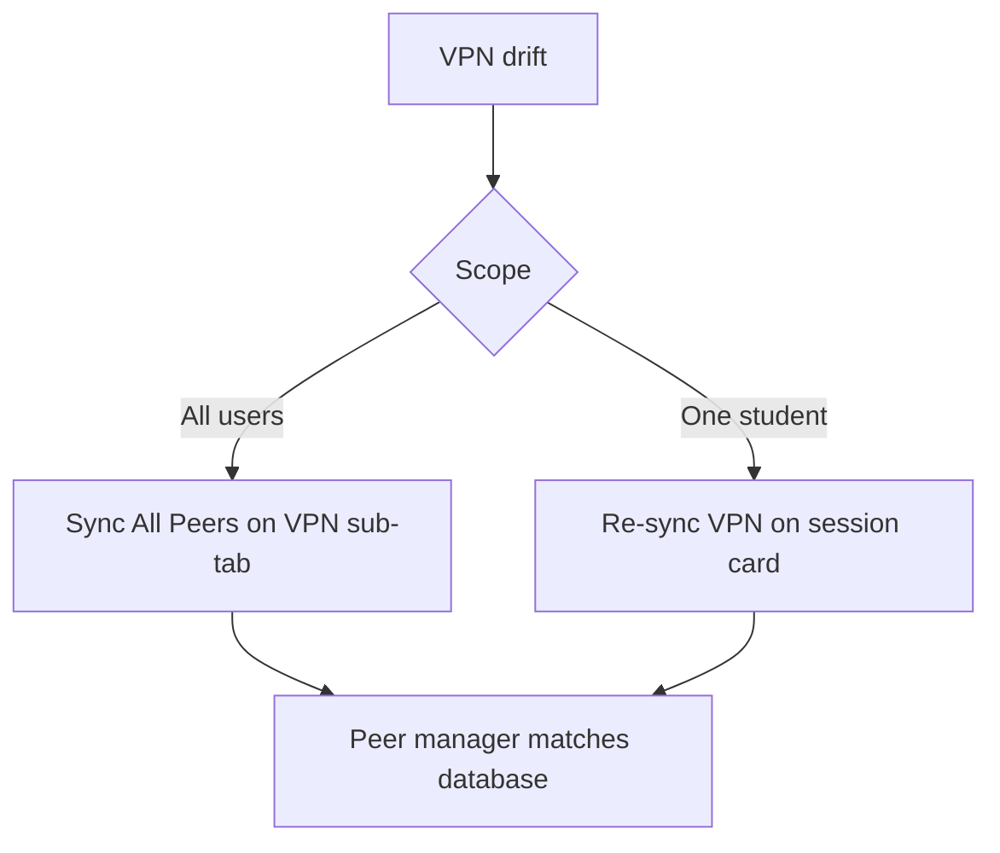

# Syncing VPN Configurations

Syncing reconciles the live WireGuard peer manager against the platform database, so every registered user has a matching server peer and stale entries are cleared. You sync the whole peer set when registrations and the server have drifted apart, and you re-sync a single session when one student's VPN is configured but not connected.

## Prerequisites

- An [admin account](../01_Getting_Started/05_Logging_In.md) signed in to the Admin Panel.

## Sync all peers

1. In the left sidebar, click **Monitoring** to open `/admin?tab=monitoring`.
2. Click the **VPN Peers** sub-tab.
3. In the panel header, click **Sync All Peers**. The button shows a spinner and reads **Syncing...** while it runs.
4. When the sync finishes, review the Active VPN Peers table and the registered count.

**What you should see:** The button returns to **Sync All Peers**, and the peer table reflects the reconciled state with health badges resolved.

<figure markdown>

<figcaption>Sync All Peers reconciles the WireGuard peer manager against the database for every user.</figcaption>
</figure>

## Re-sync one session

For a single student whose VPN has a config but is not connected, you do not need a full sync:

1. Open the **Sessions** sub-tab under **Monitoring**.
2. Find the student's session card. When the VPN badge reads Disconnected and a config exists, the card shows a **Re-sync VPN** button.
3. Click **Re-sync VPN**. The platform re-registers that student's peer.

The two sync paths cover different scopes.

!!! note "Firewall rules reapply on their own"
    The backend reapplies all firewall rules automatically when it starts, so a sync handles peers and you do not run a separate fix-rules step.

!!! tip "Sync after bulk registration"
    Run Sync All Peers after registering many users so the server peer set matches the database in one pass.

For per-peer repair and removal, see [Managing VPN Peers](16_Managing_VPN_Peers.md). For student-side issues, see [VPN Connection Problems](../07_Troubleshooting/04_VPN_Connection_Problems.md).
