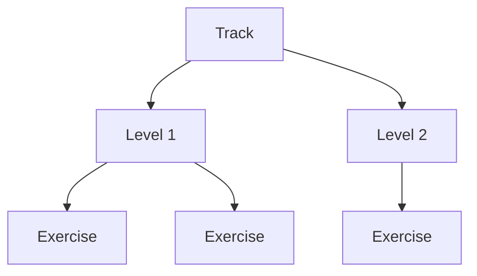
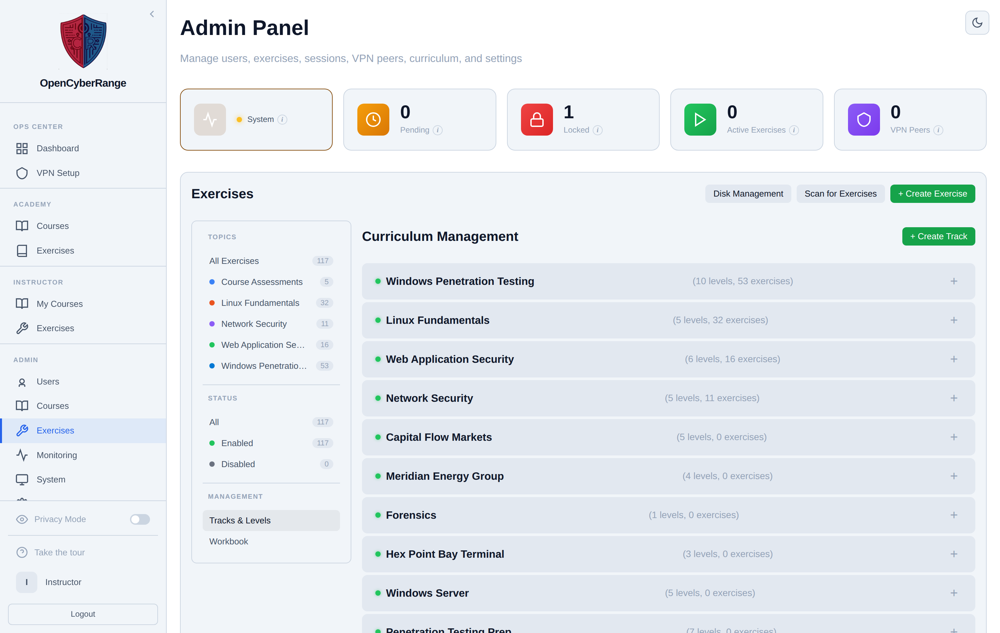

# Managing Tracks and Levels

A track is a themed learning path, and a level is an ordered stage inside a track that holds exercises. You manage both from the Curriculum Management view, where you create tracks, add levels, edit their details, and delete the ones you no longer need. Exercises are placed into a level so students progress through them in order.

## Prerequisites

- An [admin account](../01_Getting_Started/05_Logging_In.md) signed in to the Admin Panel.

## How tracks, levels, and exercises relate

The diagram shows the container relationship you manage on this view.

## Steps

1. In the left sidebar, click **Exercises** to open `/admin?tab=exercises`.
2. In the left column under Management, click **Tracks & Levels**. The **Curriculum Management** view loads.
3. Create a track: click **+ Create Track**, fill in the track details, and save. The track appears in the list with a level and exercise count.
4. Expand a track by clicking its header row. The track actions and its levels appear.
5. Add a level: click **+ Add Level** on the expanded track, fill in the level number, name, and description, and save.
6. Edit a track or level: click **Edit Track** or the level's **Edit** button, change fields, and save.
7. Delete a level: click the level's **Delete** button. The button is disabled while the level still contains exercises.

**What you should see:** New tracks and levels appear immediately in the list, with their exercise counts updating as you assign exercises to them.

<figure markdown>

<figcaption>The Curriculum Management view lists tracks, their levels, and per-item Edit, Delete, and Add Level actions.</figcaption>
</figure>

!!! warning "A level with exercises cannot be deleted"
    The Delete action on a level is disabled while that level still holds exercises. Reassign or remove the exercises first, then delete the level.

!!! warning "Deleting a track cascades"
    Deleting a track removes its levels along with it. Confirm the track is empty of content you want to keep before you delete.

!!! note "Keep names within the field limits"
    Track names, level names, and difficulty values store as short strings. Use single-word difficulty values so they fit the column.

Curriculum Management is a sub-view inside Exercises, not a top-level tab; an old `?tab=curriculum` link still resolves here. To assign an exercise to a level, set its track and level in the [Edit Lab Metadata](10_Editing_Lab_Metadata.md) modal. To change display order, see [Reordering Tracks and Levels](19_Reordering_Tracks_and_Levels.md).
