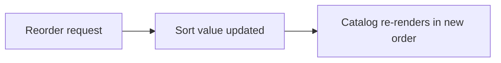

# Reordering Tracks and Levels

The order in which tracks and levels appear to students comes from a sort value on each item. You change that order to surface a track higher in the catalog or to resequence the levels inside a track. The platform exposes reorder endpoints that set the sort value for tracks and for the levels within a track.

## Prerequisites

- An [admin account](../01_Getting_Started/05_Logging_In.md) signed in to the Admin Panel.
- The tracks and levels already exist. See [Managing Tracks and Levels](18_Managing_Tracks_and_Levels.md).

## How ordering works

Each track and each level carries a sort value, and the catalog lists items from lowest to highest. The flow below shows what a reorder changes.

## Steps

1. In the left sidebar, click **Exercises** to open `/admin?tab=exercises`.
2. In the left column under Management, click **Tracks & Levels** to open the Curriculum Management view.
3. Confirm the current order by reading the track list top to bottom and expanding a track to see its levels in sequence.
4. Apply the reorder. The reorder behavior is driven by the track and level sort values that the platform reorder endpoints set.

**What you should see:** After the sort values change, the track list and the levels inside a track render in the new sequence in both the admin view and the student catalog.

The order rules to keep in mind:

| Item | Order driver | Note |
| --- | --- | --- |
| Tracks | Track sort value | Lower value lists first |
| Levels | Level sort value within a track | Lower value lists first |
| Standard exercises | Exercise sort value | Standard exercises list before drills |
| Command drills | Sort value offset above standard | Drills sort after standard exercises in a level |

!!! note "Drills sort after standard exercises"
    Command drill exercises carry a sort value offset above the standard range, so they appear after the standard exercises inside the same level.

!!! tip "Verify in the student catalog"
    After reordering, view a track as a student would to confirm the sequence renders the way you intend. See [Understanding Tracks, Levels, and Labs](../02_Student_Guide/03_Understanding_Tracks_Levels_and_Labs.md).

To create or rename the tracks and levels you are ordering, see [Managing Tracks and Levels](18_Managing_Tracks_and_Levels.md).
