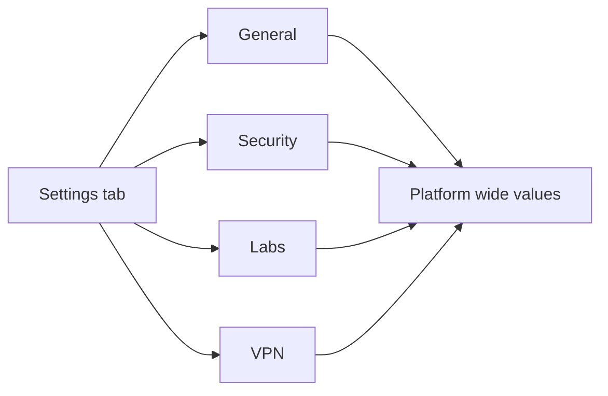
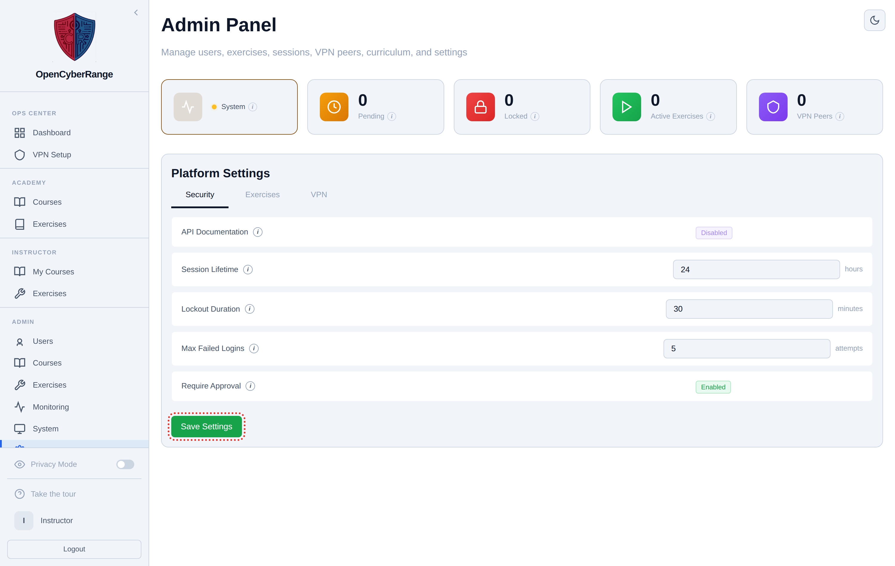

# Platform Settings

Platform Settings is where you tune platform-wide behavior: general identity values, security limits, lab defaults, and VPN parameters. You open it when you need to change a value that applies to every user, not to a single course or lab.

## Prerequisites

- An admin account. See [Admin Panel Overview](01_Admin_Panel_Overview.md).

## Where it lives

The settings screen is the **Settings** tab of the Admin Panel, reached from the **Settings** link in the left sidebar (or directly at `/admin?tab=settings`). The settings live behind four category tabs: General, Security, Labs, and VPN.

The four settings categories and what each one controls.

## Steps

1. Open the **Settings** tab from the sidebar.
2. Click a category tab: **General**, **Security**, **Labs**, or **VPN**.
3. Edit the values in the rows. Each row uses the control that fits its type:
   - A boolean shows an **Enabled** / **Disabled** toggle button.
   - A value whose key contains "color" shows a color picker.
   - Any other value shows a text or password input. Keys with units show the unit beside the input.
4. Hover the small **i** icon next to a setting name to read its description.
5. Click **Save Settings** to write your changes.

<figure markdown>

<figcaption>The Settings tab with category tabs across the top and one editable row per value.</figcaption>
</figure>

## What you should see

After you click **Save Settings**, the button shows "Saving..." and then returns to "Save Settings". The values you entered persist when you switch categories and return.

!!! warning "No exclamation marks in any value"
    Use `#` instead of `!` in any credential or password setting. An exclamation mark breaks shell handling through bash history expansion.

!!! warning "No Unicode dashes in any value"
    Do not paste en-dashes or em-dashes into a setting value. The PDF report generator uses a latin-1 font and crashes on Unicode dashes. Use a hyphen, comma, colon, or period.

!!! note "Secret values are masked"
    A secret value renders as a row of dots. To change it you type the full new value; the masked placeholder is not the stored secret.

!!! tip "Empty categories are normal"
    A category with no live settings shows "No settings in this category." That is expected, not an error.
