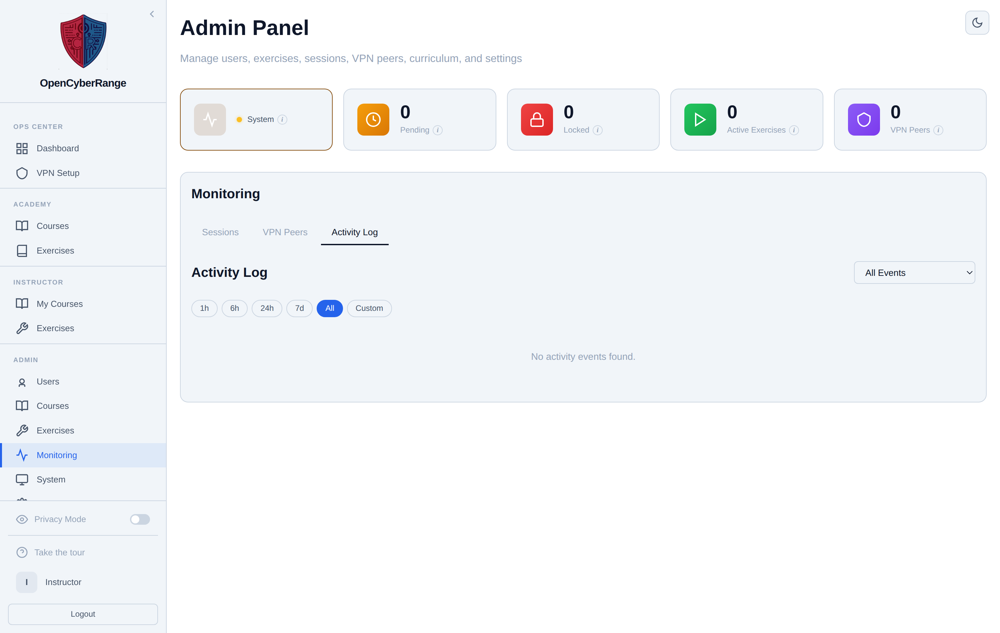

# Viewing Activity Audit Logs

The Activity Log records what happened on the platform: logins, lab launches, flag submissions, account changes, and administrative actions. You use it to answer "who did what, and when" during an incident review or a routine audit.

## Prerequisites

- An admin account. See [Admin Panel Overview](01_Admin_Panel_Overview.md).

## Where it lives

The Activity Log is a sub-tab of **Monitoring**. Open the **Monitoring** link in the left sidebar (or go to `/admin?tab=monitoring`), then click the **Activity Log** sub-tab. An old `?tab=activity` bookmark still resolves here.

## Steps

1. Open **Monitoring** from the sidebar.
2. Click the **Activity Log** sub-tab.
3. Narrow the view with the **All Events** dropdown to a single event type, or leave it on All Events.
4. Click a time-range pill to bound the window: **1h**, **6h**, **24h**, **7d**, **All**, or **Custom**. Custom reveals two date-time pickers for a start and end.
5. Read the table. Each row shows **Time**, **Event**, **User** (the actor), **Target**, and **Details**.
6. Page through results with **Prev** and **Next** at the bottom.

<figure markdown>

<figcaption>The Activity Log with the event-type dropdown, time-range pills, and a paginated table of recorded events.</figcaption>
</figure>

## What you should see

A reverse-chronological table of events. When no events fall in the selected window, the table shows "No activity events found."

!!! note "Diagnostic events are tagged and excluded from stats"
    Events that come from administrative diagnostics carry a **Diagnostics** tag and a muted row style. The platform excludes tagged events from student-facing statistics, so a diagnostics run does not inflate a class's numbers.

!!! note "Clearing session history does not clear activity"
    The **Clear History** button on the Sessions sub-tab clears session records only. Activity events are a separate store and stay intact.
