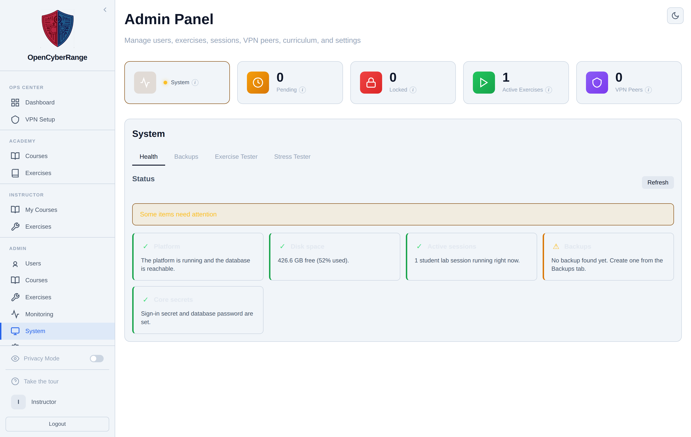

# Disk Management

Lab images and Docker build cache accumulate over time and fill the host disk. Disk Management shows what Docker is using and lets you reclaim space by pruning unused images and build cache. You open it when the host is low on disk or when a stale cached image is hiding a Dockerfile change.

## Prerequisites

- An admin account. See [Admin Panel Overview](01_Admin_Panel_Overview.md).

## Where it lives

Disk Management is a modal launched from the **Exercises** tab, not a standalone screen. Open the **Exercises** link in the left sidebar (or go to `/admin?tab=exercises`), then click the **Disk Management** button in the panel header.

## Steps

1. Open the **Exercises** tab from the sidebar.
2. Click **Disk Management** in the header to open the modal.
3. Read the four usage cards: **Images**, **Build Cache**, **Containers**, and **Volumes**. Each shows total size and how much is reclaimable.
4. Click **Prune Images** to remove all images not used by a running container. Exercises rebuild on their next launch.
5. Click **Prune Cache** to remove cached build layers. Future builds run longer because layers rebuild from scratch.
6. Click **Refresh** to recompute usage, or **Close** to dismiss the modal.

<figure markdown>

<figcaption>The Disk Management modal with Images, Build Cache, Containers, and Volumes usage cards and the prune actions.</figcaption>
</figure>

## What you should see

After a prune, the usage cards drop to reflect the reclaimed space. The button shows "Pruning..." while the operation runs.

!!! warning "Pruning forces rebuilds"
    Both prune actions are destructive to caches. The next spawn or build of an affected exercise is slower because images and layers rebuild. Run a prune when you need space, not as routine maintenance.

!!! tip "Per-exercise image cleanup is separate"
    To clear the cached image for one exercise only, use the **Delete cached Docker images** action on that exercise's row in the Exercises list rather than pruning everything. The same host disk usage also appears on the **System** tab Health card.
