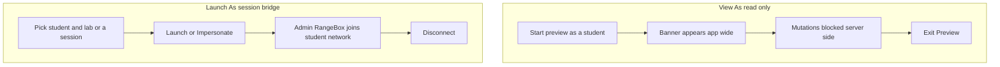
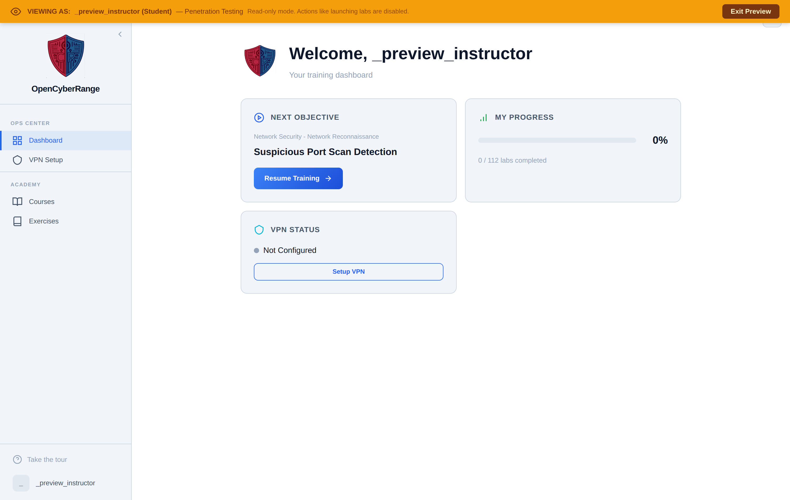

# Impersonation

The platform has two separate features that both involve acting as another user, and the word "Impersonate" appears in both. They do different things, and you choose between them by intent. Use **View As** to see the platform exactly as a student sees it, without changing anything. Use **Launch As** (also labeled **Impersonate** on a session card) to bridge your own RangeBox onto a student's lab network so you can reach their running targets.

## Prerequisites

- An admin account. See [Admin Panel Overview](01_Admin_Panel_Overview.md).
- For Launch As, an active student lab session or a student and lab to launch. See [Monitoring Active Sessions](13_Monitoring_Active_Sessions.md).

## The two features compared

The two impersonation paths and what each one grants.

| Aspect | View As | Launch As |
| --- | --- | --- |
| What it does | Renders the platform UI as that student | Connects your RangeBox to the student's lab network |
| Mutations | Blocked: launching labs, submitting flags, and edits return an error | Full network access to the student's running targets |
| Visible cue | App-wide banner reading VIEWING AS | A bridged session in Monitoring |
| How you leave | Exit Preview button in the banner | Disconnect |
| Where you start it | User and course contexts | Monitoring tab: Launch As Student, or a session card's Impersonate button |

## Steps: View As (read-only)

1. Start a preview from a user or course context.
2. Confirm the banner across the top reads **VIEWING AS** with the student's label and "Read-only mode. Actions like launching labs are disabled."
3. Browse the dashboard, tracks, and courses as that student. Any attempt to launch a lab, submit a flag, or save a change is rejected by the server.
4. Click **Exit Preview** in the banner to return to your own account.

<figure markdown>

<figcaption>The View As state: the read-only banner names the student you are previewing and offers Exit Preview.</figcaption>
</figure>

## Steps: Launch As (session bridge)

1. Open the **Monitoring** tab from the sidebar.
2. Click **Launch As Student**, choose a student and a lab, then click **Launch**. The resulting session is tagged as admin-initiated.
3. To bridge onto a session that is already running, click **Impersonate** on that session's card. Your RangeBox joins the student's lab network.
4. Use **Disconnect** to drop the bridge when you are done.

## What you should see

In View As, the banner stays visible on every page and mutating actions fail until you exit. In Launch As, you can reach the student's lab targets from your RangeBox.

!!! note "Read-only is enforced on the server"
    View As blocks every create, update, and delete request at the server, whitelisting only the exit and change-password actions. Some mutating buttons in the interface are not yet visually disabled, so a button may appear clickable but the action still fails. Treat the banner as the signal that you are read-only.

!!! warning "You cannot impersonate an admin or stack impersonations"
    View As refuses to target an admin account and refuses to start a second preview while one is active. Exit the current preview first.
