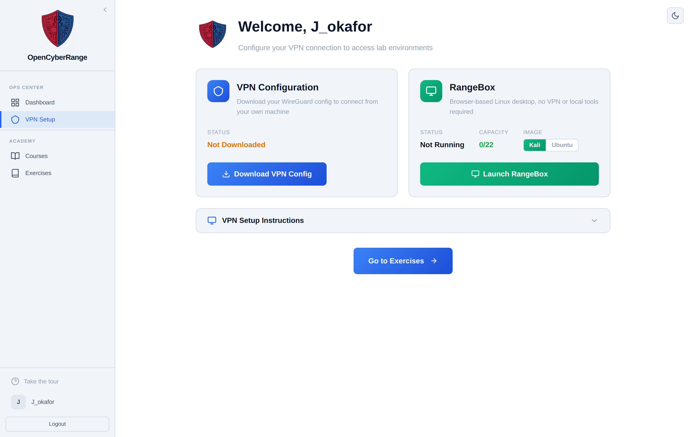
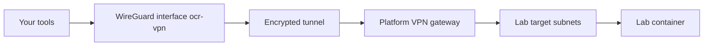
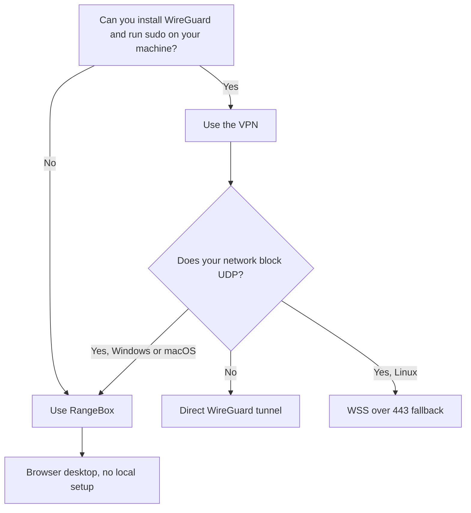

# VPN Overview

To reach a lab target from your own machine, you connect through a WireGuard VPN tunnel. The VPN setup page also offers RangeBox, a browser-based Linux desktop that needs no VPN and no local tools. Read this page to decide which access path fits your situation before you launch a lab.

## Two ways to reach a lab

Every lab runs on an isolated network that is not exposed to the public internet. You bridge into that network in one of two ways, both presented side by side on the VPN setup page.

<figure markdown>

<figcaption>The VPN setup page presents the VPN Configuration card and the RangeBox alternative side by side.</figcaption>
</figure>

The VPN Configuration card lets you download a WireGuard configuration file, install WireGuard locally, and bring up the tunnel. Your own terminal, browser, and tools then reach the lab targets directly. You need local administrator or sudo rights to install WireGuard and raise the interface.

The RangeBox card launches a Kali or Ubuntu desktop that runs in the platform and appears in your browser tab. No VPN, no installs, and no admin rights on your own machine. RangeBox is capacity limited: the card shows running sessions against the maximum, and the launch button is disabled when the pool is full.

## VPN data path

The diagram below shows how traffic flows from your machine to a lab target when you connect over the VPN.

The tunnel carries only the lab subnets. Your normal internet traffic does not go through the VPN, so browsing and other connections stay on your regular network while the tunnel is up. See [03_Installing_WireGuard_on_Linux.md](03_Installing_WireGuard_on_Linux.md) for the exact subnets the configuration routes.

## Choosing a path

Use the flow below to pick the access method that fits your machine and network.

!!! tip
    If you cannot install software on your machine, are on a locked-down or guest network, or want to start quickly, use RangeBox. The VPN gives you your own tools and full control but needs local setup.

!!! note
    RangeBox capacity is shared. When the card reads Unavailable or the pool is full, wait and retry, or switch to the VPN.

## Next steps

- VPN path: [02_Downloading_Your_VPN_Config.md](02_Downloading_Your_VPN_Config.md), then your platform's install page.
- Problems connecting: [08_Troubleshooting_VPN_Issues.md](08_Troubleshooting_VPN_Issues.md).
