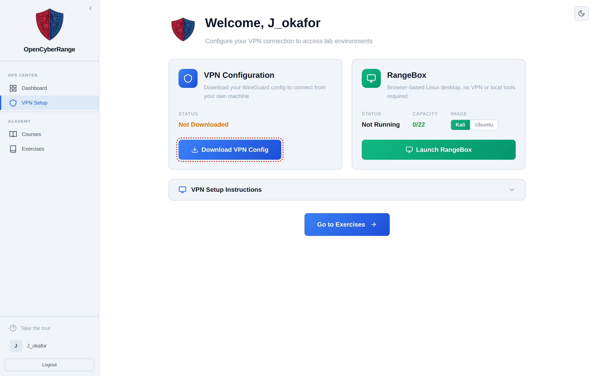
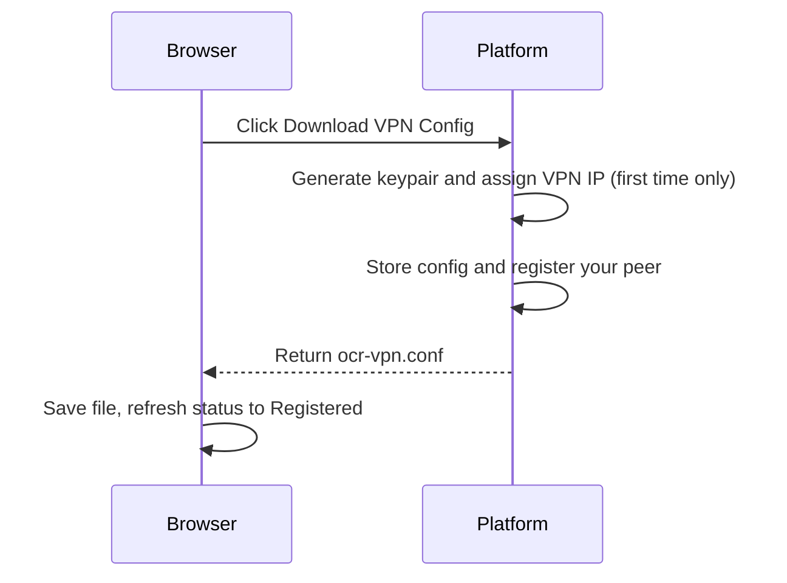

# Downloading Your VPN Config

Your WireGuard configuration file holds the keys and routes your machine needs to join the lab network. You download it once from the VPN setup page; the platform generates it on first request, registers your peer automatically, and reuses the same file on every later download. Do this before you install WireGuard or connect.

## Prerequisites

- A platform account and an active session. See [../01_Getting_Started/05_Logging_In.md](../01_Getting_Started/05_Logging_In.md).
- A decision about access method. See [01_VPN_Overview.md](01_VPN_Overview.md).

## Steps

1. Open the VPN setup page from the sidebar. The VPN Configuration card shows a **Status** value, which reads **Not Downloaded** before you have ever fetched the file.

2. Click **Download VPN Config**.

3. Your browser saves a file named `ocr-vpn.conf`. Keep that exact name; the install and connect commands all refer to it.

<figure markdown>

<figcaption>The VPN Configuration card shows your status and the Download VPN Config button.</figcaption>
</figure>

**What you should see.** After the download, the card status changes to **Registered** and a **Your VPN IP** value appears. The platform assigns you a fixed address on the lab network and registers your peer in the background; there is no separate register step.

## What the lifecycle looks like

The sequence below shows what happens when you click Download VPN Config.

## What is inside the file

The configuration is split-tunnel. It routes only the lab subnets and leaves your normal internet traffic on your regular connection. It does not set a DNS server and does not route all traffic. If your network blocks UDP, the file also carries a fallback that wraps the tunnel inside an HTTPS connection on port 443, so the first connection can take a few extra seconds while that component installs.

!!! note
    The file is generated once and reused. Every later download gives you the same keys and the same VPN IP, so you do not need to re-register if you re-download.

!!! warning
    The fallback that wraps the tunnel over port 443 is a shell hook that runs only on the Linux command-line setup. The Windows and macOS apps ignore it. See [04_Installing_WireGuard_on_Windows.md](04_Installing_WireGuard_on_Windows.md) and [05_Installing_WireGuard_on_macOS.md](05_Installing_WireGuard_on_macOS.md).

!!! tip
    Some endpoint security tools flag the auto-install hook inside the file. If the download is blocked or quarantined, allow the file or use [01_VPN_Overview.md](01_VPN_Overview.md) RangeBox instead.

If the download fails, your browser shows the message "Failed to download VPN configuration. Please try again." Retry the button, and if it keeps failing see [08_Troubleshooting_VPN_Issues.md](08_Troubleshooting_VPN_Issues.md).

## Next step

Install WireGuard for your platform:

- [03_Installing_WireGuard_on_Linux.md](03_Installing_WireGuard_on_Linux.md)
- [04_Installing_WireGuard_on_Windows.md](04_Installing_WireGuard_on_Windows.md)
- [05_Installing_WireGuard_on_macOS.md](05_Installing_WireGuard_on_macOS.md)
