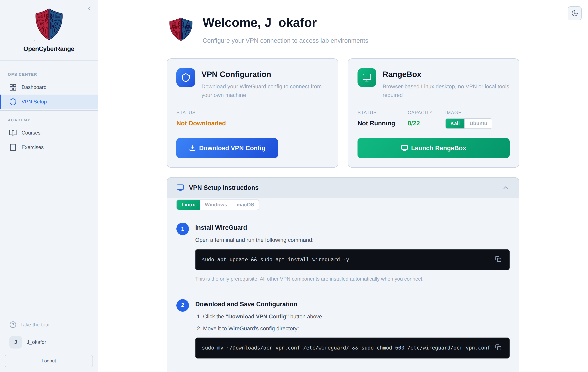

# Installing WireGuard on Linux

On Linux you install WireGuard once, place your config file, and bring the tunnel up from a terminal. The VPN setup page shows these same steps in its Linux Setup Instructions panel, with a copy button on each command. Follow this page to set up the command-line tunnel.

## Prerequisites

- Your config file `ocr-vpn.conf` downloaded. See [02_Downloading_Your_VPN_Config.md](02_Downloading_Your_VPN_Config.md).
- A terminal with sudo rights on your machine.

## Steps

1. Install WireGuard. On Debian, Ubuntu, and Kali:

        sudo apt update && sudo apt install wireguard -y

    WireGuard is the only thing you install by hand. Every other component the tunnel needs installs itself the first time you connect.

    On Fedora or RHEL use `sudo dnf install wireguard-tools`. On Arch use `sudo pacman -S wireguard-tools`.

2. Move the downloaded config into WireGuard's directory and lock down its permissions:

        sudo mv ~/Downloads/ocr-vpn.conf /etc/wireguard/ && sudo chmod 600 /etc/wireguard/ocr-vpn.conf

    The tunnel name comes from the filename, so the file must stay named `ocr-vpn.conf` and live in `/etc/wireguard/`.

3. Bring the tunnel up:

        sudo wg-quick up ocr-vpn

    The first connection can take a few extra seconds while the networking components install themselves.

**What you should see.** The `wg-quick up` command prints the interface and route setup, similar to:

    [#] ip link add ocr-vpn type wireguard
    [#] wg setconf ocr-vpn /dev/fd/63
    [#] ip -4 address add 10.0.0.X/24 dev ocr-vpn
    [#] ip link set mtu ... up dev ocr-vpn
    [#] ip -4 route add 10.100.0.0/14 dev ocr-vpn

The `10.0.0.X` address is your own VPN IP. The route lines show the lab subnets that the tunnel carries.

<figure markdown>

<figcaption>The VPN setup page carries the same Linux steps with a copy button on each command.</figcaption>
</figure>

## Subnets the tunnel routes

The config is split-tunnel: it adds routes only for the lab networks below and leaves your normal internet traffic on your regular connection.

| Subnet | Purpose |
| --- | --- |
| 10.100.0.0/14 | Lab target networks |
| 10.104.0.0/13 | Lab target networks |
| 10.112.0.0/12 | Lab target networks |
| 10.128.0.0/9 | Lab target networks |

## Disconnecting

When you finish your labs, bring the tunnel down:

    sudo wg-quick down ocr-vpn

The command stops the VPN and cleans up the tunnel.

!!! note
    Each command needs sudo. Without it WireGuard cannot create the network interface.

!!! tip
    If a command fails, see the issue and fix table in [08_Troubleshooting_VPN_Issues.md](08_Troubleshooting_VPN_Issues.md).

## Next step

Verify the tunnel and reach a lab: [06_Connecting_to_the_VPN.md](06_Connecting_to_the_VPN.md) and [07_Testing_Your_Connection.md](07_Testing_Your_Connection.md).
