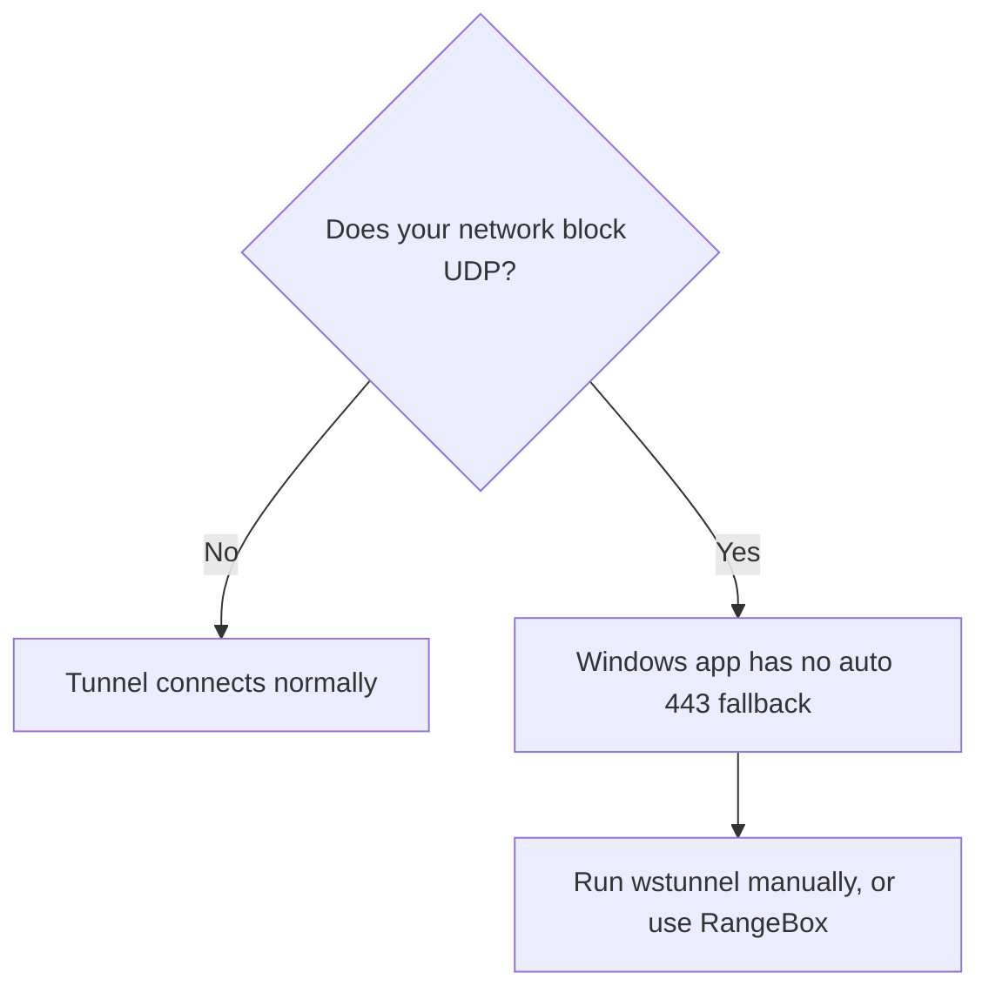

# Installing WireGuard on Windows

On Windows you use the official WireGuard application to import your config file and activate the tunnel. The platform does not ship a Windows setup panel; the config you download is standard WireGuard and imports without editing. Follow this page to connect from a Windows machine.

## Prerequisites

- Your config file `ocr-vpn.conf` downloaded. See [02_Downloading_Your_VPN_Config.md](02_Downloading_Your_VPN_Config.md).
- Permission to install the WireGuard application on your machine.

## Steps

1. Install the WireGuard application from wireguard.com for Windows, then open it.

2. Click **Add Tunnel** (the arrow next to it offers **Import tunnel(s) from file**), then select your `ocr-vpn.conf` file.

3. With the new tunnel selected, click **Activate**.

**What you should see.** The tunnel row turns active and shows a public key, the lab subnets under the allowed IPs, and a **Latest handshake** time once traffic flows. Your VPN IP from the platform appears in the tunnel detail. Return to the VPN setup page and the status reads **Registered**.

## Where Windows differs from Linux

The config file carries shell hooks that install a port 443 fallback and a passive lab mirror. The Windows application does not run those hooks, so the diagram below applies.

| Feature | Linux command line | Windows app |
| --- | --- | --- |
| Split-tunnel routing of lab subnets | Yes | Yes |
| Automatic 443 fallback on UDP-blocked networks | Yes | No |
| Passive lab mirror interface | Yes | No |

!!! warning
    On a network that blocks UDP, the Windows app does not fall back to port 443 on its own. If your handshake never completes, your network may be blocking UDP. Use [01_VPN_Overview.md](01_VPN_Overview.md) RangeBox, or run wstunnel by hand if you are comfortable doing so.

!!! note
    Re-downloading the config gives you the same keys and VPN IP, so you can re-import it without re-registering.

## Next step

Confirm the connection works: [07_Testing_Your_Connection.md](07_Testing_Your_Connection.md). For problems, see [08_Troubleshooting_VPN_Issues.md](08_Troubleshooting_VPN_Issues.md).
