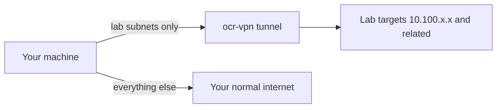

# Connecting to the VPN

Bringing the tunnel up joins your machine to the lab network so your tools can reach a running lab. Your peer is already registered from when you downloaded the config, so connecting is a single action. Do this each time you sit down to work on labs.

## Prerequisites

- WireGuard installed and your config in place. See [03_Installing_WireGuard_on_Linux.md](03_Installing_WireGuard_on_Linux.md), [04_Installing_WireGuard_on_Windows.md](04_Installing_WireGuard_on_Windows.md), or [05_Installing_WireGuard_on_macOS.md](05_Installing_WireGuard_on_macOS.md).

## Steps

### Linux

1. Bring the tunnel up:

        sudo wg-quick up ocr-vpn

2. Watch the output for the `ip link` and `ip route add` lines that set up the interface and the lab routes.

### Windows and macOS

1. Open the WireGuard application.

2. Select the `ocr-vpn` tunnel and click **Activate**.

**What you should see.** On the VPN setup page, the VPN Configuration card status reads **Registered**, and the page reflects a live connected signal once a handshake completes. On Linux, the `wg-quick up` output ends with route lines for the lab subnets.

## What connecting changes

The diagram below shows what the tunnel routes and what it leaves alone.

The tunnel routes only the lab subnets. Your internet traffic stays on your regular connection, so the VPN does not slow down or reroute your browsing.

!!! note
    The connected status is read live from the platform's peer manager, not cached, so it stays consistent no matter which page you refresh.

!!! warning
    On Linux, if `wg-quick up` reports `ocr-vpn already exists`, a stale connection is registered. Run `sudo nmcli connection delete ocr-vpn 2>/dev/null; sudo wg-quick up ocr-vpn`. The `nmcli` step applies to systems that use NetworkManager.

!!! tip
    On a network that blocks UDP, the Linux command-line tunnel falls back to an HTTPS connection on port 443, so the first connect is slower. The Windows and macOS apps do not do this automatically; see their install pages.

## Next step

Confirm you can reach a lab: [07_Testing_Your_Connection.md](07_Testing_Your_Connection.md). For failures, see [08_Troubleshooting_VPN_Issues.md](08_Troubleshooting_VPN_Issues.md).
