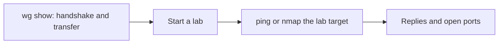

# Testing Your Connection

Confirming the tunnel works has two parts: checking that WireGuard has a handshake, and reaching a real lab target. The platform has no student-facing test button; the only platform signals are the status pill on the VPN setup page and the live connected indicator. Use this page after you bring the tunnel up.

## Prerequisites

- The tunnel up and the VPN setup page status reading **Registered**. See [06_Connecting_to_the_VPN.md](06_Connecting_to_the_VPN.md).

## Steps

1. Check the handshake. On Linux:

        sudo wg show

    On Windows and macOS, read the **Latest handshake** field in the WireGuard application.

2. Start a lab from the Exercises page so there is a live target to reach. See [../02_Student_Guide/04_Launching_a_Lab.md](../02_Student_Guide/04_Launching_a_Lab.md).

3. Reach the lab target. Ping or scan its address on the lab subnet:

        ping 10.100.0.10
        nmap 10.100.0.0/24

    Use the target address shown on your lab's page.

**What you should see.** `wg show` lists a recent **latest handshake** time and a **transfer** line with received bytes. The ping returns replies, and the scan lists open ports on the lab target.

## How testing maps to the connection

The flow below shows the order the checks confirm.

## Expected signals

| Check | Healthy result | What it means |
| --- | --- | --- |
| Status pill | Registered | Your peer is known to the platform |
| `wg show` handshake | Recent time | The tunnel completed a handshake |
| `wg show` transfer | Received bytes greater than 0 | Traffic is flowing both ways |
| ping or nmap of target | Replies or open ports | You can reach the running lab |

!!! note
    A handshake can appear before any lab is running. A connected tunnel with no reachable target usually means you have not started a lab yet. Start one from Exercises, then scan.

!!! warning
    Your connectivity test is the command-line check above plus the status pill on the VPN page. There is no diagnostics button to press.

## If a check fails

- No handshake or no transfer: see [04_VPN_Connection_Problems.md](../07_Troubleshooting/04_VPN_Connection_Problems.md).
- Handshake but no route to the target: see [05_Cannot_Reach_Lab_Target.md](../07_Troubleshooting/05_Cannot_Reach_Lab_Target.md).
- General VPN issues: see [08_Troubleshooting_VPN_Issues.md](08_Troubleshooting_VPN_Issues.md).
