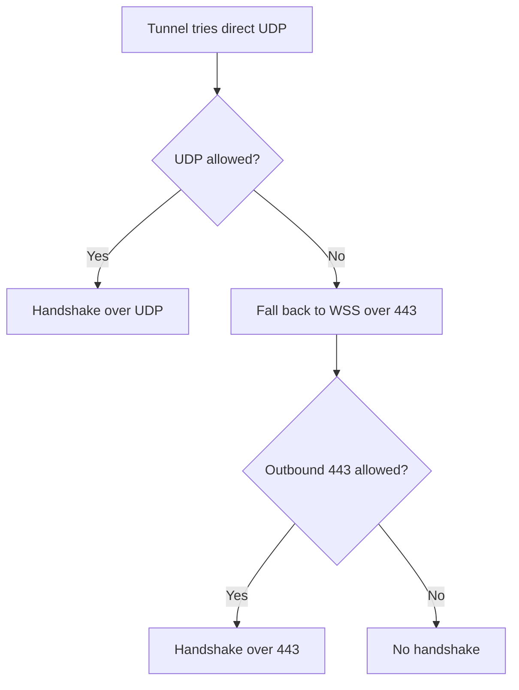

# Troubleshooting VPN Issues

Most VPN problems fall into a short list of symptoms with known fixes, and the same table appears in the VPN setup page's Linux Setup Instructions panel. Use this page when a command errors, the handshake never completes, or the tunnel is up but you cannot reach a lab.

## Prerequisites

- WireGuard installed and your config in place. See [03_Installing_WireGuard_on_Linux.md](03_Installing_WireGuard_on_Linux.md).

## Symptom, cause, and fix

| Symptom | Cause | Fix |
| --- | --- | --- |
| `RTNETLINK answers: Operation not permitted` | Command run without privileges | Run the command with `sudo` |
| `Unable to access interface` | WireGuard is not installed | Install it: `sudo apt update && sudo apt install wireguard -y` |
| `ocr-vpn already exists` | A stale connection is registered | `sudo nmcli connection delete ocr-vpn 2>/dev/null; sudo wg-quick up ocr-vpn` |
| No handshake appears | Outbound traffic is blocked | Allow outbound HTTPS on port 443 on your network |
| No route to 10.100.x.x | Routes did not apply | Restart the tunnel: `sudo wg-quick down ocr-vpn && sudo wg-quick up ocr-vpn` |
| Connected but no lab traffic | No lab is running | Start a lab from Exercises, then scan with `nmap` |

## Why allowing port 443 fixes a missing handshake

On a network that blocks UDP, the Linux command-line tunnel wraps WireGuard inside an HTTPS connection on port 443. The decision flow below shows why outbound 443 must be allowed.

!!! note
    The fallback over port 443 runs only on the Linux command-line setup. On the Windows and macOS apps, a UDP-blocked network has no automatic fallback; use [01_VPN_Overview.md](01_VPN_Overview.md) RangeBox instead.

!!! warning
    The `nmcli` fix applies to Linux systems that use NetworkManager. On other systems, bring the tunnel down with `sudo wg-quick down ocr-vpn` before bringing it back up.

!!! tip
    If the status pill reads **Registered** but you still cannot reach a lab after restarting the tunnel and starting a lab, ask an administrator to re-sync your VPN peer.

## Related troubleshooting

- Cannot complete a handshake: [04_VPN_Connection_Problems.md](../07_Troubleshooting/04_VPN_Connection_Problems.md).
- Tunnel up but target unreachable: [05_Cannot_Reach_Lab_Target.md](../07_Troubleshooting/05_Cannot_Reach_Lab_Target.md).
- Confirming a healthy connection: [07_Testing_Your_Connection.md](07_Testing_Your_Connection.md).
