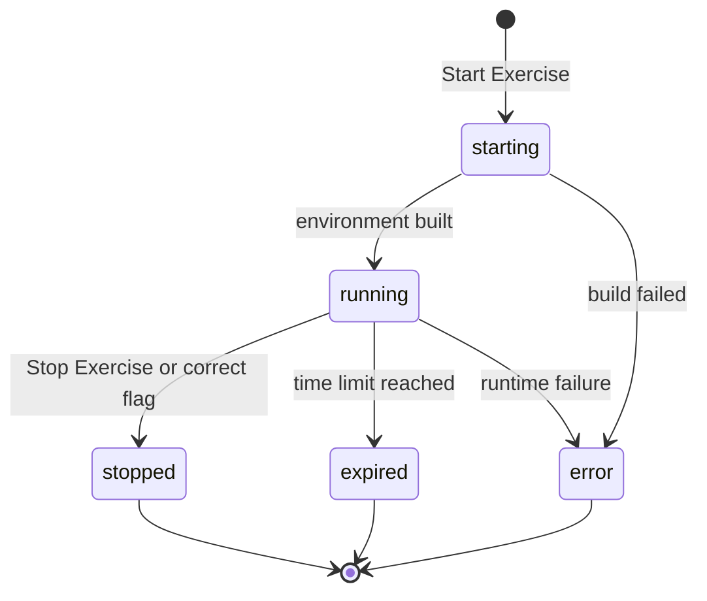

# Lab Lifecycle Overview

A lab session is the running environment behind an exercise: the Docker network and containers that hold the target you attack. The lifecycle describes how that session is born when you start an exercise, how it lives while you work, and how it ends when you finish, stop, or run out of time. Read this page when you want to understand what the platform does behind the Start and Stop buttons.

## Prerequisites

- [Launching a Lab](../02_Student_Guide/04_Launching_a_Lab.md)
- [Connecting via VPN](../02_Student_Guide/05_Connecting_via_VPN.md)

## One session at a time

You can have only one active lab session. If you try to start a second exercise while a session is already starting or running, the platform refuses with "You already have an active lab session. Please stop it first." Stop the current lab before you launch another.

## The happy path

Starting an exercise creates a session marked `starting`, then the platform builds the Docker network and containers. Once the environment is up, the session flips to `running` and a target subnet is assigned. You work until you submit the correct flag or click Stop Exercise, at which point the session is set to `stopped` and the environment is torn down in the background.

The state machine below shows the session moving from start to its end states.



## What happens when you submit a correct flag

A correct flag completes the lab and auto-stops the session. The platform records the completion, sets the session to `stopped`, and tears down the environment in the background. You do not get a separate "keep exploring" window after a correct flag, so capture anything you still need before you submit. See [Flag Format and Submission Rules](03_Flag_Format_and_Submission_Rules.md).

## How expired sessions are cleaned up

A background loop runs about every two minutes. The loop finds sessions whose clock has passed their expiry time, tears down their environments, and marks them `expired`. Because the sweep is periodic, an expired session can linger for up to about two minutes before the environment is actually destroyed.

The sequence below shows the sweep tearing down an expired session.

```mermaid
sequenceDiagram
    participant Loop as Cleanup loop
    participant DB as Session store
    participant Docker as Lab environment
    Loop->>DB: find running sessions past expiry
    DB-->>Loop: expired session list
    Loop->>Docker: destroy lab environment
    Loop->>DB: set status expired, set stopped_at
```

!!! note
    Session state lives in the database, not in any single server process, so the status you see is consistent no matter which backend worker answers your request.

!!! warning
    A session stuck in `starting` for more than five minutes is force-marked `error` by the cleanup loop. If your launch hangs, see [Lab Fails to Start](../07_Troubleshooting/03_Lab_Fails_to_Start.md).

## Related pages

- [Lab Statuses Explained](06_Lab_Statuses_Explained.md)
- [Time Limits and Expiration](05_Time_Limits_and_Expiration.md)
- [Stopping a Lab](../02_Student_Guide/10_Stopping_a_Lab.md)
