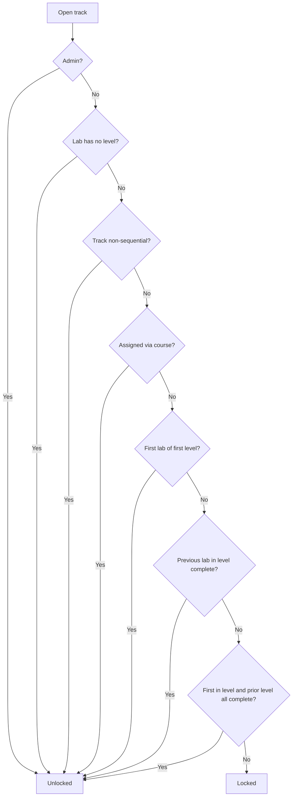

# How Prerequisite Unlocking Works

Some tracks gate their exercises so you complete them in order: a lab stays locked until you finish the one before it. Other tracks leave everything open, and labs assigned through a course ignore locking entirely. Read this page when an exercise shows a lock icon and you want to know what unlocks it.

## Prerequisites

- [Understanding Tracks, Levels, and Labs](../02_Student_Guide/03_Understanding_Tracks_Levels_and_Labs.md)
- [Browsing Exercises](../02_Student_Guide/02_Browsing_Exercises.md)

## What a locked exercise looks like

On a track page, a locked exercise shows a lock icon and the text "Complete previous exercise." You cannot open or start it until its prerequisite is satisfied. Completed exercises show a filled bar, and the next exercise you should do is marked as current.

## When a lab is unlocked

The platform decides whether a lab is unlocked by walking a short series of checks. The first one that matches wins.

| Check | Result |
|-------|--------|
| You are an admin | Unlocked (admins bypass all gating) |
| The lab has no level | Unlocked |
| The track is non-sequential | Unlocked (the whole track is open) |
| The lab was assigned through your course | Unlocked (course assignment bypasses sequencing) |
| The lab is the first active lab of the first level | Unlocked |
| The previous active lab in the same level is completed | Unlocked |
| The lab is the first of a level and every active lab in the previous level is completed | Unlocked |
| None of the above | Locked |

The flow below shows the order of these checks.

## What counts as completed

A lab counts toward unlocking only when you have submitted a correct flag for it. Opening a lab, using hints, or running out of time does not count. See [Flag Format and Submission Rules](03_Flag_Format_and_Submission_Rules.md).

!!! note
    The order of exercises follows each lab's sort order, not the date it was created. An admin who reorders a level changes which lab unlocks which.

!!! tip
    Inactive labs are skipped in the chain, so a disabled exercise in the middle of a level does not permanently block the labs after it.

!!! warning
    A course-assigned lab is unlocked regardless of your track progress. If a lab opens "out of order," it is almost always one your instructor assigned through a course. See [Course Labs and Assignments](../02_Student_Guide/13_Course_Labs_and_Assignments.md).

## Related pages

- [Lab Lifecycle Overview](01_Lab_Lifecycle_Overview.md)
- [Tracking Your Progress](../02_Student_Guide/11_Tracking_Your_Progress.md)
