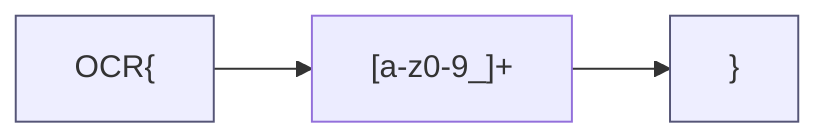
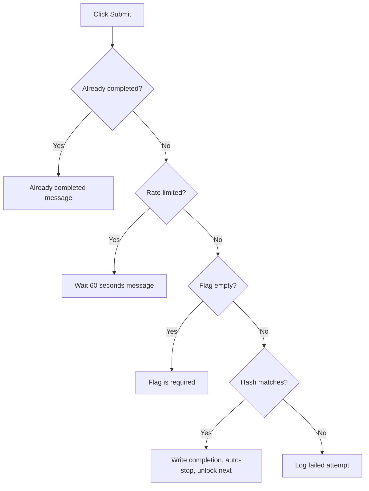

# Flag Format and Submission Rules

A flag is the proof that you solved an exercise. You find it inside the lab target, paste it into the Submit Flag box, and the platform checks it. Read this page to learn the exact flag format, how the check works, and the rules that govern how often you can submit.

## Prerequisites

- [Working Inside a Lab](../02_Student_Guide/06_Working_Inside_a_Lab.md)
- [Submitting Flags](../02_Student_Guide/07_Submitting_Flags.md)

## Flag format

Every flag has the same shape: the literal text `OCR`, an open brace, a token, and a close brace, for example `OCR{...}`. The token allows lowercase letters, digits, and underscores only. The full pattern is `^OCR{[a-z0-9_]+}$`.

The anatomy below shows the parts of a flag.

## Submission rules

The table lists the rules the platform applies to a submission.

| Rule | Behavior |
|------|----------|
| Format | Must match `OCR{...}` with a lowercase letter, digit, and underscore token |
| Case | Case-sensitive; submit the flag exactly as the lab emits it |
| Whitespace | Leading and trailing whitespace is trimmed before checking |
| Empty input | Returns "Flag is required" |
| Rate limit | Submitting too fast returns "Too many attempts. Please wait 60 seconds." |
| Correct flag | Records the completion and auto-stops the running session |
| Already completed | Returns "You have already completed this lab!" and still stops any running session |

## How the check works

When you submit, the platform trims whitespace, hashes your input, and compares the hash to the stored flag hash using a constant-time comparison. On a match it writes a completion that records your attempt count, hints used, and time spent, then auto-stops the session. The next exercise in a sequential track unlocks after a correct flag.

The decision flow below shows the path a submission takes.

!!! warning
    Uppercase letters or special characters inside the token make a flag invalid. Copy the flag exactly as the target prints it; do not retype it.

!!! tip
    If a flag you believe is correct is rejected, check for a trailing newline or a copied space, then confirm the case. See [Flag Not Accepted](../07_Troubleshooting/06_Flag_Not_Accepted.md).

## Related pages

- [Lab Lifecycle Overview](01_Lab_Lifecycle_Overview.md)
- [Scoring System Explained](04_Scoring_System_Explained.md)
