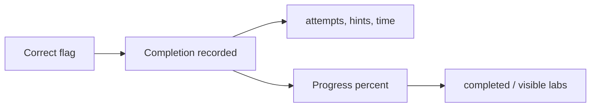
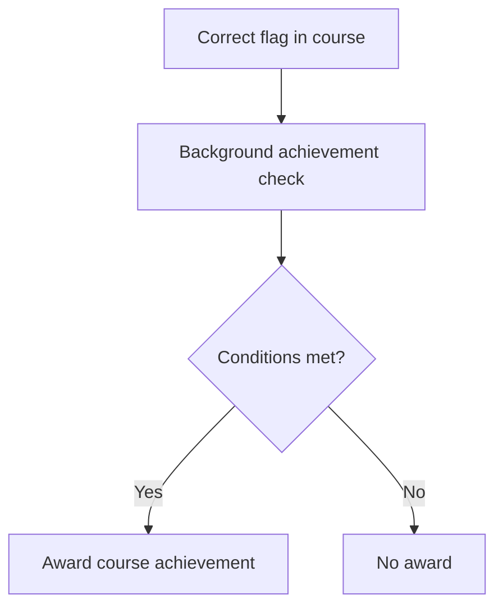

# Scoring System Explained

The platform measures your work as completion and progress, not as a numeric point total. Finishing an exercise marks it done, your progress is the share of exercises you have completed, and course play can earn achievements. Read this page to understand exactly what is counted, what is not, and where achievements come from.

## Prerequisites

- [Tracking Your Progress](../02_Student_Guide/11_Tracking_Your_Progress.md)
- [Flag Format and Submission Rules](03_Flag_Format_and_Submission_Rules.md)

## There is no point score

The platform does not assign a numeric point value to a lab and does not rank you by points. Completion is binary: a lab is either done or not done. A lab's difficulty label (beginner, intermediate, advanced, expert) describes the exercise; it is not a score multiplier.

## What completion records

A lab counts as completed when you submit a correct flag. Along with the completion, the platform records metadata for that lab: the number of attempts, hints used, and time spent. The metadata describes how you solved the lab; it does not add to or subtract from any score.

The model below shows a correct flag producing a completion and feeding your progress percentage.

## How progress is calculated

Your progress is the count of completed labs divided by the labs visible to you, expressed as a rounded percentage. The Student Dashboard shows your overall progress and recent completions, and each track page shows a Completed count for that track. See [Student Dashboard](../02_Student_Guide/01_Student_Dashboard.md).

## Achievements are course-scoped

Achievements are the closest thing to a score, and they exist only inside a course. After you submit a correct flag in a course, a background check awards any achievements you earned. The achievement types are first blood, no hints, perfectionist, speed demon, and streak.

The flow below shows the achievement check running after a correct flag.

!!! warning
    Achievements require a course. Playing a public track outside any course earns zero achievements, even with a perfect, no-hint run.

!!! note
    Achievements and badges are the same thing: the course-scoped icons shown on your course view. There is no global badge wall across the platform.

## Related pages

- [Achievements and Badges](../02_Student_Guide/15_Achievements_and_Badges.md)
- [Viewing the Scoreboard](../02_Student_Guide/14_Viewing_the_Scoreboard.md)
- [Course Labs and Assignments](../02_Student_Guide/13_Course_Labs_and_Assignments.md)
