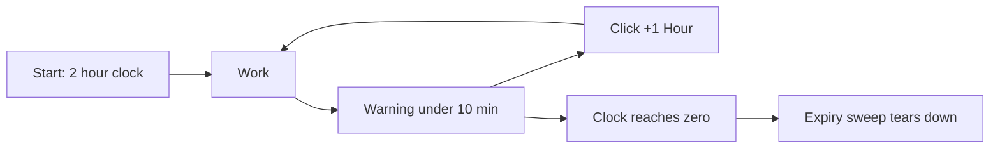

# Time Limits and Expiration

A lab session runs on a clock. A standard Docker lab gives you two hours, you can add time with a button while it runs, and an expired session is torn down automatically. Read this page to learn the timing rules and how to extend a session.

## Prerequisites

- [Launching a Lab](../02_Student_Guide/04_Launching_a_Lab.md)
- [Extending a Lab Session](../02_Student_Guide/09_Extending_a_Lab_Session.md)

## The default clock

A Docker lab starts with a two-hour clock. The active-lab panel shows a countdown timer. The timer switches to a warning style when fewer than ten minutes remain, so you have a clear cue to extend or wrap up.

## Extending a Docker lab

While the session is running, click the "+1 Hour" button to add exactly one hour. You can click it again as the clock runs down; there is no fixed cap on extensions for a standard Docker lab.

The timeline below shows the default clock, the warning cue, and the extend action.

!!! note
    The "+1 Hour" button works only while the session status is `running`. A session still in `starting` returns "No active lab session found" if you try to extend it.

## How expiration is enforced

A background loop runs about every two minutes. When the loop finds a session past its clock, it destroys the environment and marks the session `expired`. Because the sweep is periodic, teardown can lag up to about two minutes after the clock hits zero.

!!! warning
    An expired session cannot be recovered. If your work depends on a result inside the lab, save or copy it before the timer runs out. See [Session Expired Unexpectedly](../07_Troubleshooting/07_Session_Expired_Unexpectedly.md).

## Related pages

- [Lab Lifecycle Overview](01_Lab_Lifecycle_Overview.md)
- [Lab Statuses Explained](06_Lab_Statuses_Explained.md)
