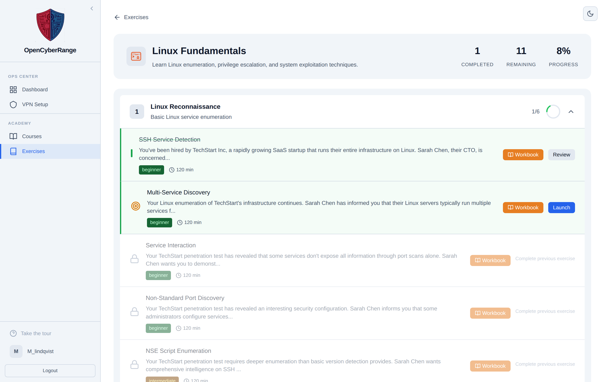
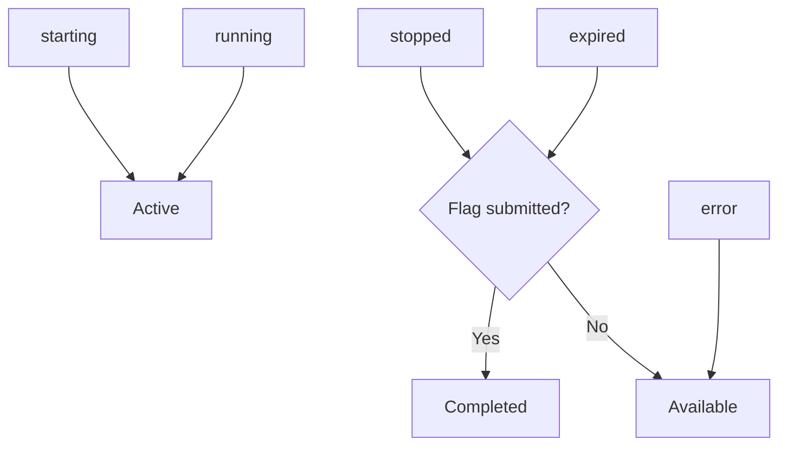

# Lab Statuses Explained

The platform tracks two separate things with similar-sounding labels: the status of a running session and the state of a lab row on a track page. The session status describes a real environment; the row state describes a lab relative to your progress. Read this page when a status word is unclear or when a lab shows as completed even though nothing is running.

## Prerequisites

- [Lab Lifecycle Overview](01_Lab_Lifecycle_Overview.md)
- [Browsing Exercises](../02_Student_Guide/02_Browsing_Exercises.md)

## The five session statuses

A lab session carries exactly one of five statuses. The table lists each one and what it means.

| Session status | Meaning |
|----------------|---------|
| starting | The environment is being built; not yet reachable |
| running | The environment is up and you can work in it |
| stopped | You stopped it, or a correct flag auto-stopped it |
| expired | The clock ran out and the cleanup loop tore it down |
| error | The build failed, or a stuck start was force-cleared |

## The track row states

A track page shows each lab as a row with its own state. Row states describe the lab relative to your progress, not a live environment.

The track page below shows lab rows in several states.

<figure markdown>

<figcaption>A track page with lab rows in various states, including a completed bar, the current lab, and a locked exercise.</figcaption>
</figure>

| Row state | Meaning |
|-----------|---------|
| Completed | You submitted a correct flag for this lab |
| Active | A session for this lab is open right now |
| Current | The next lab you should do in the track |
| Locked | A prerequisite is not met yet |
| Available | Unlocked but not started |

## How the two layers relate

A session status and a row state are not the same list. The mapping below shows where session statuses surface as row states.

!!! note
    A lab can show as Completed with no session at all. The row state remembers your correct flag long after the environment is gone.

!!! warning
    Do not read too much into the difference between stopped and expired. Stopped means you or a correct flag ended the session; expired means the two-hour clock ran out and the cleanup loop killed it. Both end states leave no running environment. See [Session Expired Unexpectedly](../07_Troubleshooting/07_Session_Expired_Unexpectedly.md).

## Related pages

- [How Prerequisite Unlocking Works](02_How_Prerequisite_Unlocking_Works.md)
- [Time Limits and Expiration](05_Time_Limits_and_Expiration.md)
- [Lab Fails to Start](../07_Troubleshooting/03_Lab_Fails_to_Start.md)
