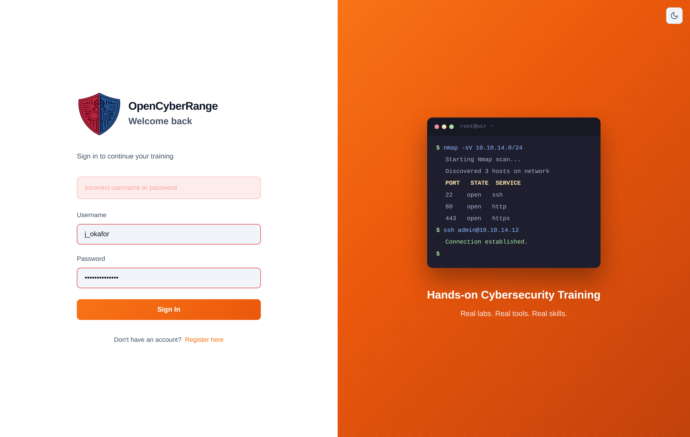
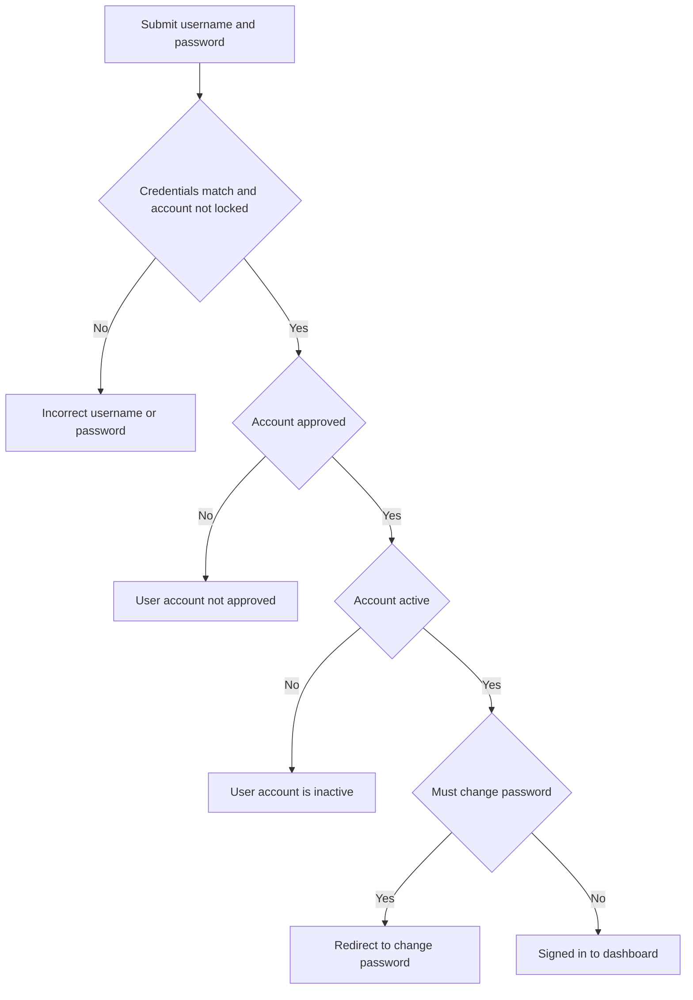

# Login Issues

Use this page when you cannot sign in to the platform. The login form takes your **username** and **password**, and a failed attempt returns a single generic message regardless of the underlying cause, so the steps below walk through the cases you cannot tell apart from the screen alone.

## Prerequisites

- A registered account that an administrator has approved. See [Registering an Account](../01_Getting_Started/04_Registering_an_Account.md).
- The correct login URL for your platform instance.

## Where you sign in

The login screen lives at `/login`. Enter your username (not your email) and password, then submit.

<figure markdown>

<figcaption>The login screen accepts your username and password; a failed sign in shows one generic error.</figcaption>
</figure>

## Symptom, cause, and fix

| Symptom | Likely cause | Fix |
| --- | --- | --- |
| "Incorrect username or password" | Wrong password, wrong username, or a locked account (the message is the same for all three) | Re-enter your password carefully, confirm you typed your username and not your email, then read [Account Locked](02_Account_Locked.md) if it persists |
| Password rejected even though you are sure it is right | Caps Lock on, or a trailing space; the password is case-sensitive | Retype the password with Caps Lock off and no leading or trailing space |
| Sign in fails when you enter your email | The form expects your username, not your email | Use the username you chose at registration |
| "User account not approved. Please wait for admin approval." | The account exists but an administrator has not approved it yet | Wait for approval; an administrator clears it from the pending list |
| "User account is inactive" | An administrator deactivated the account | Contact an administrator to reactivate it |
| You land on a change-password screen | The account is flagged to change its password on first sign in | Set a new password; after the change the flag clears and you reach the dashboard. See [Changing Your Password](../02_Student_Guide/17_Changing_Your_Password.md) |
| Repeated quick attempts start failing instantly | Login is rate limited to about 10 attempts per minute per source | Wait a minute, then try again slowly |

!!! warning
    A locked account returns the same "Incorrect username or password" message as a simple typo. The platform does this on purpose so that an outsider cannot tell whether a username exists or is locked. If your correct password keeps failing, assume a lock and read [Account Locked](02_Account_Locked.md).

!!! note
    Registration is open but gated on manual administrator approval. There is no email verification step and no second factor to clear; you wait only for an administrator to approve the account.

## Login decision flow

The diagram below shows how the platform decides whether to issue you a session.

## Related pages

- [Account Locked](02_Account_Locked.md)
- [Logging In](../01_Getting_Started/05_Logging_In.md)
- [Changing Your Password](../02_Student_Guide/17_Changing_Your_Password.md)
