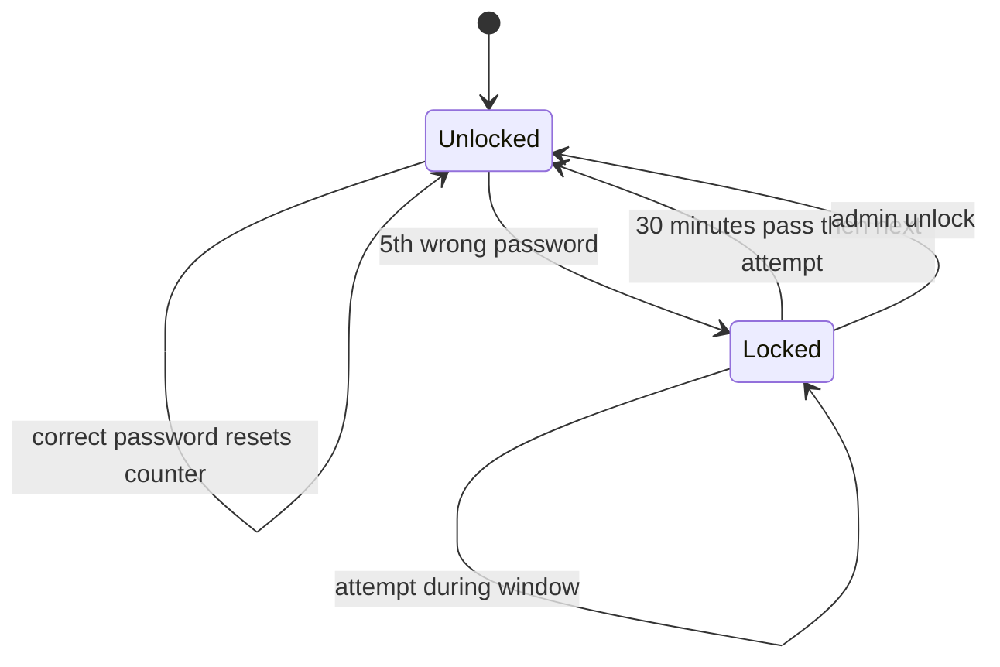

# Account Locked

Use this page when five wrong passwords in a row lock your account. A lock blocks sign in for 30 minutes, and the login screen does not announce the lock: it returns the same generic error as any other failed attempt. The steps below explain how the lock clears and what an administrator can do.

## Prerequisites

- An approved account. See [Registering an Account](../01_Getting_Started/04_Registering_an_Account.md).
- Access to an administrator if you cannot wait out the lock window.

## How the lock works

After five consecutive wrong passwords, the platform locks the account and records the lock time. While locked, every sign in fails with "Incorrect username or password", even when you finally type the correct password.

<figure markdown>


<figcaption>A locked account shows the same generic error as a wrong password; there is no separate lock notice.</figcaption>
</figure>

## Symptom, cause, and fix

| Symptom | Cause | Fix |
| --- | --- | --- |
| Correct password keeps failing with the generic error | Five failed attempts locked the account | Wait 30 minutes, then sign in once with the correct password |
| Still locked after waiting | The lock clears on the first attempt after the window, not on a timer | Make one sign in attempt with the correct password; that attempt clears the lock and logs you in |
| You cannot wait 30 minutes | A lock window is in force | Ask an administrator to unlock the account from the Admin Users panel |
| An administrator locked the account manually | A manual lock has no expiry time, so it does not auto-clear | An administrator must unlock it manually |
| Every administrator account is locked out | All admins hit the lock at once | Run a direct database update to clear `is_locked` and reset `failed_attempts` for the affected rows |

To clear an all-admins-locked situation from the database:

```sql
UPDATE users SET is_locked = false, failed_attempts = 0 WHERE username = 'testadmin';
```

!!! note
    Auto-unlock is lazy. The platform does not run a timer that flips the lock off at the 30-minute mark; it clears the lock the next time you try to sign in after the window has passed. If you keep trying during the window, each attempt fails and does not extend the lock.

!!! tip
    A successful sign in resets the failed-attempt counter to zero, so once you are back in you start fresh.

## Admin unlock

An administrator opens the Admin Panel, goes to the Users list, finds the account, and selects **Unlock**. The unlock clears the lock flag and resets the failed-attempt counter immediately.

## Lockout state machine

The diagram below shows how an account moves between the unlocked and locked states.



## Related pages

- [Login Issues](01_Login_Issues.md)
- [Logging In](../01_Getting_Started/05_Logging_In.md)
