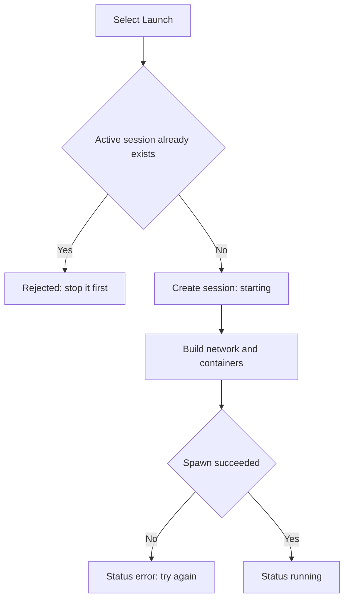

# Lab Fails to Start

Use this page when **Launch** does not bring a lab to the running state. A lab can stall on the starting status, refuse to start because another session is already active, or fail with an error. The causes and fixes below map each outcome to a recovery step.

## Prerequisites

- You are signed in and viewing a track or course exercise page. See [Launching a Lab](../02_Student_Guide/04_Launching_a_Lab.md).
- You understand the lab lifecycle. See [Lab Lifecycle Overview](../06_Lab_Workflow_Reference/01_Lab_Lifecycle_Overview.md).

## How a launch proceeds

When you select **Launch**, the platform creates a session in the starting status, builds the network and containers, and moves the session to running. Only one active lab session is allowed at a time.

## Symptom, cause, and fix

| Symptom | Cause | Fix |
| --- | --- | --- |
| "You already have an active lab session. Please stop it first." | A lab is already running under your account | Stop the running lab with **Stop Exercise**, then launch the new one |
| Stuck on the starting status for a minute or two | The container image is being pulled or built for the first time | Wait; the first build of a large image is slow, and later launches reuse the cached image |
| "Failed to start lab environment. Please try again or contact an administrator." | The spawn raised an error and the session was set to the error status | Select **Stop Exercise** to clear it, then launch again; if it repeats, contact an administrator |
| Lab session sits in the error status | A previous spawn failed | Stop the errored session, then relaunch |
| Lab starts but a browser RangeBox is missing | RangeBox capacity was exhausted | The lab still runs; RangeBox is disabled silently and you connect over the VPN instead. See [Connecting via VPN](../02_Student_Guide/05_Connecting_via_VPN.md) |

!!! note
    A RangeBox capacity shortage does not fail the lab. The platform disables RangeBox for that session and the lab continues, so connect through the VPN if the in-browser desktop does not appear.

!!! warning
    Only one active session is allowed. If you try to launch a second lab while one runs, the platform rejects it with the active-session message rather than starting both.

## Lab start decision flow

The diagram below shows how a launch resolves to running, an error, or a rejection.

## Related pages

- [Launching a Lab](../02_Student_Guide/04_Launching_a_Lab.md)
- [Lab Statuses Explained](../06_Lab_Workflow_Reference/06_Lab_Statuses_Explained.md)
- [Stopping a Lab](../02_Student_Guide/10_Stopping_a_Lab.md)
