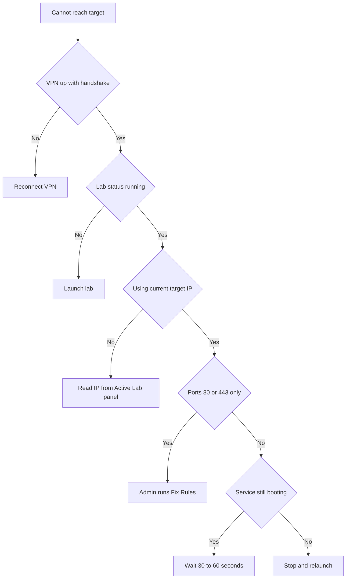

# Cannot Reach Lab Target

Use this page when the tunnel is up but pings, scans, or browser requests to a lab target time out. The target lives on an isolated per-user subnet, and several conditions can block reachability: the VPN, the lab status, a stale IP, services still booting, or firewall rule ordering on ports 80 and 443. Work through the table to find which one applies.

## Prerequisites

- A running lab. See [Launching a Lab](../02_Student_Guide/04_Launching_a_Lab.md).
- A working VPN tunnel. See [VPN Connection Problems](04_VPN_Connection_Problems.md).
- The target IP from the Active Lab panel. See [Working Inside a Lab](../02_Student_Guide/06_Working_Inside_a_Lab.md).

## Where to find the target IP

The Active Lab panel on the exercise page lists the target IP or IPs for your running session. Targets sit on a per-user subnet in the 10.100 family. The panel also shows a hosts-file hint when a lab uses a hostname.

## Symptom, cause, and fix

| Symptom | Cause | Fix |
| --- | --- | --- |
| All traffic to the target times out | The VPN is down or has no handshake | Reconnect the tunnel. See [VPN Connection Problems](04_VPN_Connection_Problems.md) |
| Nothing responds and the lab card looks idle | The lab is not in the running status | Launch the lab and confirm it shows running |
| You reach a different host than expected | You are using an IP from a previous session | Read the current target IP from the Active Lab panel; the subnet changes per session |
| Lab shows running but ports refuse for the first minute | Services inside the container are still booting | Wait 30 to 60 seconds after the running status, then retry |
| Ports 80 and 443 show closed while others respond | Firewall rule ordering for the relay is intercepting those ports | An administrator runs the firewall audit and selects **Fix Rules** to restore correct ordering |
| The target cannot reach the internet or your host LAN | Lab egress to the internet and host LAN is blocked on purpose | Expected behavior; design your work to stay inside the lab subnet |
| The lab network appears to be missing | A rare network-not-created condition from a prior crash | Stop the lab and launch it again |

!!! note
    Lab subnets are isolated from the internet, from the host LAN, and from the platform backend by design. Failure to reach the internet from inside a lab is not a bug; it keeps each student's environment contained.

!!! tip
    A target that has just reached the running status may still be starting its services. A short wait before scanning saves a false negative.

## Cannot reach target decision flow

The diagram below shows the order to check when a target will not respond.

## Related pages

- [VPN Connection Problems](04_VPN_Connection_Problems.md)
- [Working Inside a Lab](../02_Student_Guide/06_Working_Inside_a_Lab.md)
- [Lab Statuses Explained](../06_Lab_Workflow_Reference/06_Lab_Statuses_Explained.md)
