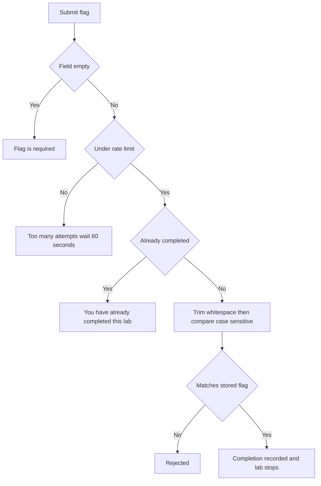

# Flag Not Accepted

Use this page when you submit a flag and the platform rejects it. The Submit Flag form compares your entry against the stored answer after trimming surrounding whitespace, and the comparison is case-sensitive. The most common cause is a case mismatch or a copy-paste artifact. The table below covers each rejection.

## Prerequisites

- A running lab with the Submit Flag form visible. See [Submitting Flags](../02_Student_Guide/07_Submitting_Flags.md).
- The expected flag format. See [Flag Format and Submission Rules](../06_Lab_Workflow_Reference/03_Flag_Format_and_Submission_Rules.md).

## How submission is checked

The Submit Flag form sits in the Active Lab panel with the placeholder `OCR{your_flag_here}`. On submit, the platform strips leading and trailing whitespace, then compares your flag against the stored value. The comparison preserves case, so `OCR{Abc}` and `OCR{abc}` are different flags.

## Symptom, cause, and fix

| Symptom | Cause | Fix |
| --- | --- | --- |
| Correct-looking flag is rejected | Case mismatch; the comparison is case-sensitive | Resubmit with the exact case the lab produced |
| Flag rejected after copy and paste | A hidden character or stray space rode along | Retype the flag, or paste then delete any trailing space |
| Flag rejected and you have the wrong braces | The format is `OCR{...}` with lowercase letters, digits, and underscores inside | Match the format exactly, including the `OCR{` prefix and closing brace |
| "Flag is required" | The field was empty on submit | Enter a flag before submitting |
| "Too many attempts. Please wait 60 seconds." | More than 10 submissions in a minute for this lab | Wait 60 seconds, then submit again |
| "You have already completed this lab!" | The lab is already complete | No action needed; the completion is recorded and the lab stops in the background |
| A flag from another lab is rejected | Each flag is unique to its lab | Submit the flag for the lab you are working in |

!!! warning
    Flag matching is case-sensitive. Whitespace around the flag is trimmed for you, but the letters inside the braces must match exactly. A single capital letter in the wrong place causes a rejection.

!!! note
    Some labs hand you an encoded value, such as Base64 or hex, that you must decode into the `OCR{...}` form before submitting. Decoding is part of those specific labs, not a platform behavior; the platform always expects the final decoded flag.

!!! tip
    A correct flag stops and tears down the lab automatically, so submit it only once you are ready to end the session.

## Flag validation flow

The diagram below shows how a submitted flag is checked.

## Related pages

- [Submitting Flags](../02_Student_Guide/07_Submitting_Flags.md)
- [Flag Format and Submission Rules](../06_Lab_Workflow_Reference/03_Flag_Format_and_Submission_Rules.md)
- [Scoring System Explained](../06_Lab_Workflow_Reference/04_Scoring_System_Explained.md)
