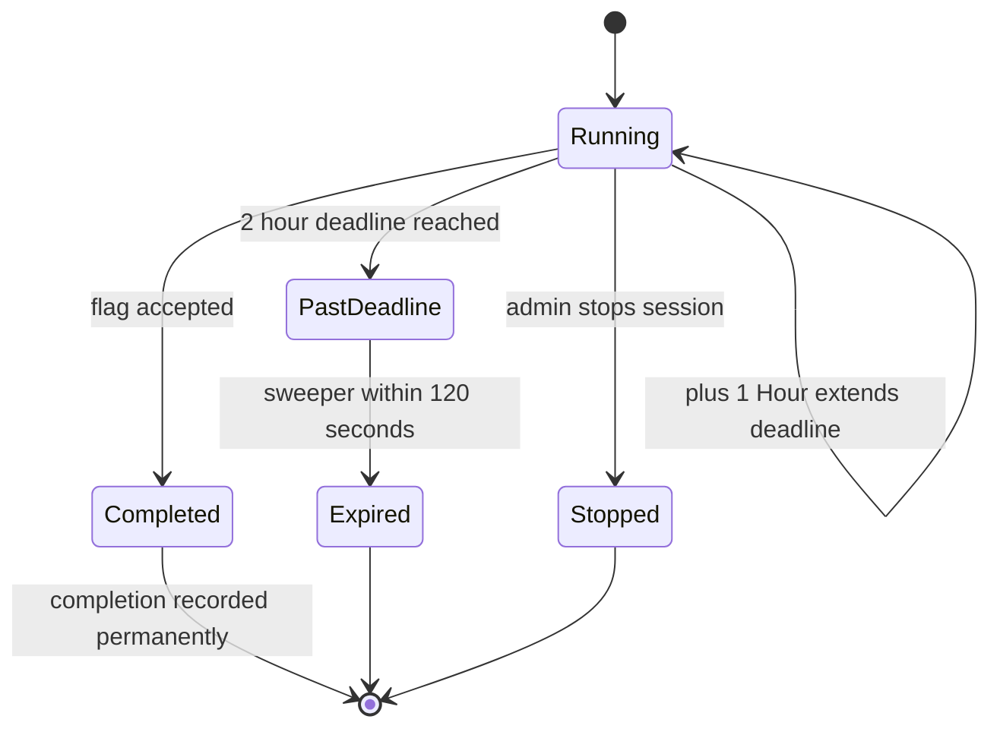

# Session Expired Unexpectedly

Use this page when a lab tears down before you expected it to, or when you want to keep one alive. A Docker lab session runs for 2 hours from launch, you can add time with **+1 Hour**, and an accepted flag is recorded permanently even after the session ends. The table below explains the timing and what survives an expiry.

## Prerequisites

- A running lab with the timer visible in the Active Lab panel. See [Extending a Lab Session](../02_Student_Guide/09_Extending_a_Lab_Session.md).
- The session timing rules. See [Time Limits and Expiration](../06_Lab_Workflow_Reference/05_Time_Limits_and_Expiration.md).

## How session timing works

A Docker lab session starts with a 2-hour lifetime. The Active Lab panel shows the time remaining, a **+1 Hour** button to add an hour, and a **Stop Exercise** button to end the session early. A background cleanup loop runs every 120 seconds; when it finds an expired session it stops the containers and marks the session expired.

## Symptom, cause, and fix

| Symptom | Cause | Fix |
| --- | --- | --- |
| Lab disappeared after about 2 hours | The 2-hour lifetime ran out and the sweeper tore it down | Launch the lab again; an accepted flag remains recorded |
| Session expired a minute or two past the timer | The sweeper polls every 120 seconds, so teardown can lag the deadline | Expected; do not count on teardown exactly at zero, and do not rely on the lag to finish work |
| Your work inside the container is gone | Container state is not preserved across expiry | Only an accepted flag persists; redo the work or submit the flag before time runs out |
| You added time but it still expired | The extend was applied late or the lab had already swept | Add time well before the timer reaches zero, since the containers are gone once it expires |
| Lab shows stopped, not expired | An administrator stopped the session | A manual stop sets the stopped status rather than expired |

!!! warning
    Work inside a lab container is lost when the session ends. Only a flag you submitted and the platform accepted is kept, because completion is written to a separate permanent record at submit time.

!!! tip
    The **+1 Hour** button works at any remaining time; there is no minimum left to use it. Extend early rather than waiting for the last minute, since once the session expires the containers cannot be recovered.

## Session expiry lifecycle

The diagram below shows how a running session reaches the expired state and what is preserved.

## Related pages

- [Extending a Lab Session](../02_Student_Guide/09_Extending_a_Lab_Session.md)
- [Time Limits and Expiration](../06_Lab_Workflow_Reference/05_Time_Limits_and_Expiration.md)
- [Lab Statuses Explained](../06_Lab_Workflow_Reference/06_Lab_Statuses_Explained.md)
