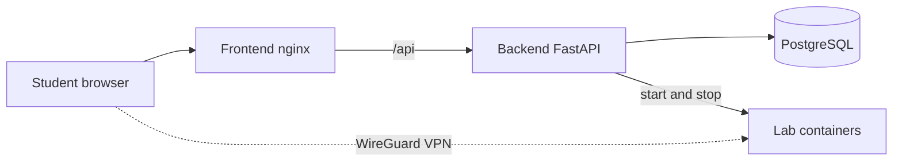

# OpenCyberRange User Manual

OpenCyberRange is a self-hosted platform for hands-on cybersecurity training. It
serves browser-based lab exercises, gates access to those labs behind a per-user
WireGuard VPN, organizes exercises into tracks and instructor courses, and gives
operators a full administrative console for users, sessions, and infrastructure.

The manual covers the whole platform from a student's first login through course
instruction and server administration. Read it top to bottom the first time, or
jump to the section that matches your role.

## How the platform fits together

A browser talks to an nginx frontend that serves the single-page application and
proxies the API. A FastAPI backend handles authentication, lab orchestration, and
course logic against a PostgreSQL database, and it drives Docker to start and stop
the lab containers each student works in. Students reach those lab containers over
a WireGuard VPN tunnel.

## Where to start

- New here? Begin with [Getting Started](01_Getting_Started/01_Platform_Overview.md).
- Working through exercises? See the [Student Guide](02_Student_Guide/01_Student_Dashboard.md)
  and the [VPN Setup Guide](05_VPN_Setup_Guide/01_VPN_Overview.md).
- Need the exact rules for flags, scoring, and lab timing? See the
  [Lab Workflow Reference](06_Lab_Workflow_Reference/01_Lab_Lifecycle_Overview.md).
- Something not working? See [Troubleshooting](07_Troubleshooting/01_Login_Issues.md).
- Teaching a course? See the [Instructor Guide](03_Instructor_Guide/01_Instructor_Dashboard.md).
- Running the server? See [Server Deployment](00_Server_Deployment/01_Prerequisites.md)
  and the [Admin Guide](04_Admin_Guide/01_Admin_Panel_Overview.md).
