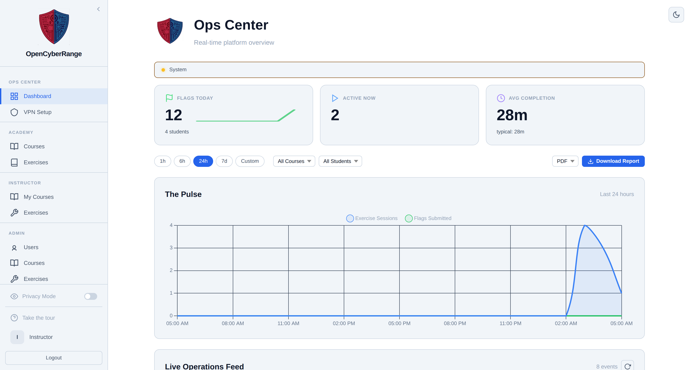
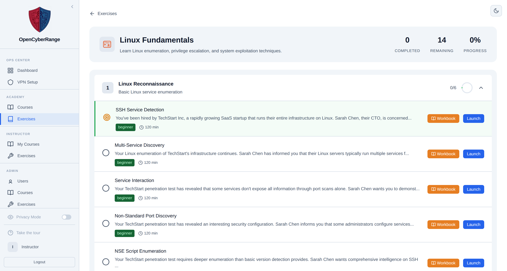
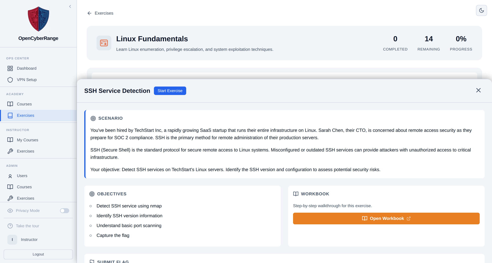
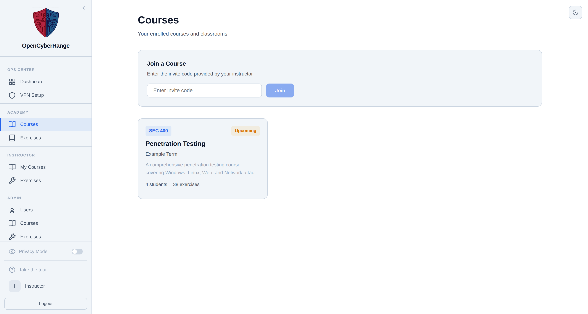
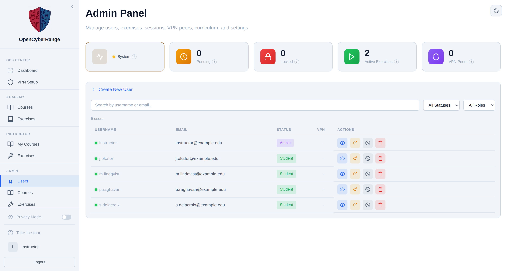
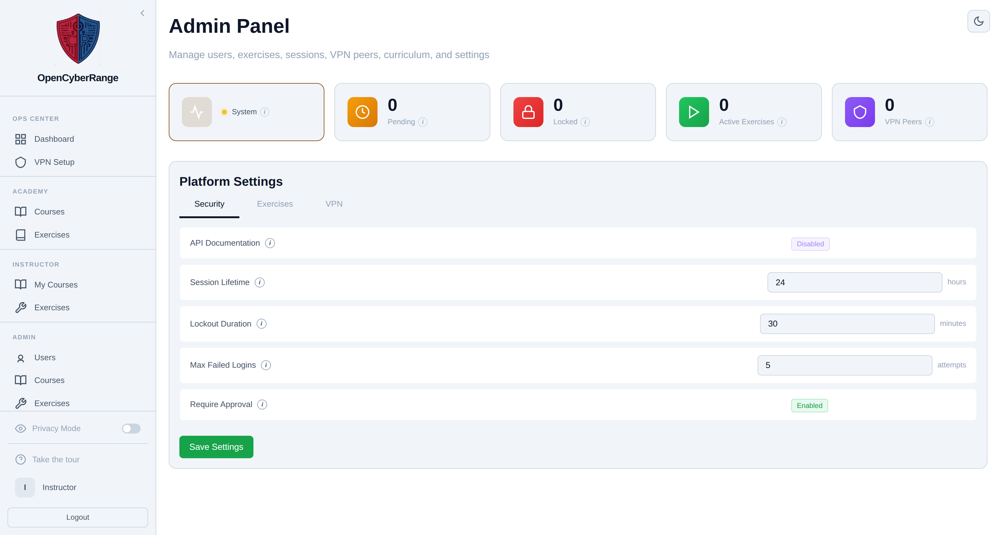

# OpenCyberRange

[](platform/labs/)
[](platform/labs/)
[](Manual-Lite/00_Server_Deployment/06_Architecture.md)
[](LICENSE)

A self-hosted cybersecurity training platform that deploys hands-on exercises inside isolated Docker containers. Students connect over WireGuard VPN, solve challenges across instructor-defined tracks, and submit flags for automated scoring. The platform ships with foundational exercises spanning penetration testing, network forensics, web exploitation, and more.




## What it looks like

**Exercise catalogue.** Tracks group exercises into levels; a level unlocks as
the one before it is completed.



**Working an exercise.** Every exercise opens with its scenario, its
objectives, a link to the workbook, and the box that takes the flag.



**Courses.** Assign exercises to a class, set the weeks, and track who has
finished what.



**Administration.** Users, sessions, VPN peers and platform settings in one
panel.





## Quick Start

Run the setup script on a fresh Ubuntu 22.04+ server (see [Requirements](#requirements) for sizing):

```bash
git clone https://github.com/syntaxoverride/opencyberrange.git
cd opencyberrange
sudo bash scripts/setup-range-server.sh --install
```

The first prompt in the setup script asks how students will reach the server:

```
How will students access this server?

  1) Local network only
     Students are on the same network as this server
     (classroom, school lab, school network)
     VPN is installed for user isolation; HTTPS uses a self-signed certificate

  2) Over the internet / cloud
     Students connect remotely from home or other locations
     Includes cloud servers (AWS, Azure, Hetzner, OVH, etc.)
     VPN is installed; optional WSTunnel for Cloudflare deployments
```

Both paths install WireGuard VPN for user isolation. The difference is the VPN endpoint address and TLS configuration.

The scenario is not the only prompt. Later in the run the script pauses to ask whether to discover labs into the database (default yes) and whether to pre-build lab images now (default no, since it can take a long time). The internet path adds a WSTunnel prompt and asks for the public IP if it cannot auto-detect one. Every prompt has a sensible default, so pressing Enter accepts it.

### Local Network (Option 1)

Choose option 1 when the server and all student machines are on the same physical network; a classroom, a school lab, or a home setup. The VPN endpoint uses the server's LAN IP, and a self-signed TLS certificate is generated so students connect over HTTPS.

After installation, students open `https://<server-ip>` in a browser, accept the certificate warning once, create an account, download their VPN config, connect with WireGuard, and start working.

### Internet / Cloud (Option 2)

Choose option 2 when students connect from home or other external networks, or when deploying to a cloud server (AWS, Azure, Hetzner, OVH, DigitalOcean, etc.). The VPN endpoint uses the server's public IP. Students download a VPN config from the platform, connect with WireGuard, and access labs over the encrypted tunnel.

A cloud install has not been verified end to end yet, so expect to adjust firewall rules and the VPN endpoint to suit your provider.

#### Cloud provider requirements

If deploying to a cloud provider, open the following ports in your provider's security group or firewall **before** running the setup script:

| Port | Protocol | Purpose |
|------|----------|---------|
| **443** | TCP | Platform web interface (HTTPS) |
| **51820** | UDP | WireGuard VPN tunnel |
| **5555** | TCP | WSTunnel fallback (only if using Cloudflare Tunnel) |

The setup script configures `iptables` on the server itself, but cloud providers add a separate firewall layer that defaults to blocking all inbound traffic. Both layers must allow these ports.

> **KVM note:** Labs that use QEMU/KVM virtual machines require hardware virtualization. Most standard cloud VPS instances do not expose `/dev/kvm`. Use a bare-metal server (Hetzner AX-series, AWS `.metal` instances, OVH dedicated) or a VPS with nested virtualization enabled. Docker-only labs work on any VPS.

For public-facing deployments behind a domain, the [Cloud Deployment guide](Manual-Lite/00_Server_Deployment/03_Cloud_Deployment.md) covers optional Cloudflare Tunnel configuration.

## What the Setup Script Does

| Phase | Local Network | Internet / Cloud |
|-------|--------------|-------------------|
| 1. System packages | Docker, Python 3, WireGuard, iptables-persistent | Same |
| 2. IP forwarding | Enabled | Enabled |
| 3. WireGuard VPN | Server keys generated, wg0 interface configured (LAN endpoint) | Same (public IP endpoint) |
| 4. Peer Manager API | Deployed on localhost:5000 | Same |
| 5. VPN firewall rules | NAT, forwarding, and isolation rules applied | Same |
| 6. Host firewall | Ports 80, 443, 51820/UDP opened | Same |
| 7. Platform | `.env` generated, Docker Compose starts backend + frontend + database | Same |
| 7b. Curriculum | Tracks, levels, and all included exercises seeded | Same |
| 7c. WSTunnel | Skipped | Optional; for Cloudflare Tunnel deployments |
| 7d. HTTPS certificate | Self-signed cert generated, frontend rebuilt with HTTPS | Skipped (Cloudflare handles TLS) |
| 8. Verification | Core + VPN + HTTPS checks | Core + VPN + Peer Manager checks |

## Manual Setup

For production deployments or custom configurations, see the [Server Deployment guides](Manual-Lite/00_Server_Deployment/) which cover each step individually.

## Platform Components

| Component | Technology | Container |
|-----------|-----------|-----------|
| Frontend | Vue.js 3 + Vite, served by nginx | `ocr-frontend` (port 80/443) |
| Backend | Python / FastAPI | `ocr-backend` (port 8000, localhost only) |
| Database | PostgreSQL 15 | `ocr-db` (port 5432, internal only) |
| VPN | WireGuard + Peer Manager API | Host systemd services (port 51820/UDP) |

## Repository Structure

```
opencyberrange/
├── platform/
│   ├── backend/          # FastAPI application
│   ├── frontend/         # Vue.js SPA + nginx config
│   ├── labs/             # Exercise library (organized by track)
│   └── .env.example      # Environment variable template
├── Workbook/             # Student walkthroughs (MkDocs wiki source)
├── Manual-Lite/          # Platform documentation (deployment, user, admin, instructor guides)
├── scripts/              # Setup, deployment, and validation tools
└── CONTRIBUTING.md       # Contributor guidelines
```

## Documentation

| Guide | Audience |
|-------|----------|
| [Server Deployment](Manual-Lite/00_Server_Deployment/) | Server administrators deploying the platform |
| [Architecture](Manual-Lite/00_Server_Deployment/06_Architecture.md) | Developers extending the platform |
| [CONTRIBUTING.md](CONTRIBUTING.md) | Contributors submitting changes |

## HTTPS

The frontend auto-detects certificates in `platform/certs/` at container startup. When certificates are present, nginx serves HTTPS on port 443 and redirects HTTP to HTTPS. When no certificates are found, nginx serves HTTP only; suitable for Cloudflare Tunnel deployments where TLS terminates at the edge.

To generate a certificate manually (outside the setup script):

```bash
sudo bash scripts/generate-self-signed-cert.sh
cd platform && docker compose up -d frontend
```

## Verifying Health

After installation, log in as admin and navigate to **Admin Panel > System Health**. The health check verifies Docker, the database, disk space, and the Peer Manager VPN service (if installed). All indicators should show green.

## Requirements

- **OS:** Ubuntu 22.04 LTS or later (Debian-based)
- **CPU:** 4+ cores (KVM-capable for shared VM labs)
- **RAM:** 32 GB minimum, 64 GB recommended for 20+ concurrent students. Most RAM goes to RangeBoxes (the in-browser desktops), each hard-capped at 2 GB; the platform auto-sizes how many it will start from free memory, keeping an 8 GB reserve. See [Prerequisites and Sizing](Manual-Lite/00_Server_Deployment/01_Prerequisites.md#memory-and-rangebox-capacity).
- **Disk (production):** 500 GB; pre-building all exercise containers uses ~200 GB of images and cache; exercises then start in seconds for students
- **Disk (evaluation):** 100 GB; skip pre-building and let containers build on first launch; the first student to start each exercise waits 1-3 minutes while Docker builds the image, but disk stays small until exercises are actually used
- **Network (local):** Server reachable on the classroom/school network
- **Network (internet/cloud):** Public IP or Cloudflare Tunnel; ports 443/TCP, 51820/UDP, and 5555/TCP (WSTunnel) open in provider firewall
