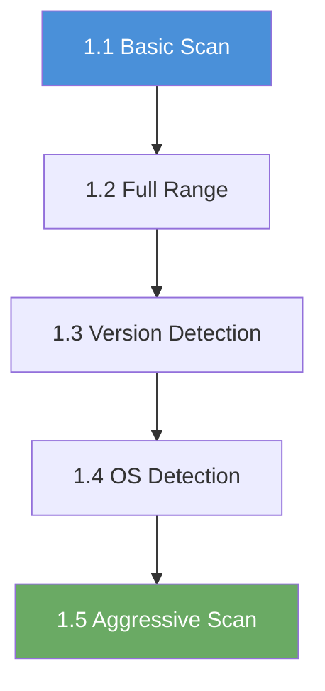

# Chapter 1: Enumeration

## Why Enumeration Comes First

Before you can attack anything, you need to know what is there. Enumeration is the process of systematically discovering what machines are on a network, what ports are open on those machines, what software is listening on those ports, and what operating system is running underneath. Every penetration test; whether it is a classroom exercise or a real-world engagement; starts here.

Skipping enumeration is like walking into a building blindfolded. You might eventually stumble into something interesting, but you will waste enormous amounts of time and miss critical details. A thorough scan in the first five minutes often reveals the exact path to the flag.

## What You Will Learn

The five labs in this chapter teach you to use **Nmap**: the single most important tool in a penetration tester's toolkit. You will start with the simplest possible scan (one port, one target) and build up to a thorough enumeration that combines port discovery, service version detection, operating system fingerprinting, and automated vulnerability scripts; all in a single command.

By the end of this chapter, you will be able to:

- Discover which ports are open on a target machine
- Identify what software is running on each open port and which version it is
- Determine the operating system and its approximate version
- Combine multiple enumeration techniques into a single efficient scan
- Read and interpret Nmap output with confidence

## What Is a Port?

Every networked computer runs multiple services; a web server, a file-sharing service, a remote desktop listener, a database, and so on. Each service needs its own "door" so that incoming connections reach the right program. These doors are called **ports**, and they are numbered from 0 to 65,535.

Some port numbers are well-known and associated with specific services by convention:

| Port | Service | What It Does |
|------|---------|-------------|
| 22 | SSH | Secure remote terminal access |
| 80 | HTTP | Unencrypted web traffic |
| 135 | MSRPC | Microsoft Remote Procedure Call |
| 139 | NetBIOS | Legacy Windows networking |
| 443 | HTTPS | Encrypted web traffic |
| 445 | SMB | Windows file and printer sharing |
| 1433 | MSSQL | Microsoft SQL Server database |
| 3389 | RDP | Remote Desktop Protocol |
| 5985 | WinRM | Windows Remote Management (HTTP) |
| 5986 | WinRM | Windows Remote Management (HTTPS) |

When you scan a target, Nmap sends carefully crafted network packets to each port and watches for responses. An open port means a service is listening and ready to accept connections. A closed port means nothing is listening. A filtered port means a firewall is silently dropping the packets.

## What Is Nmap?

**Nmap** (Network Mapper) is a free, open-source tool for network discovery and security auditing. It has been the industry standard since 1997 and is pre-installed on every copy of Kali Linux.

At its simplest, Nmap takes a target IP address and tells you which ports are open. At its most powerful, it can detect operating systems, identify software versions down to the patch level, run automated vulnerability detection scripts, and map entire networks of thousands of machines.

You will use Nmap in every chapter of this workbook, but this chapter focuses on learning the tool itself. Later chapters use Nmap as the first step before moving to service-specific tools like `smbclient`, `hydra`, or `xfreerdp`.

## The Nmap Commands You Will Use

The five labs in this chapter introduce Nmap incrementally. Each lab adds one new capability:

| Exercise | Command | What It Adds |
|-----|---------|-------------|
| 1.1 | `nmap <target>` | Scans the 1,000 most common ports |
| 1.2 | `nmap -p 1-65535 <target>` | Scans all 65,535 ports (finds services on unusual ports) |
| 1.3 | `nmap -sV <target>` | Identifies the software and version on each open port |
| 1.4 | `sudo nmap -O <target>` | Guesses the operating system based on how it responds to probes |
| 1.5 | `nmap -A <target>` | Combines version detection, OS detection, traceroute, and NSE scripts |

Do not memorize all of the flags right now. Each lab walkthrough explains the specific command you will use before you run it.

## Before You Start

Make sure the following are in place before beginning Exercise 1.1:

- [ ] You are logged into the Open Cyber Range platform
- [ ] Your VPN is connected and working (download your WireGuard config from the platform and connect before starting)
- [ ] You have a terminal open (Kali Linux VM recommended)
- [ ] You have verified VPN connectivity by pinging a known address (`ping 10.0.0.1`)
