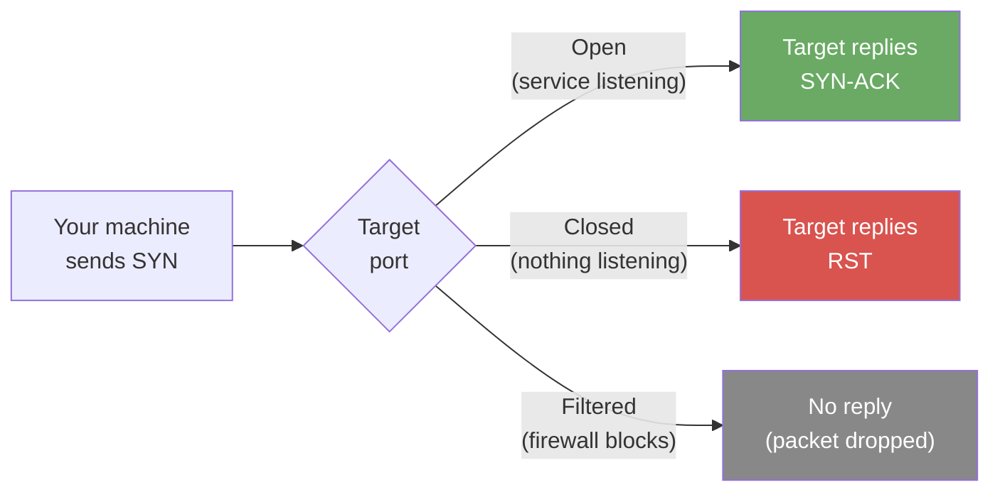

# Exercise 1.1: Basic Port Scan

## Before You Begin

You should have read the Chapter 1 Introduction, which explains what ports are, why enumeration matters, and what Nmap does at a high level. Your VPN must be connected and your terminal open. No prior scanning experience is required; the walkthrough starts from zero.

## Scenario

You have been given the IP address of a single Windows machine on the network. Your task is to perform a basic port scan to discover which services are running. The organization suspects that file-sharing services may be exposed. Your job is to confirm what is open.

## Your Objectives

- Perform a basic Nmap scan against the target
- Identify the open port(s) and the service associated with each one
- Find and submit the flag

---

## Background: What Does a Port Scan Actually Do?

When Nmap scans a target, it sends a **SYN packet** (the first step of a normal TCP connection) to each port it wants to check. What happens next depends on whether anything is listening on that port:



- **Open**: a service replied. Something is listening on that port and accepting connections
- **Closed**: the machine replied but said "nothing here." The port exists but no service is using it
- **Filtered**: no reply at all. A firewall or network device is silently dropping your packets

By default, Nmap scans the **1,000 most common ports** (out of 65,535 total). These 1,000 ports cover the vast majority of services you will encounter, including web servers, file shares, databases, and remote management tools.

## Tool Primer: Your First Nmap Command

!!! kali "Run the simplest Nmap scan"
    The simplest Nmap scan is just the tool name followed by the target IP address:

    ```bash
    nmap <target_ip>
    ```

    No flags, no options; just `nmap` and an IP. Nmap sends SYN packets to the 1,000 most common ports and reports back which ones are open.

**Reading the output:**

```
Starting Nmap 7.94 ( https://nmap.org )
Nmap scan report for 10.100.5.10
Host is up (0.0032s latency).
Not shown: 997 closed ports
PORT    STATE SERVICE
80/tcp  open  http
445/tcp open  microsoft-ds
3389/tcp open ms-wrd-registry

Nmap done: 1 IP address (1 host up) scanned in 3.42 seconds
```

Each line in the results table has three columns:

- **PORT**: the port number and protocol (almost always TCP in these exercises)
- **STATE**: open, closed, or filtered
- **SERVICE**: Nmap's best guess at what the service is, based on the port number alone (not by actually interrogating the service; that comes in Exercise 1.3)

---

## Walkthrough

### Step 1: Launch the Exercise

Open the platform in your browser and start the exercise environment. You need running containers before your scan will find anything.

- Navigate to **Exercises** → **Windows** → **Level 1**
- Click **Launch** on "Basic Port Scan"
- Wait for the status to change to **Running**
- Note the **target IP** displayed in the Active Lab View

### Step 2: Verify VPN Connectivity

!!! kali "Verify VPN connectivity with a ping"
    Before scanning, confirm your VPN tunnel is active and can reach the target. Run a quick ping:

    ```bash
    ping -c 3 <target_ip>
    ```

    Replace `<target_ip>` with the IP shown in the Active Lab View.

    You should see three replies with round-trip times. If the ping times out, your VPN is not connected; go back to the VPN Setup Guide before continuing.

### Step 3: Run Your First Scan

!!! kali "Run your first port scan"
    Now run the basic Nmap scan:

    ```bash
    nmap <target_ip>
    ```

    Nmap will take a few seconds to complete. Watch the terminal as it works; you will see a progress indicator followed by the results table.

---

### Record Your Findings

> Copy the full Nmap output from your terminal and paste it below. In a physical workbook, you would write this by hand. In a digital copy, paste the text.
>
> **My Nmap output:**
>
> ```
> (paste your output here)
> ```
>
> **Open ports I found:**
>
> | Port | Service |
> |------|---------|
> |      |         |
> |      |         |
> |      |         |

---

### Step 4: Interpret the Results

Look at the open ports in your output. For each one, consider what it tells you about the target:

- **Port 445 (microsoft-ds)**: the target is running SMB, the Windows file-sharing protocol. An entire chapter of this workbook (Chapter 2) focuses on investigating SMB
- **Any other open ports**: note them. You may see ports for HTTP (80), RDP (3389), or other services. Each one is a potential entry point that later chapters explore

The SERVICE column at this stage is just a guess based on the port number. Nmap knows that port 445 is *usually* SMB, but it has not actually verified that. Version detection (Exercise 1.3) confirms what is truly running.

### Step 5: Find and Submit the Flag

Now that your scan is complete, look for the flag on the target machine. Knowing which services are open tells you how to connect. Port 445 is open, which means SMB file sharing is running, and the target exposes an anonymous share named `public` that holds a `flag.txt` file.

!!! kali "Read the flag from the SMB public share"
    Use `smbclient` to connect to the `public` share with no password (`-N`) and download `flag.txt` to your screen in a single command:

    ```bash
    smbclient //<target_ip>/public -N -c 'get flag.txt -'
    ```

    Replace `<target_ip>` with the IP shown in the Active Lab View. The trailing `-` after `flag.txt` tells `smbclient` to print the file to standard output instead of saving it to disk. Chapter 2 covers `smbclient` in depth; for now, run the command exactly as shown.

The output contains the flag in `OCR{...}` format. Paste it into the **Submit Flag** form on the platform and click **Submit**.

---

## Analysis Questions

Take a moment to think through these questions. They do not have single right answers; the goal is to build your analytical thinking.

**1. Why does Nmap only scan 1,000 ports by default instead of all 65,535?**

??? note "Reveal Answer"

    Scanning all ports takes significantly longer. The default 1,000 covers the most commonly used services and finds the vast majority of listening programs. The tradeoff between speed and completeness is a recurring theme in penetration testing; the next exercise explores what happens when you scan the full range.

**2. A port shows as "filtered" instead of "open" or "closed." What does that tell you about the network between you and the target?**

??? note "Reveal Answer"

    Something between you and the target (a firewall, a router with access control lists, or the target's own host firewall) is silently dropping your packets. The service behind the filtered port might be running; you just cannot tell because the firewall is hiding it.

**3. You found port 445 open. If you were a system administrator trying to secure the machine, what would you do?**

??? note "Reveal Answer"

    Consider whether SMB needs to be exposed to the network at all. If file sharing is only needed internally, restrict access with firewall rules so that only authorized IP ranges can reach port 445. If SMB is not needed, disable the service entirely. Unnecessary open ports are unnecessary risk.

---

## Key Takeaways

- A **port scan** is the foundation of every penetration test; you cannot attack what you have not found
- Nmap's default scan checks the **1,000 most common ports**, which is a good starting point but not complete
- **Open** means a service is listening; **closed** means nothing is there; **filtered** means a firewall is blocking your view
- The SERVICE column in a basic scan is a **guess based on port number**, not a confirmed identification
- Port 445 (SMB) on a Windows machine is one of the most common and important services to investigate further
