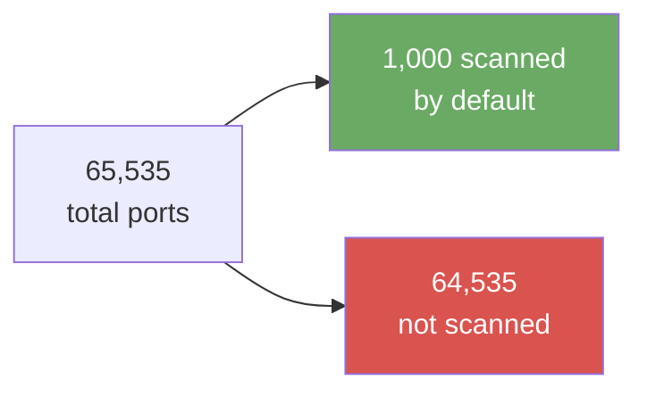

# Exercise 1.2: Multiple Port Discovery

## Before You Begin

In Exercise 1.1, you ran a basic Nmap scan that checked the 1,000 most common ports. That scan likely found a few open ports, but it only looked at a fraction of the total range. Services sometimes run on unusual port numbers; either intentionally (to avoid detection) or because the administrator chose a non-standard configuration. Exercise 1.2 teaches you to scan the full port range so nothing slips past.

## Scenario

The target machine has been reconfigured. Intelligence suggests that additional services may be running on non-standard ports; ports that a default Nmap scan would miss entirely. Your job is to perform a full port scan that covers every possible port and identify all exposed services.

## Your Objectives

- Scan all 65,535 TCP ports on the target
- Identify every open port, including any on non-standard numbers
- Compare the results to your Exercise 1.1 findings
- Find and submit the flag

---

## Background: Why Scan All Ports?

The first 1,024 ports (called "well-known ports") are assigned to specific services by convention. Ports 1,024 through 49,151 are "registered ports" used by common applications. Ports 49,152 through 65,535 are "dynamic" or "ephemeral" ports.

A default Nmap scan only checks the 1,000 most commonly seen ports. That means:

- **64,535 ports go unchecked** in a default scan
- An administrator who moves SSH from port 22 to port 2222 (a common hardening tactic) would be invisible to the default scan
- Backdoors, custom applications, and misconfigured services frequently bind to high-numbered ports
- A penetration tester who only runs the default scan may miss critical entry points



The tradeoff is time. Scanning 1,000 ports takes a few seconds. Scanning all 65,535 takes significantly longer; anywhere from 30 seconds to several minutes depending on network conditions and the target's response speed.

## Tool Primer: Full-Range Scanning

!!! kali "Scan the full 65,535-port range"
    To tell Nmap to scan every port instead of just the top 1,000, you use the `-p` flag followed by a port range:

    ```bash
    nmap -p 1-65535 <target_ip>
    ```

    A common shorthand that does exactly the same thing:

    ```bash
    nmap -p- <target_ip>
    ```

    The `-p-` notation is Nmap shorthand for "start at port 1, end at port 65535." Both forms produce the same result; use whichever you find easier to remember.

**Speeding things up:**

!!! kali "Add a timing template to speed up the scan"
    Full-range scans take longer, but you can speed them up with timing flags. Nmap has timing templates from `-T0` (slowest, stealthiest) to `-T5` (fastest, noisiest):

    ```bash
    nmap -p- -T4 <target_ip>
    ```

    `-T4` is commonly used in lab environments where stealth does not matter. It increases the number of packets Nmap sends in parallel, cutting scan time considerably.

---

## Walkthrough

### Step 1: Launch the Exercise

Start the exercise environment on the platform.

- Navigate to **Exercises** → **Windows** → **Level 1**
- Click **Launch** on "Multiple Port Discovery"
- Wait for the status to change to **Running**
- Note the **target IP**

### Step 2: Run a Default Scan First

!!! kali "Run a default scan as a baseline"
    Before scanning all ports, run the default scan to establish a baseline:

    ```bash
    nmap <target_ip>
    ```

    Record the open ports it finds; you will compare them against the full-range scan in the next step.

---

### Record Your Findings: Default Scan

> **Open ports from the default (top 1,000) scan:**
>
> | Port | Service |
> |------|---------|
> |      |         |
> |      |         |

---

### Step 3: Run the Full-Range Scan

!!! kali "Run the full-range scan"
    Now scan every port:

    ```bash
    nmap -p- -T4 <target_ip>
    ```

    The scan will take longer than the default. Watch the progress percentage in your terminal; Nmap shows how far along it is during longer scans.

---

### Record Your Findings: Full-Range Scan

> **Open ports from the full-range scan:**
>
> | Port | Service |
> |------|---------|
> |      |         |
> |      |         |
> |      |         |
> |      |         |
>
> **New ports found that the default scan missed:**
>
> | Port | Service | Why the default scan missed it |
> |------|---------|-------------------------------|
> |      |         |                               |

---

### Step 4: Compare the Two Scans

Look at your two sets of results side by side. The full-range scan should have found everything the default scan found, plus additional ports that were outside the top 1,000 list.

For each new port you discovered:

- Note the port number; is it in the well-known range (1-1024), the registered range (1025-49151), or the dynamic range (49152-65535)?
- Look at the service name Nmap guessed; does it look like a standard service running on a non-standard port, or something unusual?
- Consider why an administrator might put a service on that port number

### Step 5: Find and Submit the Flag

!!! kali "Retrieve the flag from the web server"
    One of the services you discovered is an HTTP server on port 80. Use curl to retrieve the flag from the web server:

    ```bash
    curl http://<target_ip>/flag.txt
    ```

    The response contains the flag in `OCR{...}` format. Submit the flag on the platform when you find it.

---

## Analysis Questions

**1. Your default scan found some open ports. Your full scan may have found more. What would have happened if you stopped after the default scan?**

??? note "Reveal Answer"

    You might have missed services entirely. In a real penetration test, those overlooked services might be the weakest points on the machine. A web application running on port 8080 instead of port 80, for example, might be a development server with no authentication; but you would never know if you did not scan for it.

**2. The full scan took much longer than the default scan. On a real engagement with hundreds of targets, how would you balance speed versus thoroughness?**

??? note "Reveal Answer"

    A common approach is to run the default scan first against all targets (fast, broad), identify the most interesting machines, and then run full-range scans against those specific targets (slower, deep). Penetration testers often run full-range scans overnight against the complete target list so results are ready in the morning.

**3. An administrator moves SSH from port 22 to port 54321 "for security." Does that actually make the machine safer?**

??? note "Reveal Answer"

    Moving a service to a non-standard port is called "security through obscurity." It stops automated scanners that only check default ports, but it does not stop a penetration tester who runs `-p-`. The service itself is no more secure on port 54321 than it was on port 22; the same vulnerabilities apply regardless of port number. Real security comes from strong authentication, patching, and access controls; not from hiding.

---

## Key Takeaways

- The default Nmap scan checks only **1,000 of 65,535 ports**: always run a full scan when thoroughness matters
- Use **`-p-`** or **`-p 1-65535`** to scan the complete range
- Use **`-T4`** in lab environments to speed up full-range scans
- Services on non-standard ports are common and easy to miss; never assume the default scan found everything
- The **comparison** between a default scan and a full scan is itself a valuable finding: it tells you what is hidden from casual observation
- In real engagements, combine a fast default scan (breadth) with targeted full scans (depth)
