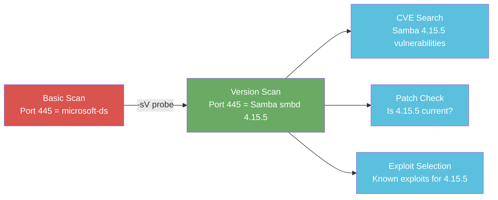
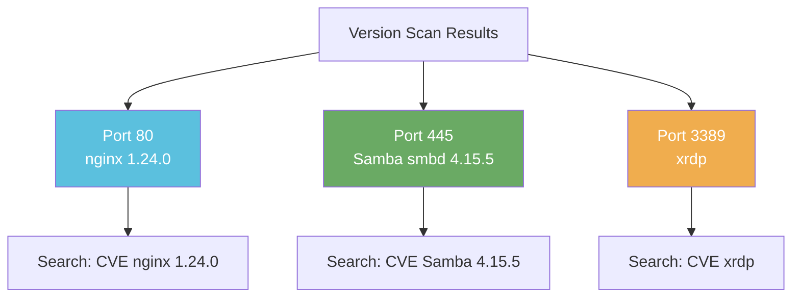

# Exercise 1.3: Service Version Detection

## Before You Begin

In Exercise 1.2, you scanned all 65,535 ports and found services the default scan missed. But the SERVICE column was still just a guess based on port numbers; Nmap had not actually confirmed what was running. this exercise teaches you to interrogate each open port and identify the exact software and version behind it. Your VPN must be connected and your terminal open.

## Scenario

You are continuing the FinanceCorp network assessment. James Mitchell, the IT director, has reviewed your port scan results and wants more detail. Knowing that ports 80, 445, and 3389 are open is a start, but the security team needs exact software names and version numbers before they can check for known vulnerabilities. Your job is to run a version detection scan and deliver precise findings.

## Your Objectives

- Use Nmap version detection (`-sV`) to identify the software and version running on each open port
- Interpret the VERSION column and understand what each result means
- Understand why version detection matters for vulnerability assessment
- Retrieve and submit the flag

---

## Background: What Is Version Detection and Why Does It Matter?

In Exercises 1.1 and 1.2, the SERVICE column in your scan results was based entirely on port numbers. Nmap looked up the port in a well-known list and printed the service typically associated with it. Port 80 became "http," port 445 became "microsoft-ds," and port 3389 became "ms-wbt-server." But these are assumptions, not facts. Any service can run on any port, and the port number alone tells you nothing about the actual software or its version.

Version detection changes that. When you pass the `-sV` flag, Nmap does not stop at discovering open ports. It sends **protocol-specific probes** to each open port; HTTP requests, SMB negotiation packets, TLS handshakes, and hundreds of other protocol signatures. It then compares the responses against its **nmap-service-probes** database to identify the exact application and version string. The result is the difference between knowing "something is listening on port 445" and knowing "Samba smbd 4.15.5 is listening on port 445."

Why does precision matter? Because vulnerabilities are tied to specific versions. A generic "http" label does not help you search for CVEs, but "nginx 1.24.0" does. You can look up that exact version in the National Vulnerability Database, check whether it is end-of-life, and determine whether known exploits exist. Version detection turns a list of open ports into an actionable inventory; the foundation of every vulnerability assessment and penetration test.

## Tool Primer: `nmap -sV`

!!! kali "Add the version detection flag"
    The version detection scan adds one flag to the basic Nmap command:

    ```bash
    nmap -sV <target_ip>
    ```

    Nmap probes each open port and prints a VERSION column with the exact software and version string it identifies.

**Flags:**

| Flag | Purpose |
|------|---------|
| `-sV` | Service Version detection; probes each open port to identify the running software and its version |
| `--version-intensity <0-9>` | Controls how many probes Nmap sends (default is 7). Lower values are faster but less accurate; higher values try more probes and may identify obscure services |

The key difference from a basic scan is the **VERSION** column that appears in the output:

```
Starting Nmap 7.94 ( https://nmap.org )
Nmap scan report for 10.100.5.10
Host is up (0.0031s latency).
Not shown: 997 closed ports
PORT     STATE SERVICE        VERSION
80/tcp   open  http           nginx 1.24.0
445/tcp  open  netbios-ssn    Samba smbd 4.15.5
3389/tcp open  ms-wbt-server  xrdp

Nmap done: 1 IP address (1 host up) scanned in 12.84 seconds
```

Notice that the SERVICE column may also change. In a basic scan, port 445 showed as "microsoft-ds." With version detection, Nmap identified the actual protocol as "netbios-ssn" and the software as "Samba smbd 4.15.5."



---

## Walkthrough

### Step 1: Launch the Exercise

Open the platform in your browser and start the exercise environment.

- Navigate to **Exercises** and locate the **Service Version Detection** lab
- Click **Launch** and wait for the status to change to **Running**
- Note the **target IP** displayed in the Active Lab View

### Step 2: Run a Basic Scan as a Baseline

!!! kali "Run a basic scan as a baseline"
    Before running version detection, perform a standard scan so you can compare the results side by side:

    ```bash
    nmap <target_ip>
    ```

    Replace `<target_ip>` with the IP shown in the Active Lab View. Record the output; pay attention to the SERVICE column. You should see entries like "http," "microsoft-ds," and "ms-wbt-server." These are guesses based on port numbers, not confirmed identifications.

---

### Record Your Findings: Basic Scan

> Copy the full Nmap output from your basic scan and paste it below.
>
> **My basic scan output:**
>
> ```
> (paste your output here)
> ```
>
> **Open ports I found:**
>
> | Port | Service (from basic scan) |
> |------|---------------------------|
> |      |                           |
> |      |                           |
> |      |                           |

---

### Step 3: Run Version Detection

!!! kali "Run version detection"
    Now run the same scan with the `-sV` flag:

    ```bash
    nmap -sV <target_ip>
    ```

    The `-sV` scan takes longer than the basic scan because Nmap is actively probing each open port with protocol-specific requests. Watch the terminal; you may see a progress indicator as Nmap works through its probe list.

    When the scan completes, look at the output. You now have a **VERSION** column that was not present before. The VERSION column contains the actual software name and version string that Nmap extracted from each service's response.

### Step 4: Interpret the Results

Compare your version scan output against the basic scan. For each open port, consider what the version information reveals:

- **Port 80; nginx 1.24.0**: The web server is not Apache or IIS; it is nginx, version 1.24.0. The exact software name and version tell you precisely what to research for vulnerabilities. It also suggests the server may be running Linux, since nginx is far more common on Linux hosts than on Windows
- **Port 445; Samba smbd 4.15.5**: The basic scan labeled this "microsoft-ds," implying Windows SMB. The version scan reveals it is actually **Samba**, the open-source SMB implementation that runs on Linux and Unix systems. The version string "4.15.5" gives you a precise target for CVE searches
- **Port 3389; xrdp**: The basic scan labeled this "ms-wbt-server," which is the standard name for Microsoft Remote Desktop. The version scan shows it is **xrdp**, an open-source RDP server. The xrdp identification further confirms that the target is likely running Linux, not Windows



### Step 5: Retrieve the Flag

!!! kali "Retrieve the flag from the SMB public share"
    Your version scan confirmed Samba on port 445. The target exposes an anonymous share named `public` that holds a `flag.txt` file. Use `smbclient` to connect with no password (`-N`) and print the file to your screen:

    ```bash
    smbclient //<target_ip>/public -N -c 'get flag.txt -'
    ```

    The trailing `-` after `flag.txt` prints the file to standard output instead of saving it to disk. The response contains the flag in `OCR{<flag_here>}` format. Paste the value into the **Submit Flag** form on the platform and click **Submit**.

---

### Record Your Findings: Version Comparison

> Compare your basic scan and version scan results in the table below. A side-by-side view highlights exactly what version detection adds.
>
> **Version scan comparison:**
>
> | Port | Basic Scan SERVICE | Version Scan SERVICE | Version Scan VERSION |
> |------|--------------------|----------------------|----------------------|
> |      |                    |                      |                      |
> |      |                    |                      |                      |
> |      |                    |                      |                      |
>
> **Flag value:**
>
> ```
> (paste your flag here)
> ```

---

## Analysis Questions

Take a moment to think through these questions. Write your answers in the spaces provided.

**1. Your basic scan showed "microsoft-ds" on port 445. Your version scan shows "Samba smbd 4.15.5." Why is the version information more useful than the port-based label?**

??? note "Reveal Answer"

    The port-based label "microsoft-ds" only tells you that something is listening on port 445, which is typically associated with Windows SMB. The version string "Samba smbd 4.15.5" tells you the exact software and its version. With that information, you can search the National Vulnerability Database for CVEs specific to Samba 4.15.5, determine whether that version has been patched, and check Exploit-DB for working exploits. Generic port labels do not give you enough specificity to do any of that.

**2. You found nginx on port 80 instead of Microsoft IIS. What does that tell you about the server, and why does it matter?**

??? note "Reveal Answer"

    Nginx is overwhelmingly deployed on Linux systems, while IIS runs exclusively on Windows. Finding nginx strongly suggests the target is a Linux host, not a Windows machine. The platform matters because your attack methodology, privilege escalation techniques, and post-exploitation tools differ significantly between operating systems. It also demonstrates why assumptions based on port numbers are dangerous; the basic scan label "http" told you nothing about the underlying platform.

**3. How would you use the version string "Samba smbd 4.15.5" in the next phase of a penetration test?**

??? note "Reveal Answer"

    You would search CVE databases (such as NIST NVD or MITRE) for known vulnerabilities affecting Samba 4.15.5 specifically. You would check Exploit-DB and GitHub for public proof-of-concept exploits targeting that version. You would also check whether 4.15.5 is still receiving security updates or has reached end-of-life, since unsupported versions are unlikely to be patched against newly discovered vulnerabilities. Version-specific research turns a generic "open port" into a concrete attack surface.

---

## Key Takeaways

- Version detection (`-sV`) actively probes each open port with protocol-specific requests rather than guessing the service from its port number
- The VERSION column reveals exact software names and version numbers; critical information for vulnerability research and CVE lookups
- Different services on the same machine may run entirely different software stacks (nginx, Samba, and xrdp all on one host), and only version detection reveals this
- Version strings are the starting point for CVE searches, Exploit-DB lookups, and patch-level assessments; they bridge enumeration and exploitation
- Now that you know what software is running, the next step is identifying the operating system underneath; that is the focus of Exercise 1.4
