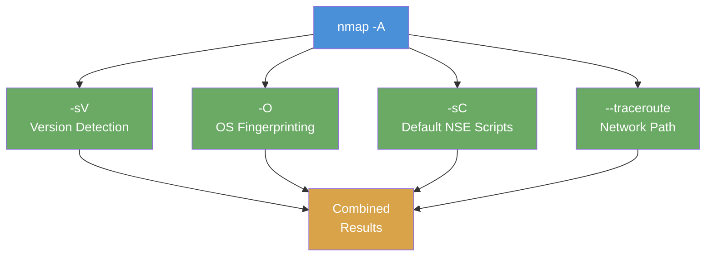

# Exercise 1.5: Comprehensive Enumeration

## Before You Begin

Over the past four labs, you built up individual scanning capabilities one at a time: basic port scanning, full-range discovery, version detection, and OS fingerprinting. Each lab added one layer. Exercise 1.5 combines everything into a single full scan; the way experienced penetration testers actually work. Your VPN must be connected and your terminal open. You need root privileges (`sudo`) because the scan includes OS fingerprinting.

## Scenario

You are wrapping up the reconnaissance phase of the FinanceCorp engagement. James Mitchell has reviewed the individual scan results from your earlier work and now needs a single full report that combines port scanning, version detection, OS fingerprinting, and script-based enumeration into one deliverable. Rather than running four separate scans and stitching the results together, you will run one command that does it all. Your task is to identify every service, confirm its version, fingerprint the operating system, and document the complete picture.

## Your Objectives

- Perform a full enumeration scan that combines multiple techniques in a single pass
- Identify all Windows services running on the target (SMB, RDP, LDAP, NetBIOS)
- Interpret NSE script results alongside version and OS data
- Apply a complete enumeration workflow from start to finish
- Retrieve and submit the flag

---

## Background: Combining Everything Into One Pass

In the previous labs, you ran separate commands for each enumeration task: `nmap` for port discovery, `-sV` for version detection, and `-O` for OS fingerprinting. That approach works, but it is inefficient. Each scan opens its own connections, sends its own probes, and processes the target independently. Running three or four scans against the same target means three or four rounds of packet exchange, three or four waits for results, and three or four chances for network conditions to change between scans.

In practice, penetration testers combine these techniques into a single pass using the `-A` flag. The `-A` flag tells Nmap to enable **aggressive scanning**, which aggregates four capabilities into one command:

- **`-sV`**: version detection (probe each port for software and version strings)
- **`-O`**: OS fingerprinting (analyze TCP/IP stack behavior to identify the operating system)
- **`-sC`**: default NSE scripts (run a curated set of Nmap Scripting Engine scripts against detected services)
- **`--traceroute`**: trace the network path to the target

The **Nmap Scripting Engine (NSE)** deserves special attention. NSE is a framework built into Nmap that runs Lua scripts against discovered services. The "default" script category includes dozens of scripts that automate common enumeration tasks; for example, `smb-os-discovery` queries an SMB service for its claimed operating system and domain membership, and `smb-security-mode` checks whether SMB signing is enabled. These scripts extract information that basic scanning and version detection cannot reach.

The trade-off is straightforward: a full scan is more thorough, but it is also **slower and noisier**. It sends more packets, triggers more log entries on the target, and takes longer to complete. In a real engagement, you weigh thoroughness against stealth. For this exercise, thoroughness is the priority.



## Tool Primer: `nmap -A`

!!! kali "Run the aggressive shorthand scan"
    There are two approaches to running a full scan. The first is the shorthand flag:

    ```bash
    sudo nmap -A <target_ip>
    ```

    The `-A` flag enables version detection, OS fingerprinting, default scripts, and traceroute in one shot. It scans the default 1,000 ports.

!!! kali "Run the explicit-flags equivalent"
    The second approach gives you more control by specifying each flag individually:

    ```bash
    sudo nmap -sV -O -sC -T4 -p- <target_ip>
    ```

    The explicit-flags version lets you add options that `-A` does not include by default; for example, `-p-` scans all 65,535 ports instead of the top 1,000, and `-T4` increases the timing template for faster execution on reliable networks.

**Key flags:**

| Flag | Purpose |
|------|---------|
| `-A` | Aggressive scan; enables `-sV`, `-O`, `-sC`, and `--traceroute` together |
| `-sC` | Runs the default category of NSE scripts against each detected service |
| `--traceroute` | Maps the network path (hops) between your machine and the target |
| `-T4` | Timing template; faster than default (`-T3`) but still reliable on most networks |

**Reading the output:**

A full scan produces significantly more output than any individual scan. The results contain four distinct categories:

```
Starting Nmap 7.94 ( https://nmap.org )
Nmap scan report for 10.100.5.10
Host is up (0.0028s latency).
Not shown: 996 closed ports

PORT     STATE SERVICE       VERSION
139/tcp  open  netbios-ssn   Microsoft Windows netbios-ssn
389/tcp  open  ldap          Microsoft Windows Active Directory LDAP
445/tcp  open  microsoft-ds  Windows Server 2019 DC
3389/tcp open  ms-wbt-server Microsoft Terminal Services

Host script results:
| smb-os-discovery:
|   OS: Windows Server 2019 Standard 17763 (Windows Server 2019 Standard 6.3)
|   Computer name: YOURDC01
|   Domain name: financecorp.local
|   FQDN: YOURDC01.financecorp.local
| smb-security-mode:
|   account_used: guest
|   message_signing: required

OS details: Microsoft Windows Server 2019
OS CPE: cpe:/o:microsoft:windows_server_2019

TRACEROUTE
HOP RTT     ADDRESS
1   2.84 ms 10.100.5.10

Nmap done: 1 IP address (1 host up) scanned in 48.21 seconds
```

Notice the four categories: the **port and version table** at the top, the **script results** section in the middle (prefixed with `|`), the **OS details** block, and the **traceroute** at the bottom. Each section corresponds to one of the four techniques that `-A` combines.

---

## Walkthrough

### Step 1: Launch the Exercise

Open the platform in your browser and start the exercise environment.

- Navigate to **Exercises** and locate the **Comprehensive Enumeration** lab
- Click **Launch** and wait for the status to change to **Running**
- Note the **target IP** displayed in the Active Lab View

### Step 2: Run the Full Scan

!!! kali "Run the full aggressive scan"
    Run the aggressive scan with the `-A` flag:

    ```bash
    sudo nmap -A <target_ip>
    ```

    Replace `<target_ip>` with the IP shown in the Active Lab View. The scan takes noticeably longer than anything you have run in previous labs; expect it to take 30 seconds to a minute or more. Nmap is performing port discovery, version probing, OS fingerprinting, script execution, and traceroute all in sequence.

!!! kali "Run the equivalent scan with individual flags"
    If you want finer control, you can run the equivalent command with individual flags:

    ```bash
    sudo nmap -sV -O -sC -T4 <target_ip>
    ```

    Both approaches produce the same categories of results. Use whichever you prefer.

### Step 3: Interpret the Port Table

Examine the port table in your output. You should see four services:

- **Port 139 (netbios-ssn)**: NetBIOS Session Service, the older Windows networking protocol used for name resolution and session management. It often runs alongside SMB on legacy or domain-joined Windows systems. Its presence confirms you are looking at a Windows host with traditional networking enabled.

- **Port 389 (ldap)**: Lightweight Directory Access Protocol. LDAP is the protocol that Active Directory uses to store and retrieve directory information; user accounts, group memberships, computer objects, and organizational structure. Seeing LDAP open on a Windows machine is a strong indicator that this server is a **domain controller**.

- **Port 445 (microsoft-ds)**: Server Message Block (SMB), the primary Windows file-sharing and inter-process communication protocol. On a domain controller, SMB handles SYSVOL replication, Group Policy distribution, and file shares. You have seen this port in every previous exercise; now you are seeing it in context alongside the other services.

- **Port 3389 (ms-wbt-server)**: Remote Desktop Protocol (RDP), which allows graphical remote access to the machine. Administrators use RDP to manage servers remotely. An open RDP port means someone can attempt to log in with a graphical desktop session if they have valid credentials.

Together, these four ports paint a clear picture: this is a **Windows Server acting as a domain controller** with remote administration enabled.

### Step 4: Review the Script Results

Below the port table, look for the **Host script results** section. The NSE default scripts have queried the target's services and extracted additional information that port scanning and version detection alone could not provide.

- **smb-os-discovery**: The script queried the SMB service directly and retrieved the server's claimed operating system, computer name, domain name, and fully qualified domain name (FQDN). Those details come from the SMB protocol itself, not from TCP/IP fingerprinting. It may report details that `-O` does not, such as the Active Directory domain name.

- **smb-security-mode**: This script checked whether SMB message signing is enabled or required. Message signing prevents man-in-the-middle attacks on SMB traffic. If signing is not required, that is a finding worth noting in a penetration test report.

- **LDAP scripts**: Depending on the target configuration, LDAP scripts may reveal directory entries, naming contexts, or domain information. Any data returned here adds to your understanding of the Active Directory environment.

Review each script result and note what it tells you that the port table and version strings did not.

### Step 5: Find the Flag

!!! kali "List SMB shares and read the server comment"
    The flag is embedded in the SMB server string. Use `smbclient` to list shares and read the server comment:

    ```bash
    smbclient -L //<target_ip> -N
    ```

    The `-L` flag lists available shares and `-N` connects without a password (null session). Look at the server comment line in the output; the server string contains the flag in `OCR{<flag_here>}` format.

Copy the flag and paste it into the **Submit Flag** form on the platform and click **Submit**.

---

### Record Your Findings

> Paste the full output of your scan below.
>
> **My scan output:**
>
> ```
> (paste your output here)
> ```

---

> Record the services you discovered in the table below.
>
> **Services discovered:**
>
> | Port | Service | Version | Notes |
> |------|---------|---------|-------|
> | 139  |         |         |       |
> | 389  |         |         |       |
> | 445  |         |         |       |
> | 3389 |         |         |       |

---

> Record the OS detection results.
>
> **OS detection:**
>
> | Field | Your Finding |
> |-------|-------------|
> | OS detected | |
> | Confidence % | |
> | CPE string | |
> | Network distance | |

---

> Summarize the most important findings from the NSE script results.
>
> **Script results summary:**
>
> | Script Name | Key Finding |
> |-------------|-------------|
> | smb-os-discovery | |
> | smb-security-mode | |
> | Other scripts | |

---

> **Flag found:**
>
> ```
> (paste your flag here)
> ```

---

## Analysis Questions

Take a moment to think through these questions. Write your answers in the spaces provided.

**1. What is the advantage of `-A` over running `-sV`, `-O`, and `-sC` as separate commands?**

??? note "Reveal Answer"

    Running `-A` performs all four techniques in a single pass. The approach saves time because Nmap only needs to establish connections and exchange packets once, rather than repeating the process for each individual scan. The results are also consistent; all data comes from the same scan at the same point in time, eliminating the possibility of services changing between separate scans. In practice, a single full scan is the standard starting point for most assessments.

**2. The script results show smb-os-discovery output. How does script-based detection compare to `-O` fingerprinting?**

??? note "Reveal Answer"

    They work in fundamentally different ways. The `-O` flag fingerprints the OS by analyzing low-level TCP/IP stack behavior; packet TTL values, window sizes, and options ordering. It infers the OS from how the network stack behaves. The smb-os-discovery script takes a direct approach: it queries the SMB service and asks what OS the server claims to be running. Scripts get their answer from the application layer (what the service reports about itself), while `-O` gets its answer from the transport layer (how the TCP/IP stack behaves). The two methods may return different results; for example, a Linux host running Samba may report "Windows" via SMB while `-O` fingerprints it as Linux.

**3. You see LDAP (port 389) open. What does this suggest about the server's role in the network?**

??? note "Reveal Answer"

    LDAP on a Windows server is a strong indicator that the machine is an Active Directory domain controller. Domain controllers use LDAP to serve the directory database that stores all user accounts, group memberships, computer objects, and Group Policy information for the domain. A domain controller is one of the highest-value targets in any Windows network; compromising it typically means compromising the entire domain. A domain controller discovery would be flagged as critical in a penetration test report and would shape the direction of the entire engagement.

**4. As a defender, what single change would most reduce the information an attacker gathers from this full scan?**

??? note "Reveal Answer"

    Implementing a host-based firewall that restricts which ports are accessible from untrusted networks. If ports 139, 389, 445, and 3389 are only reachable from authorized management subnets, an attacker scanning from an untrusted network segment sees nothing; all ports appear filtered, and no version strings, OS fingerprints, or script results are returned. Network segmentation and firewall rules are the most effective way to reduce your attack surface, because they eliminate the exposure that every other enumeration technique depends on.

---

## Key Takeaways

- `nmap -A` combines version detection, OS fingerprinting, script scanning, and traceroute into one command; the standard starting point for most penetration tests
- NSE scripts like smb-os-discovery extract information that basic scanning and version detection cannot reach, including domain names, computer names, and security configurations
- LDAP on a Windows machine typically indicates a domain controller; a critical asset that stores all user accounts and controls authentication for the entire domain
- Full scans are louder and slower than individual techniques, but they provide the most complete picture in the fewest steps
- The complete output from a single `-A` scan provides everything needed to plan the next phase of a penetration test: what ports are open, what software is running, what OS is underneath, and what the scripts could extract
- You now know what services are running, what versions they are, and what operating system is underneath. Chapter 2 takes the next step: connecting to one of those services; SMB; and extracting real data from it.
