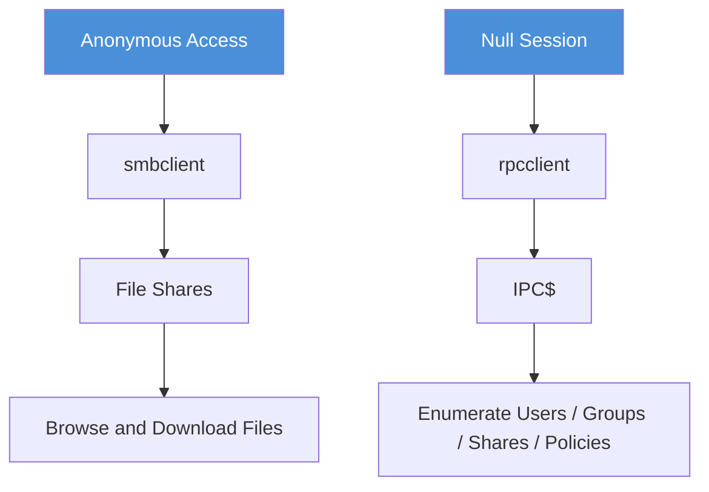
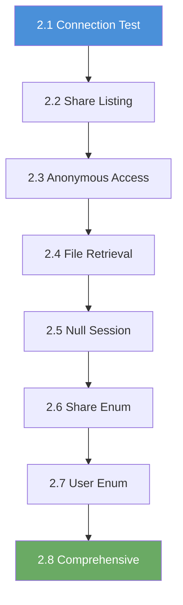

# Chapter 2: SMB Reconnaissance

## Why SMB Reconnaissance Matters

In Chapter 1 you discovered that port 445 was open on the target and identified it as SMB. Now you will interact with that service directly. Knowing a port is open is only the beginning; the next step is to connect to the service, learn what it exposes, and pull information from it.

SMB (Server Message Block) is how Windows machines share files and printers across a network. It is one of the most frequently targeted services in penetration testing because it often exposes sensitive data and supports multiple forms of unauthenticated access. Misconfigured SMB shares are everywhere in corporate environments, lab networks, and CTF challenges alike.

A misconfigured SMB share is one of the fastest paths from "I found an open port" to "I am reading the target's files." This chapter teaches you how to walk that path methodically.

## What You Will Learn

By the end of this chapter, you will be able to:

- Connect to an SMB service and read its server information
- List all available shares on a target
- Access shares that allow anonymous (guest) connections
- Download files from accessible shares
- Establish null sessions through the IPC$ share
- Enumerate shares, users, and groups through null session RPC calls
- Perform full automated enumeration with enum4linux

## What Is SMB?

**Server Message Block** is a network protocol originally created by IBM and later adopted and extended by Microsoft. Modern SMB runs directly over TCP on **port 445**. Legacy systems may use **port 139**, which wraps SMB inside the older NetBIOS session layer. In most environments you will encounter today, port 445 is the one that matters.

In a normal IT environment, SMB handles file sharing (mapping network drives), printer sharing, and inter-process communication through special shares called **named pipes** (the most notable being **IPC$**). Domain-joined Windows machines use SMB constantly; it is woven into authentication, group policy distribution, and software deployment.

Attackers care about SMB because shares are sometimes readable without any credentials (guest access), null sessions can reveal usernames, groups, and password policies through the RPC interface, and the service version string can point directly to known exploits. A single unauthenticated connection can yield enough information to plan the rest of an engagement.

## Anonymous Access vs Null Sessions

Before starting the labs, you need to understand the difference between these two forms of unauthenticated SMB access:

- **Anonymous/Guest Access**: Connecting to file shares (such as "public") without providing a password. The `-N` flag in `smbclient` suppresses the password prompt. You can browse directories, read files, and download them. Exercises 2.1 through 2.4 focus on this path.

- **Null Sessions**: Connecting to the **IPC$** share with an empty username and password to make RPC calls. You use `rpcclient` for this. You cannot browse files through a null session, but you can enumerate users, groups, shares, and password policies through the RPC interface. Exercises 2.5 through 2.8 focus on this path.

## The SMB Commands You Will Use

The eight labs in this chapter introduce SMB enumeration incrementally. Each lab adds one new capability:

| Exercise | Title | Primary Command | What It Adds |
|-----|-------|----------------|-------------|
| 2.1 | Connection Test | `smbclient -L //<target> -N` | First SMB connection |
| 2.2 | Share Listing | `smbclient -L` (detailed) | Understanding share types |
| 2.3 | Anonymous Share Access | `smbclient //<target>/share -N` | Interactive file browsing |
| 2.4 | File Retrieval | `get`, `mget` | Downloading files from shares |
| 2.5 | Null Session Connection | `rpcclient -U "" -N <target>` | RPC-based enumeration |
| 2.6 | Null Session Share Enum | `netshareenum` | Share discovery via RPC |
| 2.7 | User Enumeration | `enumdomusers` | Username discovery |
| 2.8 | Comprehensive Enumeration | `enum4linux -a <target>` | Automated full enumeration |

Do not memorize all of the commands right now. Each lab walkthrough explains the specific command you will use before you run it.

## Before You Start

Make sure the following are in place before beginning Exercise 2.1:

- [ ] You have completed Chapter 1 (Enumeration) and can run Nmap scans confidently
- [ ] Your VPN is connected and working
- [ ] You have a terminal open on your Kali Linux VM
- [ ] You have verified connectivity to the lab network
