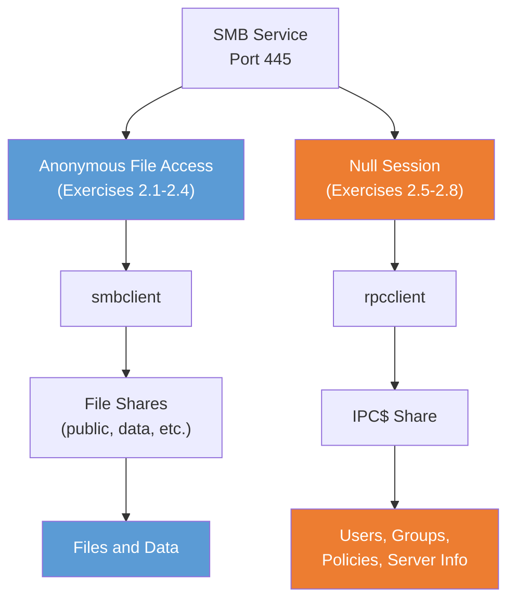

# Exercise 2.5: Null Session Connection

## Before You Begin

Exercises 2.1 through 2.4 focused on one type of anonymous access: connecting to file shares as a guest and browsing their contents. Exercise 2.5 introduces a fundamentally different technique; **null sessions**: which opens up a separate set of information that file share access cannot reveal. Null sessions mark a key moment in the chapter: you are moving from file-level enumeration to system-level enumeration.

## Scenario

Your ongoing SMB assessment of FinanceCorp has revealed that the target allows anonymous access to file shares. James Mitchell now wants you to test for null session connections. A null session can provide additional enumeration opportunities even when anonymous file access is restricted; and when both are available, the combination is significantly more powerful than either alone.

## Your Objectives

- Connect to the target using a null session
- Understand the difference between null sessions and anonymous file access
- Enumerate server information through the RPC interface
- Find and submit the flag

---

## Background: Null Sessions: A Different Kind of Anonymous Access

In Exercises 2.1 through 2.4, you connected to SMB file shares without a password and browsed their contents. That is **anonymous file access**: you are a guest user looking at shared folders. It is straightforward: you see files, you download files.

A **null session** is something different entirely. Instead of connecting to a file share, you connect to a hidden administrative share called **IPC$** (Inter-Process Communication) with an empty username *and* an empty password. The null session does not give you access to any files. What it gives you is access to the **RPC interface**: a set of functions that let you query the server for system-level information: usernames, group memberships, password policies, and server configuration.

Think of it this way:



These are two separate attack surfaces on the same service. A server might allow one but not the other, both, or neither. A thorough assessment always tests for both.

**Historical context:** Null sessions were enabled by default in older Windows versions (NT 4.0, 2000, early XP) because many networked applications depended on them for backward compatibility. Microsoft has progressively tightened the defaults in newer versions, but many systems; especially those in legacy environments or running Samba with permissive configurations; still allow them.

---

## Tool Primer: `rpcclient`

Exercise 2.5 is your first time using `rpcclient`, so here is a full introduction.

**What it is:** `rpcclient` is a Samba tool that executes Microsoft RPC (Remote Procedure Call) functions against Windows and Samba servers. Where `smbclient` talks to file shares, `rpcclient` talks to the RPC interface; a completely different channel for extracting information.

**Null session syntax:**

```bash
rpcclient -U "" -N <target_ip>
```

**Flags:**

| Flag | Meaning |
|------|---------|
| `-U ""` | Empty username (the "null" in null session) |
| `-N` | No password prompt; sends an empty password |

When the connection succeeds, you see a new prompt:

```
rpcclient $>
```

You are now inside an interactive RPC session. From here, you issue commands that query the server directly.

**Essential first commands:**

| Command | What It Returns |
|---------|-----------------|
| `srvinfo` | Server name, version, operating system, and server type string |
| `querydominfo` | Domain or workgroup name, total number of users, total number of groups |
| `exit` | Disconnects from the session |

**Sample `srvinfo` output:**

```
rpcclient $> srvinfo
        YOURSERVER     Wk Sv PrQ Unx NT SNT
        platform_id     :       500
        os version      :       6.1
        server type     :       0x809a03
```

The first line contains the server name followed by capability flags. The `srvinfo` command confirms that the null session works, but Samba truncates the long server-string description in this view, so the flag does not appear here.

**Reading the full server string with `smbclient -L`:** The server advertises a longer **server string**: a description the server publishes about itself, which is where administrators (or lab authors) embed identifying information. To see it in full, list the shares with `smbclient` and an empty session. The complete server string prints alongside the listing:

```bash
smbclient -L //<target_ip> -N
```

```
        Sharename       Type      Comment
        ---------       ----      -------
        IPC$            IPC       IPC Service (Windows Server - Null Session: OCR{<flag_here>})

        Server               Comment
        ---------            -------
        YOURSERVER           Windows Server - Null Session: OCR{<flag_here>}
```

The flag appears in the full server string that `smbclient -L` prints; the `srvinfo` view truncates it.

---

## Walkthrough

### Step 1: Launch the Exercise

Open the platform in your browser and start the exercise environment.

- Navigate to **Exercises** and locate the Null Session Connection lab
- Click **Launch** and wait for the status to change to **Running**
- Note the **target IP** displayed in the Active Lab View

### Step 2: Attempt a Null Session Connection

!!! kali "Open a null session with rpcclient"
    Open your terminal and connect to the target with empty credentials. Replace `<target_ip>` with the IP shown in the Active Lab View.

    ```bash
    rpcclient -U "" -N <target_ip>
    ```

    If the connection succeeds, you see the `rpcclient $>` prompt. The prompt means the target accepts null sessions; you are now authenticated (with empty credentials) and connected to the IPC$ share's RPC interface.

    If you receive an error such as `NT_STATUS_ACCESS_DENIED`, the server is rejecting null sessions. In this exercise, the connection should succeed.

### Step 3: Enumerate Server Information

!!! kali "Query server information"
    At the `rpcclient $>` prompt, run the server information command.

    ```
    srvinfo
    ```

    Read the output carefully. The first line confirms the server name and that the null session is working. Samba truncates the long server-string description in this view, so the flag is not visible here; you read it with `smbclient -L` in Step 6.

### Step 4: Enumerate Domain Information

!!! kali "Query domain information"
    Still at the `rpcclient $>` prompt, run the domain information command.

    ```
    querydominfo
    ```

    The `querydominfo` command returns the domain or workgroup name, the total number of users, and the total number of groups on the system. Record all of these values; they tell you the scope of what you could enumerate further with a null session.

### Step 5: Disconnect

!!! kali "Close the session"
    When you have recorded your findings, exit the session.

    ```
    exit
    ```

    The `exit` command returns you to your normal shell prompt.

### Step 6: Read the Flag from the Full Server String

!!! kali "Read the full server string with smbclient"
    Back at your normal shell prompt, list the shares with an empty session. The complete server string prints alongside the listing, in the IPC$ comment and in the server summary at the bottom:

    ```bash
    smbclient -L //<target_ip> -N
    ```

    Look for the flag in `OCR{...}` format inside the server string. The `srvinfo` command in Step 3 proves the null session works; `smbclient -L` shows the complete server string that `srvinfo` truncates.

### Step 7: Submit the Flag

Paste the flag you read from the `smbclient -L` server string into the **Submit Flag** form on the platform and click **Submit**.

---

### Record Your Findings

> **My `srvinfo` output:**
>
> ```
> (paste your output here)
> ```
>
> **My `querydominfo` output:**
>
> ```
> (paste your output here)
> ```
>
> **My `smbclient -L` server string (contains the flag):**
>
> ```
> (paste your output here)
> ```
>
> **Extracted information:**
>
> | Field | Value |
> |-------|-------|
> | Server name | |
> | Domain / Workgroup | |
> | OS version | |
> | Total users | |
> | Total groups | |
>
> **How to submit:** enter the flag on the exercise page exactly as you recovered it, keeping the `OCR{...}` wrapper.
>
> **Flag:** `OCR{____________________}`

---

## Analysis Questions

Take a moment to think through these questions. They reinforce the concepts behind what you just did.

**1. What is the difference between the anonymous file access you used in Exercises 2.1 through 2.4 and the null session you just established?**

??? note "Reveal Answer"

    Anonymous file access connects to named file shares (like "public") and lets you browse and download data stored on the server. Null sessions connect to the IPC$ share and let you query the RPC interface for system information; usernames, groups, password policies, and server configuration. They are two different attack surfaces on the same service, and each reveals information the other cannot.

**2. The `srvinfo` command returned the server's operating system and version. How is this similar to and different from Nmap's OS detection (`-O`)?**

??? note "Reveal Answer"

    Both reveal the operating system. Nmap's `-O` flag guesses the OS by analyzing subtle differences in how the target's TCP/IP stack behaves; an indirect, inference-based method. The `srvinfo` command asks the server directly through the RPC interface and gets the answer the server advertises about itself. The RPC answer is typically more specific and reliable, but it can be spoofed or altered by the administrator. Nmap's approach works even when RPC access is blocked.

**3. Why would a system administrator want to disable null sessions?**

??? note "Reveal Answer"

    Null sessions allow completely unauthenticated users to enumerate usernames, group memberships, and password policies. The enumerated detail directly enables credential attacks; an attacker who knows valid usernames can target them with password spraying or brute-force attempts, and knowledge of the password policy tells them exactly what to try. Disabling null sessions forces attackers to authenticate before they can learn anything about the system's users or configuration.

---

## Key Takeaways

- Null sessions connect to the **IPC$ share** with an empty username and empty password, then query the server's **RPC interface** for system information
- `rpcclient -U "" -N <target_ip>` is the primary tool for establishing a null session from Linux
- Null sessions reveal **system-level information** (server name, OS version, domain, user and group counts) that file share access cannot provide
- Anonymous file access and null sessions are **two separate attack surfaces**: always test for both during an SMB assessment
- The null session is established. The next labs use it to enumerate increasingly valuable information: shares (Exercise 2.6), users (Exercise 2.7), and everything at once (Exercise 2.8)
