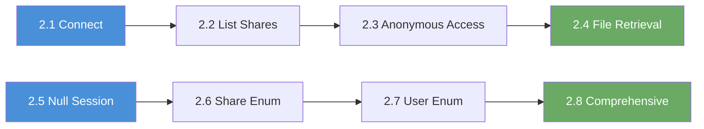

# Chapter 2: Review

## What You Learned

Over eight labs, you learned to interact with SMB; the protocol Windows uses for file sharing. You started by connecting to the service and listing available shares, then accessed anonymous shares and downloaded files. In the second half of the chapter, you shifted to null sessions; a different technique that uses empty credentials over the IPC$ share to enumerate users, groups, shares, and password policies through the RPC interface. You ended by automating everything with enum4linux.

## The Progression You Followed

Each lab added one new layer to your SMB reconnaissance capability:

| Exercise | What You Added | Why It Matters |
|-----|---------------|----------------|
| 2.1 | SMB connection test | Confirmed the service accepts connections |
| 2.2 | Share listing | Discovered what shares exist on the target |
| 2.3 | Anonymous share access | Proved files can be browsed without credentials |
| 2.4 | File retrieval | Demonstrated data exfiltration from anonymous shares |
| 2.5 | Null session connection | Opened the RPC channel for deeper enumeration |
| 2.6 | Null session share enumeration | Revealed physical paths and hidden shares via RPC |
| 2.7 | User enumeration | Discovered valid usernames; the most dangerous capability |
| 2.8 | Comprehensive enumeration | Automated everything with enum4linux |

## Self-Assessment

Answer the following questions without looking back at the walkthroughs. If you get stuck, that topic is worth revisiting.

**1.** What is the difference between anonymous SMB access and a null session?

> &nbsp;
>
> &nbsp;

**2.** What command lists available shares on an SMB server without credentials?

> &nbsp;
>
> &nbsp;

**3.** How do you download a file from an SMB share using smbclient?

> &nbsp;
>
> &nbsp;

**4.** What does the `-N` flag do in smbclient?

> &nbsp;
>
> &nbsp;

**5.** What rpcclient command lists domain users?

> &nbsp;
>
> &nbsp;

**6.** What is the significance of RID 500?

> &nbsp;
>
> &nbsp;

**7.** What does `enum4linux -a` do?

> &nbsp;
>
> &nbsp;

**8.** Why is user enumeration considered the most dangerous null session capability?

> &nbsp;
>
> &nbsp;

## Command Cheat Sheet

Keep the following reference handy throughout the rest of the workbook.

| Command | What It Does |
|---------|-------------|
| `smbclient -L //<target> -N` | List shares without credentials |
| `smbclient //<target>/<share> -N` | Connect to a share anonymously |
| `smbclient //<target>/<share> -N -c 'get file.txt'` | Download a file non-interactively |
| `smb: \> ls` | List files in current share directory |
| `smb: \> cd <dir>` | Change directory in share |
| `smb: \> get <file>` | Download a file |
| `smb: \> mget <pattern>` | Download multiple files |
| `rpcclient -U "" -N <target>` | Establish null session |
| `rpcclient $> srvinfo` | Get server information |
| `rpcclient $> netshareenum` | List shares via RPC |
| `rpcclient $> netsharegetinfo <share>` | Get share details |
| `rpcclient $> enumdomusers` | List domain users |
| `rpcclient $> queryuser <rid>` | Query specific user by RID |
| `rpcclient $> enumdomgroups` | List domain groups |
| `enum4linux -a <target>` | Comprehensive automated enumeration |

## Connect the Dots: What Comes Next

You now know what shares exist, what files they contain, and; critically; what user accounts are on the system. But knowing a username is only half the puzzle. To access the protected shares you discovered (like `private` or `admin_backup`), you need passwords. Chapter 3 takes the usernames you enumerated here and tests them with passwords; starting with manual guesses and building up to automated brute force attacks.

---

## Self-Assessment Answer Key

**1.** Anonymous SMB access lets you browse file shares using the guest account. A null session connects to the IPC$ share with empty credentials and queries the RPC interface for system information like users, groups, and policies. Different protocols, different information.

**2.** `smbclient -L //<target> -N`

**3.** Connect with `smbclient //<target>/<share> -N`, then use `get <filename>`, or non-interactively: `smbclient //<target>/<share> -N -c 'get filename'`

**4.** `-N` suppresses the password prompt and connects without providing a password (no-password mode).

**5.** `enumdomusers`

**6.** RID 500 is always the built-in Administrator account. It cannot be deleted and usually has the highest privileges on the system.

**7.** `enum4linux -a` runs a full enumeration that combines user listing, share listing, group listing, OS detection, and password policy extraction into one automated pass.

**8.** Because valid usernames are half of the credential puzzle. With a list of real usernames, an attacker can attempt targeted password attacks (Chapter 3) instead of guessing both the username and password.
