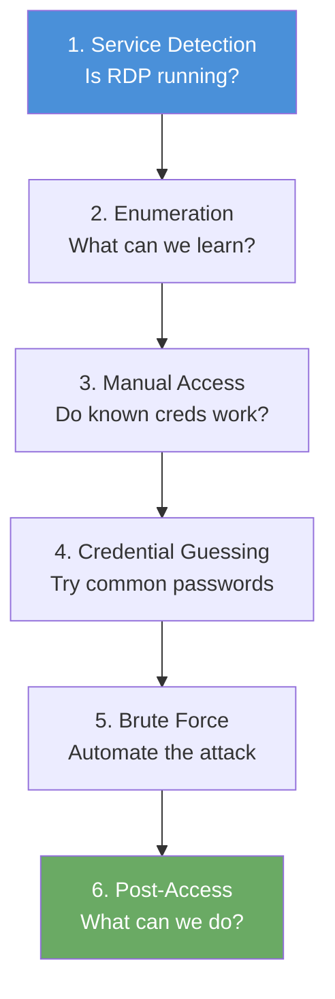

# Chapter 4: RDP Exploitation

## Why RDP Matters

Chapter 3 gave you authenticated access to SMB shares; you discovered credentials and downloaded files from protected directories. But file shares are only one service on a Windows machine. Remote Desktop Protocol (RDP) provides something far more powerful: a full graphical desktop session on the target, as if you were sitting in front of the machine. An attacker with valid RDP credentials can browse files, run programs, install software, and access anything the logged-in user can reach. In a penetration test, gaining RDP access is often the turning point between "I found some data" and "I own this system."

Your Nmap scans from earlier chapters likely already revealed port 3389 on the FinanceCorp target. You noticed it, noted it, and moved on. Now you come back to that port with a plan.

## What Is RDP?

Remote Desktop Protocol is a proprietary protocol developed by Microsoft that allows a user to connect to another computer over a network and interact with its full graphical desktop. RDP listens on **TCP port 3389** by default and is built into every version of Windows since XP. System administrators use it daily to manage servers without physical access. Attackers target it because a successful connection grants the same level of access as sitting at the keyboard.

The target in these exercises runs **xrdp**, an open-source RDP server commonly found on Linux systems configured to accept RDP connections. Nmap identifies xrdp as `ms-wbt-server` (Microsoft Windows-Based Terminal Server) because it speaks the same protocol as native Windows RDP. From the client side, connecting to xrdp feels identical to connecting to a Windows machine; the tools and techniques are the same.

RDP is one of the most commonly exposed services on the internet. Shodan regularly indexes hundreds of thousands of RDP endpoints, and credential-based attacks against RDP are a leading initial access vector for ransomware operators. Understanding how to detect, enumerate, and test RDP is essential for any penetration tester.

## How RDP Differs from SMB

SMB and RDP are both Windows-centric protocols, but they serve very different purposes. Recognizing the distinction helps you understand why gaining RDP access is a more significant finding than SMB access alone.

**SMB (port 445)** provides file and printer sharing. When you authenticate to an SMB share, you can list directories, read files, and write files; but only within the shares that the administrator has configured. You cannot run programs, install software, or interact with the system beyond file operations. SMB access is like having the key to a filing cabinet.

**RDP (port 3389)** provides a full interactive desktop session. When you authenticate over RDP, you see the target's desktop, taskbar, and applications. You can open a terminal and run any command the user account allows. You can browse the entire filesystem, not just specific shares. You can launch web browsers to access internal applications, open email clients, or connect to databases. RDP access is like sitting down at the computer itself.

In a penetration test report, SMB credential compromise is a significant finding. RDP credential compromise is a critical finding, because the scope of what an attacker can do with a desktop session far exceeds what they can do with file share access alone.

## The RDP Attack Workflow

The six labs in this chapter follow the same structured workflow that you used for SMB. Repeating the same methodology across different protocols reinforces the pattern and builds the habit of working systematically.

Each phase answers a specific question. Detection asks "is the service present?" Enumeration asks "what configuration details can we learn without credentials?" Manual access asks "do any known credentials work?" Credential guessing and brute force ask "can we discover unknown credentials?" Post-access asks "what is the real-world impact of this compromise?" By the time you finish all six labs, you will have answered every question in the chain.

## What Will You Learn?

The six labs in this chapter take you from discovering the RDP service to establishing a full graphical session and retrieving data from the target desktop. Each lab builds on the previous one, following the same methodology you used for SMB: discover, enumerate, test, exploit.

By the end of this chapter, you will be able to:

- Detect RDP services running on port 3389 using Nmap
- Enumerate RDP version details, encryption levels, and NTLM information using NSE scripts
- Connect to an RDP session using xfreerdp with known credentials
- Test common credential combinations against RDP manually
- Perform automated brute force attacks against RDP using Hydra
- Navigate a full RDP desktop session and retrieve files through multiple methods

## Lab Progression

The six labs follow a deliberate path from passive detection to full interactive access. Each lab introduces one new capability.

| Exercise | Title | Key Commands |
|-----|-------|-------------|
| 4.1 | RDP Service Detection | `nmap -p 3389 -sV -Pn <target_ip>` |
| 4.2 | RDP Version Enumeration | `nmap --script rdp-enum-encryption,rdp-ntlm-info <target_ip>` |
| 4.3 | RDP Manual Connection Test | `xfreerdp /v:<target_ip> /u:admin /p:password /cert:ignore` |
| 4.4 | RDP Credential Guessing | `xfreerdp /v:<target_ip> /u:admin /p:<guess> /cert:ignore` |
| 4.5 | RDP Brute Force Attack | `hydra -l admin -P wordlist.txt rdp://<target_ip>` |
| 4.6 | RDP Session Access and Flag Retrieval | `xfreerdp /v:<target_ip> /u:admin /p:qwerty +clipboard /dynamic-resolution` |

Notice how the progression mirrors Chapter 3: detect the service, learn about its configuration, attempt manual access, guess credentials, automate the guessing, and then exploit successful credentials for full access.

## Before You Start

Make sure the following are in place before beginning Exercise 4.1:

- [ ] You have completed Chapter 3 (SMB Credential Attacks)
- [ ] You understand basic Nmap scanning from Chapter 1
- [ ] Your VPN is connected and your terminal is open
- [ ] You have a Kali Linux terminal with `nmap`, `xfreerdp`, and `hydra` installed (pre-installed on most Kali builds)
- [ ] You have verified connectivity to the target by pinging it or running a quick Nmap scan
- [ ] You are comfortable reading Nmap output (service names, version strings, script results)

If any of the earlier chapter concepts feel unclear, review those labs before proceeding. The techniques here assume you are comfortable with port scanning, service detection, and the general credential-attack workflow.
