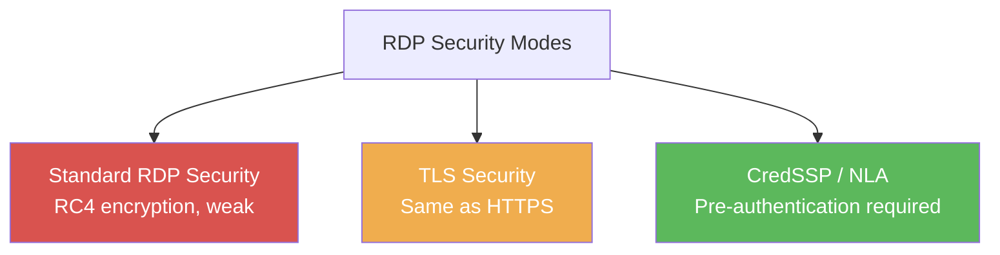

# Exercise 4.2: RDP Version Enumeration

## Before You Begin

Exercise 4.1 confirmed that RDP is running on port 3389 and identified the service as xrdp. Knowing the service exists is useful, but a penetration tester needs more detail: what encryption levels are supported, what authentication information leaks through the protocol, and whether the server is vulnerable to known exploits. Nmap's NSE (Nmap Scripting Engine) scripts extract exactly that information.

## Scenario

After confirming that FinanceCorp's target has RDP exposed, James Mitchell asks for a deeper assessment. He wants to know the encryption strength of the RDP service, whether the server leaks any domain or hostname information through NTLM negotiation, and whether the service might be vulnerable to BlueKeep (CVE-2019-0708); a critical RDP vulnerability that allows remote code execution without authentication. You will use targeted NSE scripts to answer all three questions.

The target provides an SSH account for flag retrieval: username `rdpuser`, password `password123`.

## Your Objectives

- Use NSE scripts to enumerate RDP encryption levels and security protocols
- Extract NTLM authentication information (hostname, domain, OS version) from the RDP handshake
- Examine SSL/TLS certificate details on the RDP service
- Understand the BlueKeep vulnerability and its relevance to RDP assessments
- Capture the flag

---

## Background: RDP Security Layers

RDP supports multiple security configurations, and the level of protection varies significantly between them. Understanding these layers helps you assess how well the target is defended.

RDP can operate in three security modes:

- **Standard RDP Security**: the original encryption built into the RDP protocol. It uses RSA for key exchange and RC4 for bulk encryption. Known weaknesses in this mode allow man-in-the-middle attacks.
- **TLS (Transport Layer Security)**: wraps the RDP session in a standard TLS tunnel, the same encryption used by HTTPS. Significantly stronger than standard RDP security.
- **CredSSP (Credential Security Support Provider)**: adds Network Level Authentication (NLA), which requires the user to authenticate before the full RDP session is established. NLA is the strongest option because it prevents unauthenticated users from reaching the login screen.

A server that supports only Standard RDP Security without TLS or NLA is significantly weaker than one requiring CredSSP. Your enumeration will reveal which modes the target supports.

**BlueKeep (CVE-2019-0708)** is a critical vulnerability disclosed in May 2019 that affects the RDP service on older Windows systems (Windows 7, Windows Server 2008). It allows an unauthenticated attacker to execute arbitrary code by sending specially crafted requests to the RDP service. BlueKeep is "wormable"; meaning it can spread from machine to machine without user interaction. While the lab target (xrdp on Linux) is not vulnerable to BlueKeep, understanding the vulnerability is essential because you will encounter Windows RDP targets in real assessments.



---

## Tool Primer: Nmap NSE Scripts for RDP

The Nmap Scripting Engine (NSE) extends Nmap's capabilities beyond port scanning. Three scripts are particularly relevant for RDP enumeration.

| Script | Purpose |
|--------|---------|
| `rdp-enum-encryption` | Lists supported encryption protocols and security layers |
| `rdp-ntlm-info` | Extracts NTLM authentication details (hostname, domain, OS) |
| `ssl-cert` | Retrieves the SSL/TLS certificate (if TLS is enabled) |

**Running multiple scripts at once:**

!!! kali "Run three RDP NSE scripts in one scan"
    Comma-separating the script names tells Nmap to run all three against the same port in a single connection.

    ```bash
    nmap -p 3389 -Pn --script rdp-enum-encryption,rdp-ntlm-info,ssl-cert <target_ip>
    ```

    Sample `rdp-enum-encryption` output:

    ```
    | rdp-enum-encryption:
    |   Security layer
    |     CredSSP (NLA): SUCCESS
    |     CredSSP with Early User Auth: SUCCESS
    |     Native RDP: SUCCESS
    |     RDSTLS: SUCCESS
    |     SSL: SUCCESS
    |   RDP Encryption level: Client Compatible
    |     40-bit RC4: SUCCESS
    |     56-bit RC4: SUCCESS
    |     128-bit RC4: SUCCESS
    |     FIPS 140-1: SUCCESS
    |_  RDP Protocol Version: Unknown
    ```

    Sample `rdp-ntlm-info` output:

    ```
    | rdp-ntlm-info:
    |   Target_Name: FINANCECORP
    |   NetBIOS_Domain_Name: FINANCECORP
    |   NetBIOS_Computer_Name: WIN-DC01
    |   DNS_Domain_Name: financecorp.local
    |   DNS_Computer_Name: WIN-DC01.financecorp.local
    |_  Product_Version: 10.0.17763
    ```

The NTLM information is especially valuable because it reveals internal hostnames, domain names, and sometimes the exact Windows version; all without requiring any authentication.

---

## Walkthrough

### Step 1: Launch the Exercise

Open the platform in your browser and start the exercise environment.

- Navigate to **Exercises** --> **RDP Exploitation** --> **Level 2**
- Click **Launch** on "RDP Version Enumeration"
- Wait for the status to change to **Running**
- Note the **target IP** displayed in the Active Lab View

### Step 2: Run the RDP Encryption Enumeration Script

Start with the encryption enumeration script to discover what security modes the target supports.

!!! kali "Enumerate RDP encryption modes"
    The `rdp-enum-encryption` script lists every supported security layer and encryption strength. Replace `<target_ip>` with the IP shown in the Active Lab View.

    ```bash
    nmap -p 3389 -Pn --script rdp-enum-encryption <target_ip>
    ```

    Examine the output carefully. Look for which security layers returned **SUCCESS** and which encryption levels are supported. Pay attention to whether weak encryption (40-bit RC4) is accepted; a finding worth noting in any real assessment.

### Step 3: Run the NTLM Information Script

The NTLM info script extracts authentication metadata from the RDP handshake. No credentials are needed for this; the information leaks during the initial protocol negotiation.

!!! kali "Extract NTLM info from the RDP handshake"
    The `rdp-ntlm-info` script reads the hostname, domain, and OS version that the server leaks during protocol negotiation.

    ```bash
    nmap -p 3389 -Pn --script rdp-ntlm-info <target_ip>
    ```

    Record every field in the output. The `Target_Name`, `NetBIOS_Computer_Name`, and `DNS_Domain_Name` fields are reconnaissance gold. They reveal the internal naming structure of the organization without requiring any access.

### Step 4: Check the SSL Certificate

If the target supports TLS for RDP, the SSL certificate may contain additional information such as hostnames, organization names, and validity dates.

!!! kali "Retrieve the RDP SSL certificate"
    The `ssl-cert` script pulls the certificate when the service offers a TLS layer.

    ```bash
    nmap -p 3389 -Pn --script ssl-cert <target_ip>
    ```

    Look at the **Subject** and **Issuer** fields in the certificate. Self-signed certificates are common on internal servers and indicate that the organization has not deployed a proper PKI (Public Key Infrastructure) for RDP.

### Step 5: Run All Scripts Together

For efficiency, combine all three scripts into a single scan. Running them together saves time because Nmap only needs to establish one connection to the target.

!!! kali "Run all three scripts together"
    Comma-separating the three script names runs the full enumeration in one pass against the same connection.

    ```bash
    nmap -p 3389 -Pn --script rdp-enum-encryption,rdp-ntlm-info,ssl-cert <target_ip>
    ```

    Compare the combined output with the individual results from Steps 2-4. The information should be identical, but having it in one output makes documentation easier.

### Step 6: Understand BlueKeep Context

BlueKeep (CVE-2019-0708) targets a flaw in the RDP service on Windows 7, Windows Server 2008, and Windows Server 2008 R2. Nmap has a detection script for it.

!!! kali "Test for the MS12-020 RDP vulnerability"
    The `rdp-vuln-ms12-020` script probes for a known RDP code-execution flaw that you would run against Windows targets.

    ```bash
    nmap -p 3389 -Pn --script rdp-vuln-ms12-020 <target_ip>
    ```

    The lab target runs xrdp on Linux, so it is not vulnerable to BlueKeep or MS12-020. However, in a real engagement, you would always run vulnerability-specific scripts against Windows RDP targets. A positive result for BlueKeep is a critical finding that should be reported immediately.

### Step 7: Retrieve the Flag via SSH

Connect to the target using SSH to retrieve the flag for this exercise.

!!! kali "Connect to the target over SSH"
    SSH gives you a shell on the target so you can read the flag file directly. Log in as `rdpuser` with the password `password123` when prompted. The same `rdpuser:password123` credentials are listed in the lab scenario.

    ```bash
    ssh rdpuser@<target_ip>
    ```

Once connected, read the flag file.

!!! target "Read the flag file on the target"
    The `cat` command runs in your SSH session on the target host and prints the flag stored in the user's home directory.

    ```bash
    cat /home/rdpuser/flag.txt
    ```

    The flag is in `OCR{<flag_here>}` format. Copy it before you disconnect.

!!! target "Close the SSH session"
    The `exit` command leaves the target shell and returns you to your Kali prompt so you can paste the flag into the **Submit Flag** form.

    ```bash
    exit
    ```

---

### Record Your Findings

> **Encryption enumeration results:**
>
> | Security Layer | Status |
> |---------------|--------|
> | CredSSP (NLA) | |
> | Native RDP | |
> | SSL/TLS | |
>
> | Encryption Level | Status |
> |-----------------|--------|
> | 40-bit RC4 | |
> | 56-bit RC4 | |
> | 128-bit RC4 | |
> | FIPS 140-1 | |
>
> **NTLM information extracted:**
>
> | Field | Value |
> |-------|-------|
> | Target_Name | |
> | NetBIOS_Computer_Name | |
> | DNS_Domain_Name | |
> | Product_Version | |
>
> **SSL certificate details:**
>
> ```
> (paste the Subject and Issuer fields here)
> ```
>
> **Flag:**
>
> ```
> (paste the flag here)
> ```

---

### Step 8: Record the Flag

Submit the flag you retrieved from `/home/rdpuser/flag.txt` in the `OCR{<flag_here>}` format to the platform.

---

## Analysis Questions

Take a moment to think through these questions. They reinforce the concepts behind each step you performed.

**1. The target supports 40-bit RC4 encryption for RDP. Why is accepting weak encryption a security concern, even if stronger options are also available?**

??? note "Reveal Answer"

    An attacker who can perform a man-in-the-middle attack on the network could force the RDP session to downgrade to 40-bit encryption. 40-bit keys can be brute-forced in seconds on modern hardware. If the server only accepted 128-bit or FIPS 140-1 encryption, the downgrade attack would fail. Accepting weak encryption gives attackers options they should not have.

**2. The `rdp-ntlm-info` script revealed the internal domain name and hostname without any authentication. Why is this a concern?**

??? note "Reveal Answer"

    Internal naming conventions reveal organizational structure. A domain name like `financecorp.local` confirms the Active Directory domain. Hostnames like `WIN-DC01` suggest a domain controller. An attacker can use this information to plan targeted attacks, craft phishing emails with believable internal references, or guess additional hostnames following the same naming pattern. Leaking internal infrastructure details to unauthenticated users violates the principle of least privilege.

**3. The lab target runs xrdp on Linux and is not vulnerable to BlueKeep. How would you adjust your approach if the target were a Windows Server 2008 R2 machine?**

??? note "Reveal Answer"

    You would immediately run the BlueKeep detection script (`nmap --script rdp-vuln-ms12-020` or a dedicated BlueKeep scanner). If the system were vulnerable, you would flag it as a critical finding requiring immediate patching. BlueKeep allows unauthenticated remote code execution, making it far more severe than weak credentials. You would also check whether the system has been patched (KB4499175 for Server 2008 R2) and recommend enabling NLA as a mitigation even after patching.

---

## Key Takeaways

- **NSE scripts** extend Nmap from a port scanner into a detailed enumeration tool
- **`rdp-enum-encryption`** reveals which security layers and encryption strengths the server accepts; weak encryption is a reportable finding
- **`rdp-ntlm-info`** extracts hostnames, domain names, and OS versions without authentication; valuable reconnaissance data
- **BlueKeep (CVE-2019-0708)** is a critical RDP vulnerability affecting older Windows systems; always test for it on Windows targets
- Enumeration builds the intelligence you need before attempting connections. The next exercise uses what you have learned here to make your first RDP connection.
