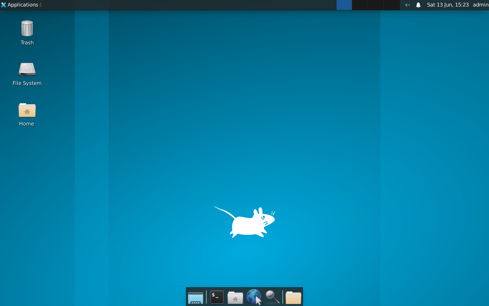

# Exercise 4.3: RDP Manual Connection Test

## Before You Begin

Exercises 4.1 and 4.2 confirmed that RDP is running and revealed its encryption configuration and NTLM information. All of that was passive; you gathered data without attempting to log in. Now you cross the line from reconnaissance into active exploitation. You have a set of known credentials (`admin:password`), and you will use them to establish your first full RDP session.

## Scenario

During the FinanceCorp assessment, another team member discovered the credentials `admin:password` through a different attack vector; perhaps a configuration file left in an accessible share, or a sticky note photographed during a physical assessment. James Mitchell asks you to verify whether these credentials grant RDP access to the target server. If they do, you need to document the access level and retrieve any sensitive data visible from the desktop session.

## Your Objectives

- Connect to the target's RDP service using xfreerdp with known credentials
- Navigate the XFCE desktop environment within the RDP session
- Verify that the credentials provide a working graphical session
- Locate and retrieve the flag from the remote desktop
- Capture the flag

---

## Background: How RDP Sessions Work

When you connect to an RDP server with valid credentials, the server creates a full desktop session for your user account. You see the same desktop, applications, and files that the user would see if they were physically sitting at the machine. Every action you take; opening files, running commands, installing software; executes on the remote system, not on your local machine.

RDP sessions are not anonymous. The server logs every connection attempt, including the source IP address, the username, and the timestamp. In a real engagement, your RDP connections will appear in the Windows Event Log (or syslog on Linux/xrdp targets). The fact that connections are logged is something to note in your report; it means defenders can detect your activity if they are monitoring.

The target in these exercises runs the **XFCE desktop environment** through xrdp. XFCE is a lightweight Linux desktop that provides a taskbar, file manager, terminal emulator, and standard graphical applications. If you are familiar with Windows desktops, XFCE will feel similar; icons on the desktop, a taskbar at the bottom or top, and right-click context menus for common actions.

```mermaid
graph LR
    A["Kali Linux<br/>xfreerdp client"]
    B["windows-target<br/>xrdp server"]
    A; "RDP Protocol<br/>Port 3389" --> B
    B; "XFCE Desktop<br/>Session" --> C["Full graphical<br/>access"]
```

---

## Tool Primer: xfreerdp

`xfreerdp` is an open-source RDP client included with most Linux distributions. It connects to any RDP server; Windows-native or xrdp; and displays the remote desktop in a window on your local machine.

!!! kali "Basic xfreerdp connection syntax"
    The minimal command to open an RDP session supplies the target, a username, a password, and the certificate-ignore flag. Substitute the values for your engagement before running it.

    ```bash
    xfreerdp /v:<target_ip> /u:admin /p:password /cert:ignore
    ```

    A successful run opens a remote desktop window. A failure returns the connection to the prompt with an error code.

**Key flags explained:**

| Flag | Purpose |
|------|---------|
| `/v:<target_ip>` | Target server address (IP or hostname) |
| `/u:admin` | Username to authenticate with |
| `/p:password` | Password to authenticate with |
| `/cert:ignore` | Accept untrusted certificates without prompting |
| `/size:1280x720` | Set the resolution of the remote desktop window |
| `+clipboard` | Enable clipboard sharing between local and remote systems |

**Why `/cert:ignore`?** RDP servers typically use self-signed certificates. Without this flag, xfreerdp prompts you to manually accept the certificate every time you connect. In a lab environment, ignoring the certificate warning is safe and saves time.

**What success looks like:** A new window appears on your screen showing the remote desktop. You will see the XFCE desktop environment with a taskbar, desktop icons, and possibly a wallpaper.

**What failure looks like:** The terminal displays an error message such as `ERRCONNECT_LOGON_FAILURE` or `ERRCONNECT_CONNECT_TRANSPORT_FAILED` and no window appears. Authentication failures mean the credentials are wrong. Transport failures mean the service is unreachable.

---

## Walkthrough

### Step 1: Launch the Exercise

Open the platform in your browser and start the exercise environment.

- Navigate to **Exercises** --> **RDP Exploitation** --> **Level 3**
- Click **Launch** on "RDP Manual Connection Test"
- Wait for the status to change to **Running**
- Note the **target IP** displayed in the Active Lab View

### Step 2: Verify RDP Is Accessible

!!! kali "Confirm RDP port is reachable"
    Before attempting a connection, confirm that port 3389 is reachable. The `-Pn` flag skips host discovery and treats the target as online, which avoids a false "host down" result when ICMP is filtered.

    ```bash
    nmap -p 3389 -Pn <target_ip>
    ```

    You should see port 3389 in the **open** state. If it shows as filtered, wait for the lab to finish initializing and try again.

### Step 3: Connect with xfreerdp

!!! kali "Open an RDP session with xfreerdp"
    Establish your first RDP session using the known credentials. The `/cert:ignore` flag accepts the self-signed certificate, and `/size:1280x720` sets the window resolution.

    ```bash
    xfreerdp /v:<target_ip> /u:admin /p:password /cert:ignore /size:1280x720
    ```

    A new window should appear within a few seconds, displaying the XFCE desktop. If you see an error instead of a desktop, check the following:

- Is the target IP correct?
- Is port 3389 confirmed open from Step 2?
- Did you include `/cert:ignore`?

<figure markdown>
  { width="820" }
  <figcaption>The graphical session an attacker gains the instant the credentials validate: the Applications menu, the panel showing the logged-in admin user, the Trash, File System, and Home desktop icons, and the launcher dock. The same desktop the user would see sitting at the physical machine is now under your control.</figcaption>
</figure>

### Step 4: Explore the Desktop

Once the RDP session is established, take a moment to orient yourself in the remote desktop environment. The XFCE desktop has several key elements worth noting.

Look for the following:

- **Taskbar**: usually at the top or bottom of the screen, with application launchers and a system tray
- **Desktop icons**: files or shortcuts placed on the desktop surface
- **File Manager**: accessible from the taskbar, shows the filesystem graphically
- **Terminal Emulator**: accessible from the taskbar or by right-clicking the desktop, provides a command line

Open the file manager by clicking its icon in the taskbar or by right-clicking the desktop and selecting "Open Terminal Here" to get a command prompt.

<figure markdown>
  { width="820" }
  <figcaption>A terminal opened inside the session lands you at the remote admin home prompt. Every command typed here runs on the victim host, not your Kali box, which is what makes interactive RDP access so much more powerful than file-share-only protocols.</figcaption>
</figure>

### Step 5: Locate the Flag

The flag for this exercise is located at `/home/admin/flag.txt`. You can retrieve it using either the graphical file manager or the terminal. Both methods are valid; choose the one you are more comfortable with.

**Method A; Using the Terminal:**

!!! target "Read the flag from the remote terminal"
    Open a terminal within the RDP session and run the following command on the target. The terminal runs inside the XFCE desktop, so the command executes on the remote machine.

    ```bash
    cat /home/admin/flag.txt
    ```

    The command prints the flag value in `OCR{<flag_here>}` format. Record it for submission.

**Method B; Using the File Manager:**

Open the file manager, navigate to `/home/admin/`, and double-click `flag.txt` to open it in a text editor.

The flag is in `OCR{<flag_here>}` format. Write it down or use clipboard sharing to copy it.

### Step 6: Enable Clipboard Sharing (if needed)

!!! kali "Reconnect with clipboard sharing enabled"
    If you did not include `+clipboard` in your initial connection, disconnect and reconnect with clipboard support enabled. The `+clipboard` flag turns on bidirectional copy and paste between your Kali machine and the remote desktop.

    ```bash
    xfreerdp /v:<target_ip> /u:admin /p:password \
      /cert:ignore /size:1280x720 +clipboard
    ```

    With clipboard sharing active, you can copy text inside the RDP session (Ctrl+C) and paste it on your local machine (Ctrl+V). Copying the flag directly avoids transcription errors.

### Step 7: Disconnect the Session

Close the RDP window by clicking the X button on the window frame, or press Ctrl+Alt+Enter to toggle fullscreen and then close. You can also disconnect from the terminal by killing the xfreerdp process.

---

### Record Your Findings

> **Connection command used:**
>
> ```
> (paste the exact xfreerdp command you ran)
> ```
>
> **Desktop environment observed:**
>
> | Element | Present? (Yes/No) |
> |---------|-------------------|
> | Taskbar | |
> | Desktop icons | |
> | File Manager | |
> | Terminal Emulator | |
>
> **Flag retrieval method used:** (Terminal / File Manager / Both)
>
> **Flag:**
>
> ```
> (paste the flag here)
> ```

---

### Step 8: Record the Flag

Submit the flag you retrieved from `/home/admin/flag.txt` in the `OCR{<flag_here>}` format to the platform.

---

## Analysis Questions

Take a moment to think through these questions. They reinforce the concepts behind each step you performed.

**1. The credentials `admin:password` gave you full desktop access. How does RDP access differ from SMB access in terms of what an attacker can do?**

??? note "Reveal Answer"

    SMB access lets you read and write files on specific shares. RDP access gives you a full interactive desktop session; you can run programs, open browsers, access internal web applications, pivot to other systems, install backdoors, and interact with the system exactly as a legitimate user would. RDP access is significantly more dangerous than file share access because it provides complete control over the user's session.

**2. You used `/cert:ignore` to bypass the certificate warning. In a real engagement, what should you do with the certificate information instead of ignoring it?**

??? note "Reveal Answer"

    In a real engagement, you should examine the certificate details (issuer, subject, validity dates) and record them in your notes. A self-signed certificate is a finding worth reporting; it means the organization has not deployed proper certificate management for RDP. The certificate's subject name may also reveal internal hostnames or domain information useful for further reconnaissance.

**3. The target runs XFCE, a Linux desktop environment. How would the experience differ if the target were a Windows Server?**

??? note "Reveal Answer"

    On a Windows Server, you would see the standard Windows desktop with the Start menu, taskbar, and Windows Explorer. The file paths would use backslashes (`C:\Users\admin\flag.txt` instead of `/home/admin/flag.txt`). The command-line tools would be `cmd.exe` or PowerShell instead of bash. The underlying RDP protocol is identical; only the desktop environment and operating system differ. Your xfreerdp client works with both.

**4. RDP connections are logged on the server. What log entries would your connection generate?**

??? note "Reveal Answer"

    On a Linux/xrdp target, your connection generates entries in syslog and the xrdp log files (typically `/var/log/xrdp.log` and `/var/log/xrdp-sesman.log`). These logs record the source IP, username, connection time, and session duration. On a Windows target, RDP connections generate Event ID 4624 (successful logon) and Event ID 4625 (failed logon) in the Security Event Log. A security operations team monitoring these logs would see your activity.

---

## Key Takeaways

- **xfreerdp** is the standard Linux RDP client for connecting to both Windows and xrdp targets
- **`/cert:ignore`** bypasses certificate warnings; essential in lab environments, but examine certificates in real engagements
- RDP provides **full graphical desktop access**, making it far more powerful than file-share-only protocols like SMB
- The **XFCE desktop** on the target provides a file manager, terminal, and standard Linux tools through the graphical session
- You connected with known credentials; but what if you do not have credentials? The next exercise explores manual credential guessing against RDP.
