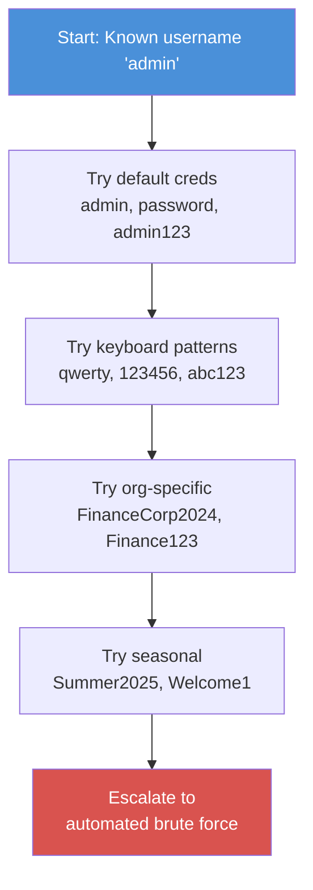
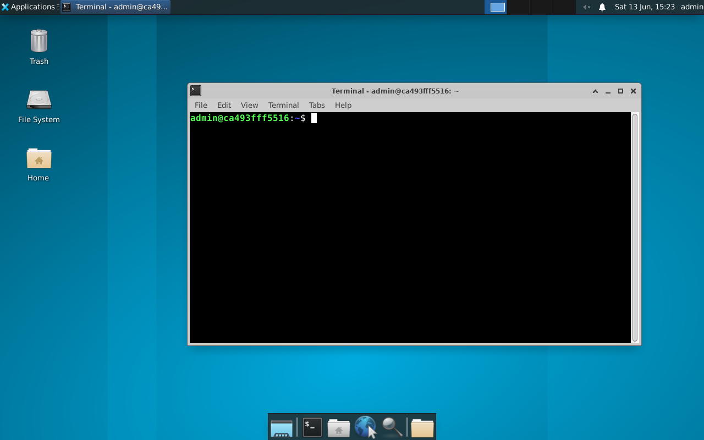

# Exercise 4.4: RDP Credential Guessing

## Before You Begin

Exercise 4.3 gave you RDP access using credentials that were already known. In the real world, you rarely start with a valid username and password handed to you. Penetration testers often begin with nothing more than a service on an open port and a list of common guesses. Before reaching for automated tools, manual credential guessing helps you develop intuition about how authentication failures look, how long each attempt takes, and which credential patterns are worth trying first.

## Scenario

James Mitchell has asked you to test whether any default or easily guessable credentials work on the FinanceCorp RDP service. You know the username `admin` exists on the system from your earlier enumeration. Your job is to systematically try common passwords, observe the results, and determine whether the account uses a weak password. The credentials from Exercise 4.3 (`admin:password`) have been changed; you need to discover the new password.

## Your Objectives

- Manually test common credential combinations against the RDP service
- Observe and interpret xfreerdp authentication error messages
- Apply a structured approach to manual credential guessing
- Discover valid credentials and establish an RDP session
- Capture the flag

---

## Background: Manual Credential Guessing Strategy

Automated brute force tools test thousands of passwords per minute, but running them blindly wastes time and generates noise. A skilled tester starts with manual guessing; a small number of high-probability passwords chosen based on context. Manual guessing is quiet (fewer log entries), fast (you test the most likely candidates first), and educational (you learn how the service responds to failures).

Effective manual guessing follows a structured order, starting with the most commonly successful categories.

**Category 1; Default credentials.** Every service has well-known defaults. For RDP on a system with an `admin` account, the usual suspects are `admin`, `password`, `admin123`, and blank passwords.

**Category 2; Keyboard patterns.** Passwords like `qwerty`, `123456`, `abc123`, and `1q2w3e4r` appear in nearly every breach database. Users choose them because they are fast to type, not because they are secure.

**Category 3; Organizational context.** Knowing the company name is "FinanceCorp" lets you try patterns like `FinanceCorp2024`, `Finance123`, and `Welcome1`. These organizational passwords are especially common as initial passwords set by IT departments.

**Category 4; Seasonal and date-based.** Passwords like `Summer2025`, `Winter2024`, and `January2025` are common in environments that force periodic password changes, because users pick the easiest pattern that meets complexity requirements.

A well-organized tester works through these categories in order, spending two to three minutes on manual guessing before escalating to automated tools. If the password falls in the first 10-15 guesses, you have saved significant time compared to launching a full brute force.



---

## Tool Primer: xfreerdp for Credential Testing

You already know xfreerdp from Exercise 4.3. For credential testing, the key behavior to understand is how xfreerdp reports authentication failures.

!!! kali "Test a single credential pair"
    To test one password, pass it with `/p:` and watch the result. Replace `testpassword` with the candidate you want to try.

    ```bash
    xfreerdp /v:<target_ip> /u:admin /p:testpassword /cert:ignore
    ```

    A desktop window means the credentials are valid. An error returned to the prompt means they were rejected.

**Successful authentication:** A desktop window appears. The credentials are valid.

**Failed authentication:** The terminal displays an error and no window appears. The exact error message varies by configuration, but common failures look like the following output.

```
[ERROR][com.freerdp.core.connection] - ERRCONNECT_LOGON_FAILURE [0x00020014]
```

The error code `0x00020014` maps to `ERRCONNECT_LOGON_FAILURE`, which means the username or password was rejected. Just like SMB's `NT_STATUS_LOGON_FAILURE`, RDP does not tell you whether the username or the password was wrong; both produce the same error.

**Testing quickly:** Each failed xfreerdp attempt takes 2-5 seconds because the client must complete the full TLS handshake and authentication exchange before receiving the rejection. Plan accordingly; 10 manual guesses will take about 30-50 seconds.

---

## Walkthrough

### Step 1: Launch the Exercise

Open the platform in your browser and start the exercise environment.

- Navigate to **Exercises** --> **RDP Exploitation** --> **Level 4**
- Click **Launch** on "RDP Credential Guessing"
- Wait for the status to change to **Running**
- Note the **target IP** displayed in the Active Lab View

### Step 2: Verify RDP Is Accessible

!!! kali "Confirm RDP port is reachable"
    Confirm that port 3389 is reachable on the target. The `-Pn` flag skips host discovery so a filtered ICMP response does not hide a live host.

    ```bash
    nmap -p 3389 -Pn <target_ip>
    ```

    Port 3389 should be in the **open** state before you proceed.

### Step 3: Test Default Credentials

!!! kali "Try default passwords one at a time"
    Start with the most commonly used default passwords. Try each one individually and observe the result. The first attempt tests the username-matches-password pattern.

    ```bash
    xfreerdp /v:<target_ip> /u:admin /p:admin /cert:ignore
    ```

    If you see the LOGON_FAILURE error, the password `admin` is incorrect. Move to the next guess.

    ```bash
    xfreerdp /v:<target_ip> /u:admin /p:password /cert:ignore
    ```

    Try the default from the previous exercise. If the password has been changed, you will see another failure.

    ```bash
    xfreerdp /v:<target_ip> /u:admin /p:admin123 /cert:ignore
    ```

    Pay close attention to the response for each attempt. When you try `admin123`, the behavior should differ from the previous failures; instead of an error message, a desktop window should appear.

### Step 4: Confirm the Successful Connection

If the `admin:admin123` attempt opens a desktop window, you have found valid credentials. The XFCE desktop should appear, confirming that the `admin` account uses the password `admin123`.

Take a moment to verify you have full access by opening the file manager or a terminal within the RDP session.

<figure markdown>
  { width="820" }
  <figcaption>Confirmation that the guess landed: the XFCE desktop loads and a terminal opened inside the session sits at the remote admin prompt. The moment a failure error turns into a live desktop is the signal that the password is correct.</figcaption>
</figure>

### Step 5: Record the Attempts

Documenting every attempt, not just the successful one, is essential for a penetration test report. A complete record shows the client that you followed a methodical approach.

Keep track of each credential pair you tested and its result using the table in the Record Your Findings section below.

### Step 6: Retrieve the Flag

!!! target "Read the flag from the remote terminal"
    The flag is located at `/home/admin/flag.txt`. Open a terminal within the RDP session and read the file on the target. The terminal runs inside the remote desktop, so the command executes on the victim host.

    ```bash
    cat /home/admin/flag.txt
    ```

    The flag is in `OCR{<flag_here>}` format. Copy it using clipboard sharing or write it down.

### Step 7: Disconnect

Close the RDP session by closing the desktop window or pressing Ctrl+Alt+Enter and then closing the window. You can also terminate xfreerdp from your local terminal with Ctrl+C.

---

### Record Your Findings

> **Credential testing log:**
>
> | Attempt | Username | Password | Result |
> |---------|----------|----------|--------|
> | 1 | admin | admin | |
> | 2 | admin | password | |
> | 3 | admin | admin123 | |
> | 4 | | | |
> | 5 | | | |
>
> **Successful credentials:**
>
> | Username | Password |
> |----------|----------|
> | | |
>
> **Number of attempts before success:** ____
>
> **Flag:**
>
> ```
> (paste the flag here)
> ```

---

### Step 8: Record the Flag

Submit the flag you retrieved from `/home/admin/flag.txt` in the `OCR{<flag_here>}` format to the platform.

---

## Analysis Questions

Take a moment to think through these questions. They reinforce the concepts behind each step you performed.

**1. You found the password `admin123` on your third attempt. In a real environment with account lockout after 5 failed attempts, would your approach still work?**

??? note "Reveal Answer"

    Yes; three attempts is well within a typical lockout threshold of 5. Manual guessing with a short list of high-probability passwords is specifically designed to stay under lockout thresholds. An automated brute force testing hundreds of passwords would trigger lockout quickly, but targeted manual guessing is safe when you limit yourself to fewer than the lockout threshold minus one (to leave a margin of safety).

**2. The password `admin123` combines the username with a simple numeric suffix. What does this pattern reveal about how the password was likely created?**

??? note "Reveal Answer"

    The password was probably set by an IT administrator as an initial or default password, using a predictable pattern of "username + numbers." Many organizations use this pattern for new accounts, expecting users to change the password on first login. If no password change is enforced, the initial password remains active indefinitely. Penetration testers should always try "username + common suffixes" (123, 1, 01, 2024) as one of their first guessing strategies.

**3. Why is manual credential guessing preferred over automated brute force as a first step?**

??? note "Reveal Answer"

    Manual guessing is quieter (fewer failed login attempts appear in logs), faster for high-probability passwords (you skip the thousands of unlikely passwords in a wordlist), and less likely to trigger account lockout or intrusion detection systems. It also gives you firsthand experience with the service's authentication behavior; how long each attempt takes, what error messages look like, and whether the service throttles connections. Starting manual and escalating to automated tools is the standard penetration testing methodology.

---

## Key Takeaways

- **Manual credential guessing** should always precede automated brute force attacks
- Test passwords in priority order: **default credentials, keyboard patterns, organizational context, seasonal patterns**
- The password `admin123` follows the common "username + numbers" pattern; always include these in your first guesses
- xfreerdp reports `ERRCONNECT_LOGON_FAILURE` for both wrong usernames and wrong passwords, preventing username enumeration through error messages
- Manual guessing stays under **account lockout thresholds**, making it safer than automated tools in environments with lockout policies
- You found the password in three tries. The next exercise automates the process for situations where manual guessing does not succeed quickly.
