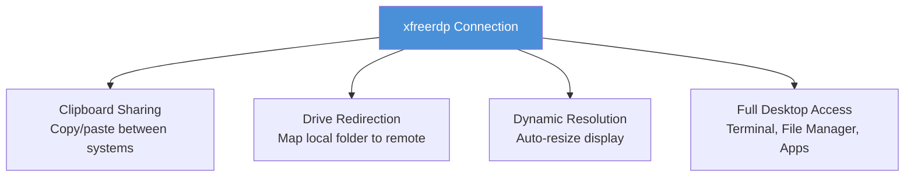
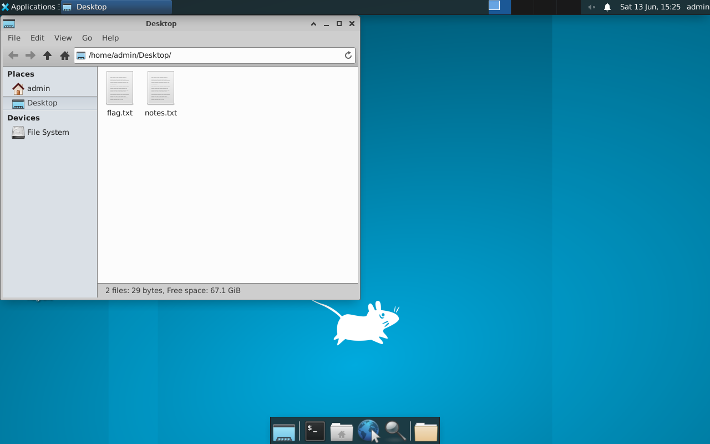

# Exercise 4.6: RDP Session Access and Flag Retrieval

## Before You Begin

Exercises 4.1 through 4.5 followed a clear progression: detect the service, enumerate its configuration, connect with known credentials, guess credentials manually, and brute force credentials automatically. Each lab built one skill. Now you combine everything into a complete RDP exploitation scenario; connecting with discovered credentials, navigating the desktop environment, and retrieving data through multiple methods. A penetration tester who can only find credentials but cannot operate within the session is only half effective.

## Scenario

James Mitchell wants a complete demonstration of the RDP risk at FinanceCorp. Finding credentials is only part of the story; the client needs to see what an attacker can actually do once they are inside. You will establish a full RDP session with advanced options, navigate the target's desktop, and retrieve a flag file stored on the user's Desktop using three different methods. Your report should show that an attacker with RDP access has the same level of control as someone sitting at the physical machine.

Use the working credentials for this lab: username `admin`, password `password123`. The flag is on the admin Desktop at `/home/admin/Desktop/flag.txt`.

## Your Objectives

- Connect to the target using xfreerdp with advanced session options (clipboard, drive sharing, dynamic resolution)
- Navigate the remote XFCE desktop to locate files visually
- Retrieve the flag using three different methods: terminal, file manager, and drive sharing
- Demonstrate the full impact of RDP access in a penetration test context
- Capture the flag

---

## Background: Post-Authentication RDP Capabilities

Gaining RDP access means more than just seeing a desktop. A full RDP session provides capabilities that make it one of the most valuable footholds in a penetration test.

**Clipboard sharing** allows you to copy and paste text between your local machine and the remote desktop. Passwords, file contents, and command output can be transferred instantly. In an attack scenario, an adversary could copy sensitive data from the target and paste it into their own notes without leaving any file transfer artifacts.

**Drive redirection** maps a local directory from your machine into the remote desktop's file system. The remote system sees your local folder as a network drive, allowing you to drag and drop files between systems. For a penetration tester, drive redirection means you can exfiltrate files from the target by simply copying them to the shared drive; no need for separate file transfer tools.

**Dynamic resolution** adjusts the remote desktop resolution to match your local window size. Resizing the window automatically changes the remote display, making it easier to work in the session without scrolling or squinting at a tiny viewport.

These features are all controlled by xfreerdp command-line flags. Each one adds a capability that mirrors what a real attacker would use after compromising RDP credentials.



---

## Tool Primer: xfreerdp Advanced Options

Building on Exercise 4.3's basic connection, the following flags enable advanced session features.

| Flag | Purpose |
|------|---------|
| `+clipboard` | Enable bidirectional clipboard sharing |
| `/drive:share,/tmp/rdp_share` | Map a local directory to a remote drive |
| `/dynamic-resolution` | Allow resolution changes when resizing the window |
| `/cert:ignore` | Accept untrusted certificates without prompting |
| `/size:1280x720` | Set initial window resolution |

!!! kali "Full xfreerdp connection with advanced options"
    The following command combines clipboard sharing, drive redirection, and dynamic resolution in one connection. Each flag adds a capability that mirrors what a real attacker would use after compromising RDP credentials.

    ```bash
    xfreerdp /v:<target_ip> /u:admin /p:password123 \
      /cert:ignore +clipboard \
      /drive:share,/tmp/rdp_share \
      /dynamic-resolution
    ```

    A remote desktop window opens with all three features active.

**Drive redirection explained:** The `/drive:share,/tmp/rdp_share` flag tells xfreerdp to create a directory at `/tmp/rdp_share` on your local machine (if it does not already exist) and present it as a network drive named "share" inside the remote desktop. Any file you copy to that drive in the remote session will appear in `/tmp/rdp_share` on your local machine.

!!! kali "Create the local share directory"
    Before connecting with drive redirection, create the local share directory first. The `-p` flag makes the operation succeed even if the directory already exists.

    ```bash
    mkdir -p /tmp/rdp_share
    ```

    The command produces no output on success.

---

## Walkthrough

### Step 1: Launch the Exercise

Open the platform in your browser and start the exercise environment.

- Navigate to **Exercises** --> **RDP Exploitation** --> **Level 6**
- Click **Launch** on "RDP Session Access and Flag Retrieval"
- Wait for the status to change to **Running**
- Note the **target IP** displayed in the Active Lab View

### Step 2: Prepare the Local Share Directory

!!! kali "Create and verify the local share directory"
    Create the directory that will be mapped into the remote session for file transfer.

    ```bash
    mkdir -p /tmp/rdp_share
    ```

    Verify the directory exists.

    ```bash
    ls -ld /tmp/rdp_share
    ```

    You should see the directory listed with appropriate permissions.

### Step 3: Connect with Advanced Options

!!! kali "Connect with all advanced features"
    Establish the RDP session with all advanced features enabled. The same combined flag set from the Tool Primer turns on clipboard, drive sharing, and dynamic resolution.

    ```bash
    xfreerdp /v:<target_ip> /u:admin /p:password123 \
      /cert:ignore +clipboard \
      /drive:share,/tmp/rdp_share \
      /dynamic-resolution
    ```

    The XFCE desktop should appear in a new window. Try resizing the window; the remote desktop should adjust its resolution automatically thanks to the `/dynamic-resolution` flag.

### Step 4: Locate the Flag Visually

The flag for this exercise is on the user's Desktop at `/home/admin/Desktop/flag.txt`. Start by looking at the desktop surface itself.

Look for a file icon labeled `flag.txt` on the desktop. In the XFCE environment, desktop files appear as icons on the desktop surface. If the file is visible, you can double-click it to open it in the default text editor and read its contents.

If the file is not visible as a desktop icon, open the file manager from the taskbar and navigate to `/home/admin/Desktop/`.

### Step 5: Retrieve the Flag Using the Terminal (Method 1)

Open a terminal emulator within the RDP session. You can find it in the taskbar, or right-click the desktop and look for a "Terminal" or "Open Terminal Here" option.

!!! target "Read the flag from the remote terminal"
    Once the terminal is open, read the flag file on the target. The terminal runs inside the remote desktop, so the command executes on the victim host.

    ```bash
    cat /home/admin/Desktop/flag.txt
    ```

    The flag is in `OCR{<flag_here>}` format. With clipboard sharing enabled, you can select the flag text in the remote terminal, copy it (Ctrl+Shift+C in most terminal emulators), and paste it directly on your local machine.

### Step 6: Retrieve the Flag Using the File Manager (Method 2)

Open the XFCE file manager (Thunar) from the taskbar. Navigate through the directory tree on the left panel.

Click through the following path: **Home** --> **Desktop**.

You should see `flag.txt` in the file listing. Double-click the file to open it in the text editor and read the flag contents. Having multiple retrieval methods available is important because some remote systems may have restricted terminal access or disabled certain GUI applications.

<figure markdown>
  { width="820" }
  <figcaption>The Thunar file manager navigated to /home/admin/Desktop reveals the flag.txt file directly in the listing, no command line required. A file manager turns the RDP foothold into point-and-click data discovery, which is exactly how an attacker would sweep a compromised desktop for sensitive material.</figcaption>
</figure>

### Step 7: Retrieve the Flag Using Drive Sharing (Method 3)

Drive sharing allows you to copy files from the remote system to your local machine through the mapped drive.

!!! target "Copy the flag onto the mapped drive"
    Inside the RDP session, open a terminal and copy the flag to the shared drive. The command runs on the target and writes into the redirected drive path.

    ```bash
    cp /home/admin/Desktop/flag.txt /media/cdrom/share/
    ```

    The path `/media/cdrom/share/` (or similar, depending on the xrdp configuration) is where the redirected drive appears in the remote filesystem. If that path does not exist, look for the mapped drive in the file manager under "Devices" or "Network" in the left panel.

!!! kali "Read the transferred flag on your local machine"
    After copying the file, check your local machine. The file should appear in your local share directory.

    ```bash
    cat /tmp/rdp_share/flag.txt
    ```

    If the drive mapping path differs on your system, you can also use the file manager within the RDP session to locate the mapped drive and drag the flag file to it.

### Step 8: Disconnect and Verify

!!! kali "Verify the transfer after disconnecting"
    Close the RDP session. Back on your local machine, verify that the flag was successfully transferred through drive sharing.

    ```bash
    ls /tmp/rdp_share/
    cat /tmp/rdp_share/flag.txt
    ```

    You should see `flag.txt` in the directory and its contents should match what you saw in the remote terminal.

---

### Record Your Findings

> **Connection command used:**
>
> ```
> (paste the full xfreerdp command with all options)
> ```
>
> **Flag retrieval results by method:**
>
> | Method | Successful? | Notes |
> |--------|------------|-------|
> | Terminal (cat) | | |
> | File Manager (GUI) | | |
> | Drive Sharing (copy) | | |
>
> **Flag (should be identical across all methods):**
>
> ```
> (paste the flag here)
> ```

---

### Step 9: Record the Flag

Submit the flag you retrieved from `/home/admin/Desktop/flag.txt` in the `OCR{<flag_here>}` format to the platform.

---

## Analysis Questions

Take a moment to think through these questions. They reinforce the concepts behind each step you performed.

**1. You retrieved the same flag using three different methods. In a real penetration test, why would you want multiple data retrieval techniques?**

??? note "Reveal Answer"

    Different targets have different restrictions. Some servers disable clipboard sharing at the Group Policy level. Some have no graphical file manager installed. Some block drive redirection through firewall rules. Knowing multiple retrieval methods ensures you can always extract data regardless of the target's configuration. In a report, demonstrating multiple methods also shows the client that disabling one feature does not eliminate the risk.

**2. Drive sharing maps a local directory into the remote session. What security risk does drive sharing introduce from the attacker's perspective?**

??? note "Reveal Answer"

    Drive sharing is bidirectional. While you can copy files from the remote system to your local machine, the remote system can also read files from your mapped directory. If you accidentally share a directory containing sensitive files (SSH keys, client data from other engagements, your notes), the target system; or another user on that system; could access them. Always create a dedicated, empty directory for drive sharing and never map your home directory or any directory containing sensitive data.

**3. An attacker with RDP access can do anything the logged-in user can do. What are three actions beyond file retrieval that make RDP access dangerous?**

??? note "Reveal Answer"

    (1) Installing persistent backdoors (new user accounts, scheduled tasks, remote access tools) that survive a password change. (2) Pivoting to other internal systems by using the compromised machine as a launch point for further attacks. (3) Accessing internal web applications, databases, and network resources that are only reachable from the internal network. RDP access effectively places the attacker inside the network perimeter, bypassing external-facing firewalls and security controls entirely.

**4. The credentials `admin:password123` gave you desktop-level access. What recommendation would you include in the FinanceCorp penetration test report?**

??? note "Reveal Answer"

    The report should recommend: (1) Enforce strong password complexity requirements (minimum 12 characters, mixed case, numbers, special characters). (2) Enable Network Level Authentication (NLA) to require authentication before the desktop session is created. (3) Restrict RDP access to specific IP addresses or require VPN connectivity. (4) Implement account lockout policies to limit brute force effectiveness. (5) Enable multi-factor authentication (MFA) for all RDP connections. (6) Monitor RDP login events for anomalous patterns (unusual times, unknown source IPs, multiple failed attempts).

---

## Key Takeaways

- **`+clipboard`** enables copy-paste between your local machine and the remote desktop; essential for efficient data transfer
- **`/drive:share,/tmp/rdp_share`** maps a local directory into the remote session, allowing file transfer without separate tools
- **`/dynamic-resolution`** adjusts the remote desktop to match your window size, improving usability
- Always have **multiple retrieval methods** available; terminal commands, graphical file manager, and drive sharing each work in different scenarios
- RDP access provides the **same level of control as physical access** to the machine; credential protection is critical
- You have completed all six RDP exploitation labs. The Chapter Review consolidates your skills and prepares you for Chapter 5 (WinRM Exploitation).
