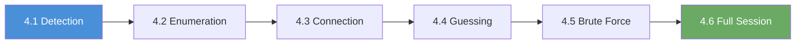

# Chapter 4: Review

## What You Learned

Over six labs, you progressed from detecting an RDP service on port 3389 to establishing a full graphical desktop session with clipboard sharing, drive redirection, and dynamic resolution. You learned to enumerate RDP encryption levels and NTLM information using NSE scripts, connect to an RDP session with xfreerdp, guess credentials manually using a structured priority-based approach, automate brute force attacks with Hydra, and retrieve files from the remote desktop through three independent methods. Along the way, you built the same reconnaissance-to-exploitation workflow that you used for SMB in Chapters 2 and 3; proving that the methodology transfers across protocols.

## The Progression You Followed

Each lab added one new layer to your RDP exploitation capability.

| Exercise | What You Added | Why It Matters |
|-----|---------------|----------------|
| 4.1 | RDP service detection | Confirmed the target runs RDP on port 3389 |
| 4.2 | NSE script enumeration | Discovered encryption levels, NTLM info, certificate details |
| 4.3 | Manual RDP connection | Established first desktop session with known credentials |
| 4.4 | Credential guessing | Tested common passwords manually with structured priority |
| 4.5 | Hydra brute force | Automated credential discovery with a targeted wordlist |
| 4.6 | Full session exploitation | Retrieved data via terminal, file manager, and drive sharing |

---

## Self-Assessment

Answer the following questions without looking back at the walkthroughs. If you get stuck on a question, that topic is worth revisiting in the corresponding lab.

**1.** What is the default port for RDP, and what service name does Nmap report for it?

> &nbsp;
>
> &nbsp;

**2.** Name three NSE scripts used for RDP enumeration and explain what each one reveals.

> &nbsp;
>
> &nbsp;

**3.** What xfreerdp flag bypasses the certificate trust warning?

> &nbsp;
>
> &nbsp;

**4.** In what order should you test password categories during manual credential guessing?

> &nbsp;
>
> &nbsp;

**5.** What Hydra flag limits the number of parallel connections, and what value is recommended for RDP?

> &nbsp;
>
> &nbsp;

**6.** What does the `-f` flag do in Hydra?

> &nbsp;
>
> &nbsp;

**7.** Name three xfreerdp flags that enhance a post-authentication RDP session.

> &nbsp;
>
> &nbsp;

**8.** What is BlueKeep (CVE-2019-0708), and why is it relevant to RDP assessments?

> &nbsp;
>
> &nbsp;

---

## Command Cheat Sheet

Keep the following reference handy throughout the rest of the workbook. These commands cover every technique from the chapter.

| Command | What It Does |
|---------|-------------|
| `nmap -p 3389 -Pn <target_ip>` | Check if RDP port is open |
| `nmap -p 3389 -sV -Pn <target_ip>` | Detect RDP service and version |
| `nmap -p 3389 --script rdp-enum-encryption <target_ip>` | Enumerate RDP encryption levels |
| `nmap -p 3389 --script rdp-ntlm-info <target_ip>` | Extract NTLM authentication details |
| `nmap -p 3389 --script ssl-cert <target_ip>` | Retrieve RDP SSL/TLS certificate |
| `xfreerdp /v:<target_ip> /u:user /p:pass /cert:ignore` | Connect to RDP with credentials |
| `xfreerdp /v:<target_ip> /u:user /p:pass /cert:ignore +clipboard` | Connect with clipboard sharing |
| `xfreerdp /v:<target_ip> /u:user /p:pass /cert:ignore /drive:share,/tmp/rdp_share` | Connect with drive redirection |
| `xfreerdp /v:<target_ip> /u:user /p:pass /cert:ignore /dynamic-resolution` | Connect with auto-resize |
| `hydra -l user -P wordlist.txt -t 4 -V -f rdp://<target_ip>` | Brute force RDP with Hydra |

---

## Connect the Dots: What Comes Next

You can now detect, enumerate, and exploit RDP; the graphical remote access protocol. But RDP is not the only remote management service on a Windows machine. Chapter 5 introduces **WinRM (Windows Remote Management)**, a command-line remote management protocol that runs on ports 5985 (HTTP) and 5986 (HTTPS). WinRM provides remote command execution without a graphical desktop, making it faster and stealthier than RDP. The tools change; you will use `evil-winrm` instead of `xfreerdp`: but the workflow remains the same: discover the service, enumerate what you can, and test credentials to gain access.

Where RDP gives you a visual desktop, WinRM gives you a PowerShell session. Both paths lead to full system access, but they leave different forensic footprints and are defended by different security controls. A complete penetration tester knows both.

---

## Self-Assessment Answer Key

**1.** RDP runs on **TCP port 3389** by default. Nmap reports the service name as **ms-wbt-server** (Microsoft Windows-Based Terminal Server), regardless of whether the server runs native Windows RDP or xrdp.

**2.** (1) **rdp-enum-encryption**: reveals which security layers (Standard RDP, TLS, CredSSP/NLA) and encryption levels (40-bit, 56-bit, 128-bit RC4, FIPS 140-1) the server supports. (2) **rdp-ntlm-info**: extracts NTLM authentication metadata including hostnames, domain names, and OS version without requiring credentials. (3) **ssl-cert**: retrieves the SSL/TLS certificate used by the RDP service, showing the subject, issuer, and validity dates.

**3.** The **`/cert:ignore`** flag tells xfreerdp to accept untrusted (self-signed) certificates without prompting for confirmation.

**4.** Test in this priority order: (1) **Default credentials** (admin/admin, admin/password, admin/admin123). (2) **Keyboard patterns** (qwerty, 123456, abc123). (3) **Organizational context** (FinanceCorp2024, Finance123). (4) **Seasonal/date patterns** (Summer2025, Welcome1).

**5.** The **`-t`** flag controls the number of parallel threads. A value of **4** is recommended for RDP because the TLS handshake overhead makes high thread counts unreliable and likely to trigger rate limiting.

**6.** The **`-f`** flag tells Hydra to **stop after finding the first valid credential pair**, rather than continuing to test all remaining combinations in the wordlist.

**7.** (1) **`+clipboard`**: enables bidirectional clipboard sharing between local and remote. (2) **`/drive:share,/tmp/rdp_share`**: maps a local directory into the remote session as a network drive. (3) **`/dynamic-resolution`**: adjusts the remote desktop resolution when you resize the window.

**8.** **BlueKeep (CVE-2019-0708)** is a critical vulnerability in the RDP service on Windows 7, Windows Server 2008, and Windows Server 2008 R2. It allows an **unauthenticated attacker** to execute arbitrary code by sending specially crafted requests to port 3389, without needing any credentials. It is classified as "wormable" because it can propagate automatically between vulnerable machines. RDP assessments should always include a BlueKeep check on Windows targets.
