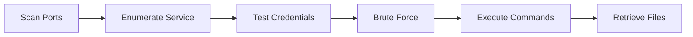

# CH05: WinRM Exploitation

## Why WinRM Matters

Windows Remote Management (WinRM) is the protocol that system administrators rely on to manage Windows machines from across the network. Every enterprise environment running Windows Server likely has WinRM enabled on dozens or hundreds of hosts. When a penetration tester discovers an exposed WinRM service, they have found a direct path to remote command execution; provided they can authenticate.

FinanceCorp, like many organizations, uses WinRM to manage its Windows infrastructure. During your engagement, you will probe these services for weaknesses, test credentials, and demonstrate the impact of unauthorized remote management access.

---

## What Is WinRM?

WinRM is Microsoft's implementation of the WS-Management (Web Services-Management) protocol. The protocol uses SOAP (Simple Object Access Protocol) messages carried over HTTP or HTTPS to communicate with remote hosts. Two default ports handle WinRM traffic.

| Port | Transport | Description |
|------|-----------|-------------|
| 5985 | HTTP | Unencrypted WinRM communication |
| 5986 | HTTPS | TLS-encrypted WinRM communication |

Because WinRM rides on top of HTTP, it often blends in with normal web traffic. Firewalls and intrusion detection systems may not flag it unless they inspect traffic at the application layer. An attacker who gains valid credentials can execute commands, transfer files, and pivot deeper into the network; all through a protocol that the organization itself depends on.

---

## What Will You Learn?

By the end of this chapter, you will be able to:

- Detect WinRM services running on target hosts using port scanning
- Enumerate WinRM version information and authentication configurations
- Test credentials manually against WinRM endpoints
- Perform automated brute-force attacks against remote management services
- Execute commands remotely after successful authentication
- Search for and retrieve sensitive files from compromised hosts

---

## Lab Progression

Each lab in this chapter builds on the skills from the previous one. The table below shows how the labs connect.

| Exercise | Title | Core Skill |
|-----|-------|------------|
| 5.1 | WinRM Service Detection | Port scanning with nmap |
| 5.2 | WinRM Version and Configuration Enumeration | Header analysis and script scanning |
| 5.3 | WinRM Manual Authentication | Credential testing |
| 5.4 | WinRM Credential Brute Force | Automated password attacks with Hydra |
| 5.5 | WinRM Command Execution | Post-authentication enumeration |
| 5.6 | WinRM File Retrieval | Filesystem search and data exfiltration |

---

## Attack Flow

The following diagram shows the progression from initial discovery to data retrieval.

Each lab represents one node in the attack chain. Skipping a step in a real engagement could mean missing critical information, so treat each exercise as a required phase of the penetration test.

---

## Before You Start

Confirm the following items before beginning Exercise 5.1.

- [ ] You have access to the OpenCyberRange platform and can launch Chapter 5 lab environments
- [ ] Your attack machine has `nmap`, `curl`, and `hydra` installed
- [ ] You understand basic Linux command-line navigation (covered in Chapter 1)
- [ ] You can open an SSH session from your attack machine using the `ssh` command
- [ ] You have a text editor or note-taking tool ready to record your findings

If any of these items are missing, revisit the platform setup guide or ask your instructor before proceeding.

---

## Conventions Used in This Chapter

Command examples appear in fenced code blocks. Placeholders use angle brackets; replace `<target_ip>` with the actual IP address of your lab target. Flags are always wrapped in the `OCR{<flag_here>}` format. Never share flags outside your lab session.

Proceed to **Exercise 5.1; WinRM Service Detection** when you are ready.
