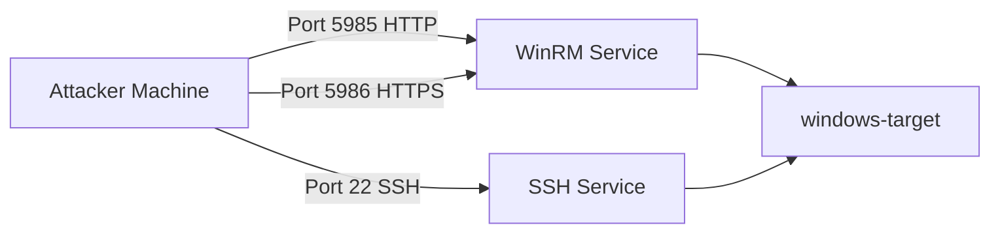

# Exercise 5.1: WinRM Service Detection

## Before You Begin

Service detection is always the first step in any penetration test. Before you can exploit WinRM, you need to confirm that the service is running and identify which ports it listens on.

## Scenario

FinanceCorp has hired your team to assess the security of their Windows infrastructure. Your project lead has assigned you a single target host suspected of running remote management services. Your first task is to scan the host, identify any WinRM endpoints, and document what you find.

## Your Objectives

- Scan the target for WinRM ports (5985 and 5986)
- Identify the service version running on open ports
- Confirm network connectivity to the target
- Document all detected services

---

## Background: How WinRM Listens on the Network

WinRM relies on two well-known ports to accept incoming management connections. Port 5985 handles unencrypted HTTP traffic, while port 5986 handles HTTPS traffic encrypted with TLS (Transport Layer Security). When a WinRM service is active, it registers an HTTP listener that responds to SOAP requests on these ports.

From a scanning perspective, WinRM ports behave like standard HTTP services. On a real Windows host, the server identifies itself as "Microsoft-HTTPAPI/2.0" because WinRM uses the Windows HTTP Server API to handle requests, and recognizing that server string is key to identifying WinRM during reconnaissance. The string appears in the HTTP `Server` response header, so the reliable way to read it is a header request with `curl -I`. An nmap version scan reads the same banner inconsistently and, against the lab endpoint, reports a generic Python `http.server` fingerprint instead.

In the OpenCyberRange lab environment, a WinRM simulator runs on the target host to replicate the behavior of a real Windows WinRM service. The simulator responds with the same headers and version strings you would see in a production environment.



---

## Tool Primer: nmap

Nmap (Network Mapper) is the standard tool for port scanning and service detection. The flags used in this exercise are listed below.

| Flag | Purpose |
|------|---------|
| `-p` | Specify ports to scan (e.g., `-p 5985,5986`) |
| `-sV` | Probe open ports to determine service version |
| `-sC` | Run default nmap scripts against detected services |
| `-Pn` | Skip host discovery and treat the target as online |
| `-v` | Increase verbosity to show scan progress |

A basic version-detection scan produces output similar to the following. The lab WinRM endpoint is backed by a lightweight HTTP server, so `nmap -sV` reports a Python `http.server` fingerprint rather than the Windows banner. Confirm the WinRM identity with a header request instead, which is covered in the walkthrough.

```
PORT     STATE SERVICE VERSION
5985/tcp open  http    SimpleHTTPServer 0.6 (Python 3.10.12)
5986/tcp open  http    SimpleHTTPServer 0.6 (Python 3.10.12)
```

---

## Walkthrough

### Step 1: Verify Connectivity

Before scanning, confirm that you can reach the target host. Run a ping command with a limited count to avoid waiting indefinitely.

!!! kali "Kali - Ping the target to verify connectivity"
    ```bash
    ping -c 3 <target_ip>
    ```

You should see three reply packets. If you receive "Destination Host Unreachable" or 100% packet loss, verify that your lab environment is running and that you have the correct IP address.

### Step 2: Scan for WinRM Ports

Run an nmap scan targeting only the WinRM ports and SSH port. Limiting the scan to specific ports keeps it fast and focused.

!!! kali "Kali - Scan for WinRM and SSH ports"
    ```bash
    nmap -p 22,5985,5986 -sV <target_ip>
    ```

Review the output carefully. You should see port 5985 reported as open with an HTTP service. Against the lab endpoint, nmap fingerprints it as `SimpleHTTPServer 0.6 (Python 3.10.12)` rather than the Windows banner, so do not expect "Microsoft HTTPAPI httpd 2.0" from `-sV` here. Port 22 should show an SSH service. Record every open port, its state, and the reported service version. Step 3a confirms the WinRM banner directly with curl.

### Step 3: Run a Script Scan

Nmap includes scripts that can extract more detail from detected services. Run a default script scan against the WinRM ports to gather extra information.

!!! kali "Kali - Run default NSE scripts against WinRM ports"
    ```bash
    nmap -p 5985,5986 -sC -sV <target_ip>
    ```

Compare the output to your previous scan. Script scans may reveal additional details such as HTTP response headers, authentication methods, or redirect behavior. Note any new findings.

### Step 3a: Confirm the WinRM Banner with curl

The `-sV` scan does not surface the Windows banner against this target, so request the HTTP headers directly. The `Server` header is where WinRM advertises itself, and a header-only request avoids pulling the response body.

!!! kali "Kali - Read the HTTP Server header on port 5985"
    ```bash
    curl -I http://<target_ip>:5985
    ```

Look for a `Server: Microsoft-HTTPAPI/2.0` line in the response. That header is the signature that identifies the endpoint as WinRM, confirming what the version scan could not.

### Step 4: Connect via SSH and Retrieve the Flag

The target also runs an SSH service on port 22. Use the credentials provided to log in and retrieve the flag file.

!!! kali "Kali - Connect to the target via SSH"
    ```bash
    ssh admin@<target_ip>
    ```

When prompted for a password, enter `password123`. Once logged in, read the flag file.

!!! kali "Kali - Read the flag file"
    ```bash
    cat /home/admin/flag.txt
    ```

---

### Record Your Findings

> Copy the table below into your notes and fill in each row based on your scan results.
>
> | Port | State | Service | Version |
> |------|-------|---------|---------|
> | 22 | | | |
> | 5985 | | | |
> | 5986 | | | |

---

### Step 5: Record the Flag

The flag you retrieved from `/home/admin/flag.txt` follows the standard format. Record it in your notes as `OCR{<flag_here>}`, replacing `<flag_here>` with the value you found in the file.

---

## Analysis Questions

1. Why does WinRM appear as an HTTP service in nmap scan results?

??? note "Reveal Answer"
    WinRM uses the Windows HTTP Server API (HTTP.sys) to handle connections. Because it communicates over HTTP/HTTPS, nmap identifies it using the standard HTTP service fingerprint rather than a custom WinRM-specific signature.

2. What is the significance of the "Microsoft-HTTPAPI/2.0" version string?

??? note "Reveal Answer"
    The version string indicates that the service uses Microsoft's HTTP Server API version 2.0. Any service built on HTTP.sys, including WinRM, SCCM, and SSRS, may report the same string, so further enumeration is needed to confirm the exact service.

3. Why did we also scan port 22 in addition to the WinRM ports?

??? note "Reveal Answer"
    Port 22 runs SSH, which provides an alternative remote access method. Identifying all remote management services on a host gives a complete picture of the attack surface and may provide fallback access if one protocol is locked down.

---

## Key Takeaways

- WinRM listens on ports 5985 (HTTP) and 5986 (HTTPS) by default
- The "Microsoft-HTTPAPI/2.0" server string identifies WinRM, but read it from the HTTP `Server` header with `curl -I` because `nmap -sV` does not report it reliably against the lab endpoint
- Script scans (`-sC`) can reveal additional configuration details beyond basic version detection
- Always document every open port and service during the reconnaissance phase
- In Exercise 5.2, you will dig deeper into WinRM's configuration by analyzing HTTP headers and authentication methods
